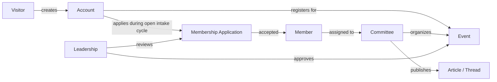

# Product Overview

| Field            | Value      |
| ---------------- | ---------- |
| **Last Updated** | 2026-10-02 |
| **Status**       | Draft      |

## 1. What SDC is

**The Saudi Developer Community (SDC — المجتمع السعودي للمطورين)** is a non-profit technology community that helps developers and technology enthusiasts in Saudi Arabia gain practical experience, build real projects and share knowledge.

The community's own published description (About page, `app/about/page.js`) states that it does this through:

- workshops and regular technical meetups;
- open-source projects;
- hosting inspiring speakers;
- enriching Arabic technical content with high-quality material;
- knowledge sharing in artificial intelligence and modern technologies.

The community is run by volunteers organized into **leadership** and **committees** (AI, Cybersecurity, Technology & Development, Projects, Design & Identity — see [organizational structure](../03-business-domain/organizational-structure.md)). It has been operating for several years and has run online workshops, meetups and multi-day camps (bootcamps), some in partnership with other organizations.

## 2. What the platform is

The SDC platform (`sdc_web`) is the community's **public website and internal operating system**:

| Facet | Serves | Examples |
| ----- | ------ | -------- |
| **Public website** | Anyone | Community identity, about/vision, published events, technical threads/articles, leadership and member directory, partners |
| **Participant self-service** | Anyone with an account | Register for events, track registration status, manage own account |
| **Membership** | Applicants and members | Apply during the annual membership intake window, maintain a member profile shown in the directory |
| **Internal management** | Leadership and committees | Create and publish events, review registrations, review membership applications, publish articles, manage committees and their members |
| **Oversight** | Founders and leadership | Community-wide statistics and committee activity reports |
| **Administration** | System administrators | Users, role assignments, configuration, audit visibility |

## 3. What the platform is today (summary)

**CURRENT** — the platform is primarily a bilingual (Arabic/English) marketing website with a thin layer of Supabase-backed functionality: email/password accounts, a member directory read from a `members` table, event registration into an `event_registrations` table, and a single committee review page whose access is controlled by a hardcoded email list. Events and articles are hardcoded in page source files. Full detail: [current-system audit](../01-project/current-system-audit.md).

## 4. What the platform is not

| It is not… | Why it matters |
| ---------- | -------------- |
| A commercial SaaS product | No pricing, plans, tenants, subscriptions or billing concepts. |
| A multi-organization platform | It serves one community: SDC. No multi-tenancy. |
| A social network / forum | Members do not post freely; content is reviewed and published by the community (see [article lifecycle](../03-business-domain/article-lifecycle.md)). Comments, likes and messaging are out of scope (see [scope](./scope.md)). |
| A learning-management system | Events link to delivery platforms (online meeting links); course delivery, grading and LMS features are out of scope. |
| A general open-registration membership system | Creating an **account** does not make someone a **member**. Membership is granted only through the dedicated, periodically-open intake process (DECISION D-001). |
| A replacement for the community's social channels | X, LinkedIn and Instagram remain the primary broadcast channels; the platform is the system of record. |

## 5. Core concepts at a glance

Definitions for every term: [glossary](./glossary.md).
