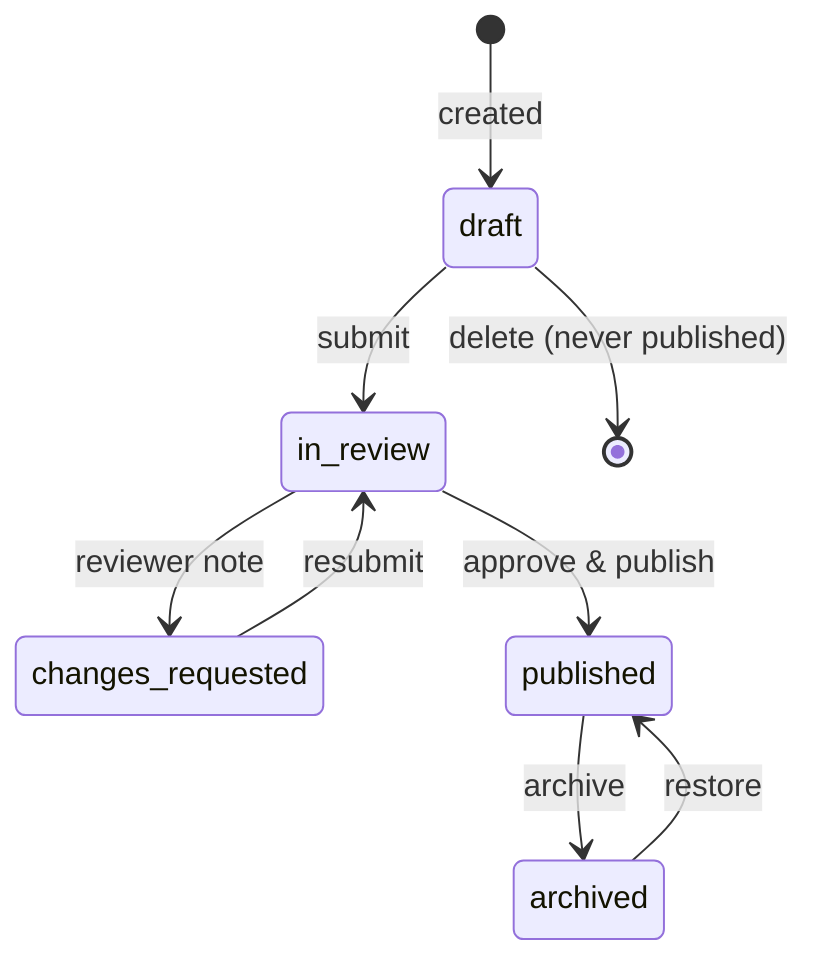

# Article / Thread Lifecycle

| Field            | Value      |
| ---------------- | ---------- |
| **Last Updated** | 2026-10-02 |
| **Status**       | Draft — authority pending **OPEN Q-006**, naming pending **OPEN Q-033** |

## 1. Articles today (CURRENT)

- Six bilingual technical write-ups, hardcoded in `app/articles/[id]/page.js`, plain paragraphs.
- Metadata: title, author (a committee such as "AI Committee", or a list of named people), date (display string), reading time, tags (ar/en lists differ), optional source link + label (e.g., a Google Drive resource file).
- Public label alternates between **ثريد / Thread** (list page, home page) and **مقال / Article** (detail breadcrumb).

## 2. Content model (Proposed)

| Field | Notes |
| ----- | ----- |
| Title (ar/en), slug | Arabic required; English optional but recommended |
| Excerpt (ar/en) | For cards and social previews |
| Body (ar/en) | Markdown, sanitized at render (no raw HTML) |
| Owning committee | Optional (personal articles allowed? **OPEN Q-033**) |
| Authors | Ordered list of users and/or a committee byline; external guest authors as display names (**OPEN Q-033**) |
| Tags | Shared tag vocabulary with ar/en labels |
| Reading time | Computed from body length (not typed) |
| Cover image | Optional |
| Source/resources link + label | Optional |
| `published_at` | Set on first publish; drives the displayed date |

## 3. Lifecycle

| Transition | Who (Proposed — **OPEN Q-006**) |
| ---------- | ------------------------------- |
| create / edit draft | Any committee role in the owning committee; the author |
| submit | Author |
| approve & publish | Committee head/deputy of the owning committee, or community leader |
| request changes | Same as approve |
| edit published | Committee head/deputy, community leader (audited; `updated_at` shown) |
| archive / restore | Committee head, community leader |

## 4. Rules

| # | Rule | Status |
| - | ---- | ------ |
| AR-1 | Only `published` articles are publicly visible; `archived` ones return 404 publicly but keep their URL reserved. | Proposed |
| AR-2 | Slugs are unique and stable after first publish (changing one adds a redirect). | Proposed |
| AR-3 | Body is stored as Markdown and rendered with sanitization; no script/iframe/raw HTML. | Proposed |
| AR-4 | `published_at` is set once and not changed by later edits. | Proposed |
| AR-5 | Members who are not committee members cannot publish; whether they can submit drafts for review is **OPEN Q-006**. | Proposed |
