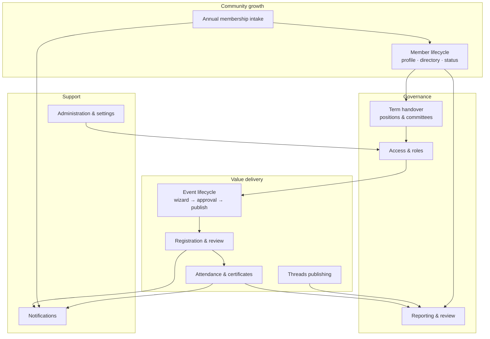
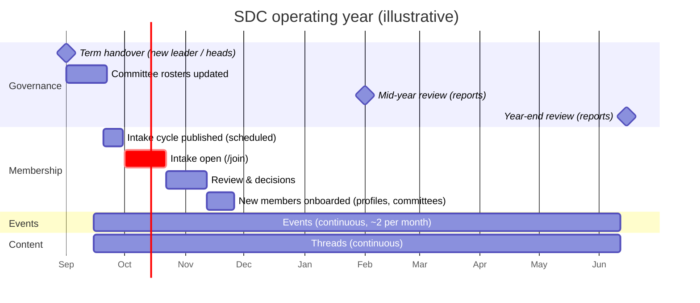
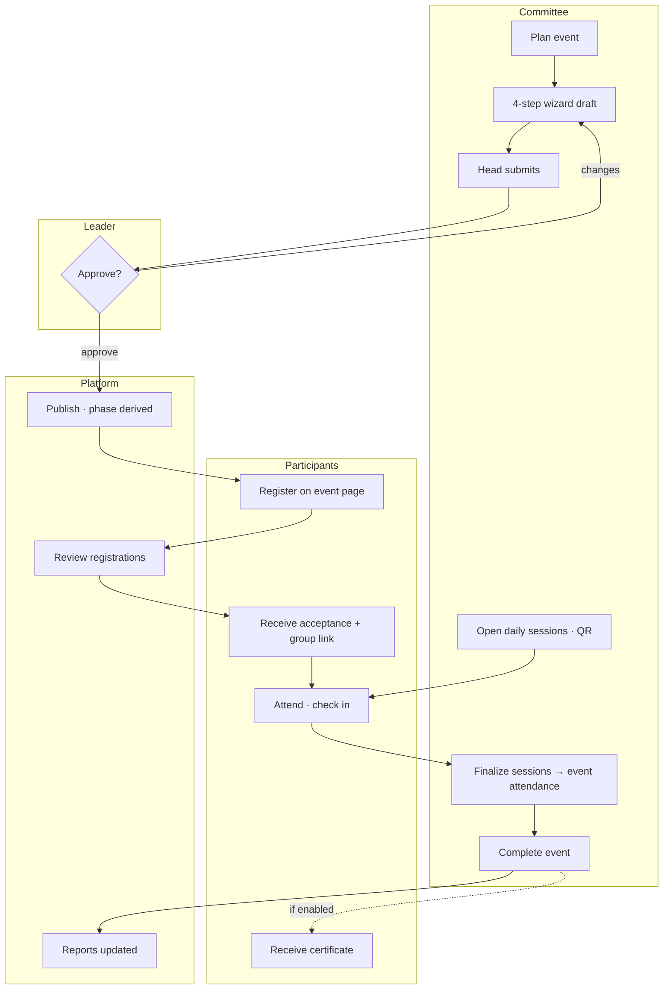
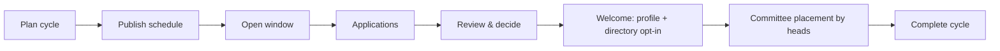

# Business Processes — End to End

| Field            | Value      |
| ---------------- | ---------- |
| **Last Updated** | 2026-10-02 |
| **Status**       | Draft (Proposed) — dates and owners pending **Q-005, Q-011, Q-013** |

This page shows how SDC operates **across modules** during a year. Each process links to the module spec that implements it ([11-modules](../11-modules/README.md)). The rules themselves stay in [business rules](./business-rules.md) and the lifecycle documents.

## 1. Process landscape

| Process | Owner | Module(s) |
| ------- | ----- | --------- |
| Term handover | Community leader | [committees](../11-modules/committees/README.md), [access control](../11-modules/access-control/README.md) |
| Annual membership intake | Community leader | [membership](../11-modules/membership/README.md) |
| Member lifecycle | Community leader / members | [members](../11-modules/members/README.md) |
| Event lifecycle | Committee heads + leader | [events](../11-modules/events/README.md) |
| Registration & review | Committee heads | [registrations](../11-modules/registrations/README.md) |
| Attendance & certificates | Committee heads | [attendance](../11-modules/attendance/README.md) |
| Threads publishing | Committees | [articles](../11-modules/articles/README.md) |
| Reporting & review | Founders, leader | [reports](../11-modules/reports/README.md) |
| Notifications | System | [notifications](../11-modules/notifications/README.md) |
| Administration | System admins | [administration](../11-modules/administration/README.md) |

## 2. The SDC year (illustrative calendar)

Exact dates are **OPEN** (Q-011 for the intake, Q-003 for terms). This is the shape the platform is designed for:

## 3. Event journey (cross-module)

| Step | Module | Key rule |
| ---- | ------ | -------- |
| Draft → submit → approve | events | Publish guards; approver = leader (Q-005) |
| Register → decide | registrations | One per person; seats; members-only |
| Acceptance e-mail | notifications | Contains the group link and meeting link |
| Sessions, check-in, finalize | attendance | One canonical percentage |
| Complete → certificates | events + attendance | Completion requires finalized attendance; certificates only if enabled (Q-020) |
| Reports | reports | Attendance rate only from finalized events |

## 4. Membership intake journey

Summarized here; full detail in [membership §4](../11-modules/membership/README.md#4-business-process--the-annual-intake).

## 5. Term handover

Full detail in [committees §4](../11-modules/committees/README.md#4-business-process--term-handover).

| # | Step | Who | Platform effect |
| - | ---- | --- | --------------- |
| 1 | Decide the new leader and heads | Founders / community (offline) | — |
| 2 | Admin assigns the new `community_leader` with a start date; the old term ends that day | System admin | Leadership view switches on the date |
| 3 | Leader runs *handover* for each committee head | Leader | Old heads lose scoped permissions at the end date |
| 4 | New heads update their rosters | Heads | Committee pages and access updated |
| 5 | Leader checks the sidebar of each role (personas) | Leader | No hardcoded lists to edit |

## 6. Responsibility matrix (RACI)

R = responsible, A = accountable, C = consulted, I = informed.

| Activity | Founders | Leader | Committee head | Committee member | System admin | Member / participant |
| -------- | :------: | :----: | :------------: | :--------------: | :----------: | :------------------: |
| Plan and run the intake cycle | C | **A/R** | C | — | I | I |
| Decide applications | I | **A/R** | C (Q-013) | — | — | I |
| Create an event | I | I | **A** | **R** | — | — |
| Approve and publish an event | I | **A/R** | C | — | — | I |
| Review registrations | — | I | **A/R** | C | — | I |
| Run attendance and finalize | — | I | **A/R** | R | — | R (check in) |
| Issue certificates | — | **A** | R | — | — | I |
| Publish a thread | I | C | **A/R** | R (author) | — | I |
| Term handover | C | **A/R** | I | I | R (global roles) | I |
| Manage roles and settings | I | R (non-global) | — | — | **A/R** | — |
| Read reports | **R** | **R** | R (own) | — | I | — |

## 7. Process health indicators

| Indicator | Target (Proposed) | Source |
| --------- | ----------------- | ------ |
| Event approval turnaround (submit → decision) | ≤ 3 days | `audit_logs` (events) |
| Registration decision time (pending → decided) | ≤ 5 days, and always before the event | `event_registrations` |
| Application decision time | Within the cycle's `review_ends_at` | `membership_applications` |
| Attendance finalized | Within 3 days after the last day | `events.attendance_finalized_at` |
| E-mail delivery success | ≥ 98 % sent on the first attempt | `email_logs` |

These appear on the leader's overview as "pending work" ([reports](../11-modules/reports/README.md)).
