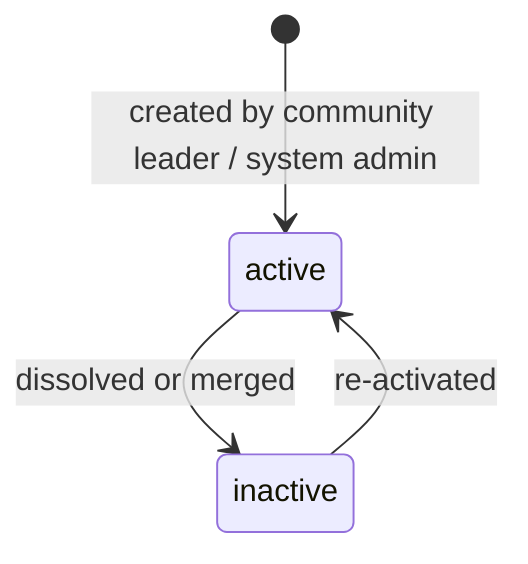

# Committee Model

| Field            | Value      |
| ---------------- | ---------- |
| **Last Updated** | 2026-10-02 |
| **Status**       | Draft — blocked on **OPEN Q-004** |

## 1. What a committee is

A **committee (لجنة)** is a standing, volunteer working group responsible for one domain of the community's activity. Committees are the unit that **organizes events**, **publishes content**, and **groups members** for collaboration and permissions.

## 2. Committees observed (CURRENT)

| Committee (as named in code) | Evidence |
| ---------------------------- | -------- |
| AI Committee — لجنة الذكاء الاصطناعي | Head listed; credited as author of 5 of 6 articles |
| Cybersecurity Committee — لجنة الأمن السيبراني | Head listed; cybersecurity and CTF camps |
| Technology & Development Committee — لجنة التقنية والتطوير | Head and deputy listed |
| Projects — المشاريع | "Head of Projects" listed (not called a committee) |
| Design & Identity — التصميم والهوية | "Head of Design & Brand Identity" listed (not called a committee) |

### 2.1 Conflicting taxonomies (PROBLEM)

Three different lists describe "parts" of the community:

| List | Values | Location |
| ---- | ------ | -------- |
| Committees (leadership page) | AI, Cybersecurity, Technology & Development, Projects, Design & Identity | `app/members/page.js` |
| "Community sections" (home page) | AI, Data Science, Marketing, Podcast & Content, Product Management, Public Relations | `CommunitySections.jsx` |
| Member "track" (free text) | e.g., Web Development, AI Track, Cybersecurity | `members.track` |

**OPEN Q-004** — what is the canonical list of committees, and what are "community sections" and "tracks"? Options:

| Option | Meaning | Data model impact |
| ------ | ------- | ----------------- |
| A | Sections = committees (the home page list is outdated or aspirational) | One `committees` table; home page lists active committees |
| B | Sections are *interest areas* distinct from committees | Separate `interest_areas` lookup; members pick interests |
| C | Track = the member's committee | `members.track` replaced by committee membership |
| D | Track = technical specialization (independent of committee) | `tracks` lookup table on member profile |

**ASSUMPTION A-006** — until answered, the design uses **one `committees` table** (Option A) and treats **track as a technical specialization lookup** (Option D). Both are cheap to change before Phase 3.

## 3. Committee attributes (Proposed)

| Attribute | Notes |
| --------- | ----- |
| Slug | URL-safe, unique (`ai`, `cybersecurity`, …) |
| Name (ar/en) | Arabic required |
| Description (ar/en) | Shown on a public committee page (future) |
| Status | `active` / `inactive` (never deleted) |
| Display order | For public listings |
| Contact email | Optional (**OPEN Q-004**) |

## 4. Responsibilities and permissions (Proposed)

| Activity | Committee head | Deputy | Committee member | Notes |
| -------- | :------------: | :----: | :--------------: | ----- |
| Create event draft for the committee | ✅ | ✅ | ✅ | |
| Submit event for review | ✅ | ✅ | ❌ | **OPEN Q-005** |
| Publish event | ❌ (submit only) | ❌ | ❌ | Community leader approves — **OPEN Q-005** |
| Review registrations for committee events | ✅ | ✅ | grantable | |
| Record attendance | ✅ | ✅ | grantable | |
| Draft article | ✅ | ✅ | ✅ | |
| Approve/publish committee article | ✅ | ✅ | ❌ | **OPEN Q-006** |
| Add/remove committee members | ✅ | ❌ | ❌ | |
| View committee reports | ✅ | ✅ | ❌ | |

The authoritative permission matrix is in [permission catalog](../06-security/permission-catalog.md).

## 5. Committee membership rules

| # | Rule | Status |
| - | ---- | ------ |
| CM-1 | Only **members** (active member record) can be committee members, deputies or heads. | Proposed |
| CM-2 | Committee membership is a time-bound role assignment scoped to the committee. | Proposed |
| CM-3 | A member may belong to more than one committee. | Assumed (A-005) |
| CM-4 | Exactly zero or one active head per committee. | Proposed |
| CM-5 | When a member's membership becomes inactive, their committee assignments end on the same date. | Proposed |
| CM-6 | Applicants may state a preferred committee on their membership application; placement is decided by the committee head or leader after acceptance. | Proposed — **OPEN Q-013** |

## 6. Committee lifecycle

An inactive committee keeps its events, articles and history; it cannot own new events or receive new members.
