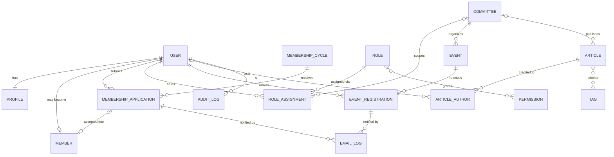

# Domain Model

| Field            | Value      |
| ---------------- | ---------- |
| **Last Updated** | 2026-10-02 |
| **Status**       | Draft      |

## 1. Domain areas

| Area | Responsibility | Core entities |
| ---- | -------------- | ------------- |
| **Identity & Access** | Who someone is and what they may do | Account (User), Profile, Role, Permission, Role Assignment |
| **Organization** | How the community is structured | Committee, Position (expressed as Role Assignment), Term |
| **Membership** | Becoming and being a member | Membership Cycle, Membership Application, Member |
| **Activities** | What the community runs | Event, Event Registration, Attendance |
| **Content** | What the community publishes | Article, Article Author, Tag |
| **Communication** | What the platform tells people | Notification (email), Email Log |
| **Governance** | Traceability and oversight | Audit Log, Reports (derived) |

## 2. Conceptual model

## 3. Key modelling decisions

| # | Decision | Rationale | Status |
| - | -------- | --------- | ------ |
| DM-1 | **Account ≠ Member.** A user account exists for anyone who signs up; a Member record exists only after an accepted membership application (or a documented migration of an existing member). | DECISION D-001: joining the community happens only through the dedicated intake page. | Confirmed |
| DM-2 | **Positions are role assignments.** Founder, community leader, advisor, committee head/deputy/member are all expressed as a time-bound assignment of a role to a user, optionally scoped to a committee. The public leadership display is generated from them. | One source of truth for "who holds what" for both display and permissions; removes hardcoded leadership; supports annual rotation (the advisor is a former leader — rotation is real). | Proposed (ADR-004) |
| DM-3 | **Committees own activities.** Every event belongs to exactly one committee (or to "community-wide" leadership — **OPEN Q-005**); articles may belong to a committee. | Enables committee scope for permissions and committee reports. | Proposed |
| DM-4 | **Editorial status is stored, timing phase is derived.** An event's stored status covers its editorial lifecycle (draft → published / cancelled / completed). "Coming soon", "registration open", "ended" are computed from dates. | Avoids stale statuses and cron jobs; fixes the current "ended" label comparison. | Proposed |
| DM-5 | **Registrations reference users, not typed names.** Name/email are snapshotted at registration time from the profile, for historical records. | Removes name-matching; preserves the record if a profile changes. | Proposed |
| DM-6 | **Nothing with history is hard-deleted.** Committees, events, members become inactive/cancelled/archived. | Reports and audit integrity. | Proposed |

## 4. Aggregates and ownership

| Aggregate root | Contains | Owned by (scope) |
| -------------- | -------- | ---------------- |
| Membership Cycle | Applications | Global (leadership) |
| Member | Member profile, directory visibility | The member (profile fields) + leadership (status) |
| Committee | Role assignments scoped to it | Leadership (create/close) + committee head (members) |
| Event | Registrations, attendance | Organizing committee |
| Article | Authors, tags | Owning committee (or author for personal drafts) |
