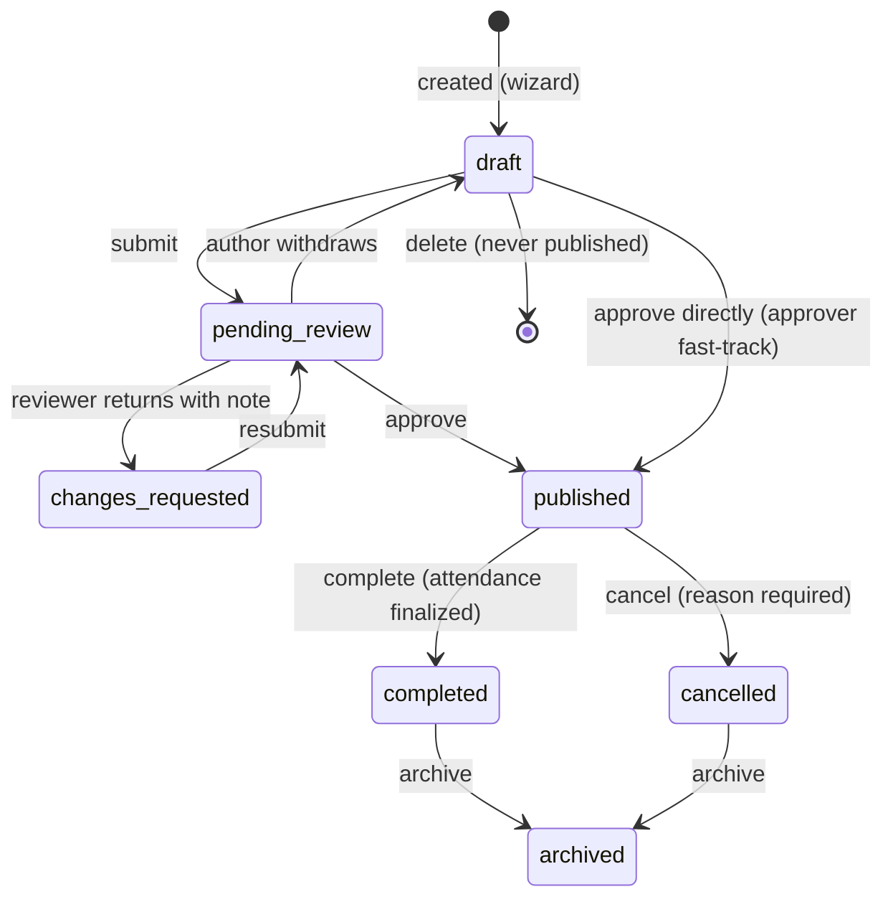

# Event Lifecycle

| Field            | Value      |
| ---------------- | ---------- |
| **Last Updated** | 2026-10-02 |
| **Status**       | Draft — approval authority pending **OPEN Q-005** |

## 1. Events today (CURRENT)

- Six real past/upcoming events (meetups, workshops, camps), all **online**, hardcoded in source.
- Display status is a translated label: *Coming soon* (قريبًا) or *Ended* (منتهي); "Registration open" (متاح التسجيل) exists as a CSS state.
- Dates are free text ("To be announced soon", "15–19 September 2024", "27/10/2024 to 1/11/2024").
- Detail content: target audience, location (+ map link), date, duration, awards/certificate, FAQ, contact phone/email, social links, and four lists — *tasks & responsibilities*, *requirements & criteria*, *deliverables*, *opportunities & benefits*.
- Registration requires review: "your registration will be reviewed by the competent committee" (registration email).

## 2. Event content model (Proposed — KFUCS-aligned, [ADR-012](../90-decisions/ADR-012-event-model-and-wizard-from-kfucs.md))

Captured by the 4-step creation wizard ([13-event-form](../10-design-system/INTERNAL-SCREENS/13-event-form.md)). Field-level mapping: [KFUCS alignment](../98-reference/kfucs-event-model-alignment.md).

| Wizard step | Group | Fields |
| ----------- | ----- | ------ |
| 1 Identity | Identity | Title (ar required / en), slug, type (workshop · bootcamp · hackathon · meeting · meetup · talk — **OPEN Q-040**), organizing committee, summary, description (Markdown) |
| 2 Logistics | Schedule | `schedule_type`: single day · consecutive range · specific dates; start/end date, date list, start/end time (Asia/Riyadh) |
| 2 Logistics | Place | `location_mode`: in person · online · hybrid; location ar/en + map link; meeting URL + notes (**private**); group link (**private, required to publish**) |
| 2 Logistics | Registration | Seats (optional), registration opens/closes, requires approval (default on — **OPEN Q-018**), waitlist (**OPEN Q-029**), audience public/members-only (**OPEN Q-009**) |
| 3 Content | Content | Goals (≥ 1 Arabic, ≤ 15), FAQ (≤ 15), presenters (accounts or guests, ≤ 10), cover image |
| 3 Content | SDC details | Target audience, requirements, responsibilities, deliverables, benefits (optional lists, as on today's pages), awards, certificate available, contact email/phone |
| 4 Review | Display | Show presenters / goals / FAQ / details / seats remaining; auto-close registration when full |
| 4 Review | Confirmation | Preview card + "the information is correct" checkbox, then *Submit for review* or *Approve & publish* |

## 3. Editorial lifecycle (stored status)

Same states as KFUCS, except that `REGISTRATION_CLOSED` and `IN_PROGRESS` are **derived phases** (§4) rather than stored by a sweep job, and KFUCS `REJECTED` becomes `changes_requested`.

| Transition | Who (Proposed) | Guard |
| ---------- | -------------- | ----- |
| create draft | Committee member/deputy/head of the organizing committee; community leader | Committee is active |
| submit | Committee head/deputy | Steps 1–3 valid; confirmation ticked |
| approve → published | Community leader (**OPEN Q-005**) | Status `pending_review` (or `draft` for fast-track by an approver); publish guards: start date, location (in person/hybrid), group link, ≥ 1 Arabic goal |
| request changes | Community leader | Note ≥ 10 characters |
| withdraw | Submitter, committee head | Status `pending_review` |
| cancel | Committee head (own committee), community leader | Status `published`; reason required; registrants notified |
| complete | Committee head, community leader | Last date passed; **attendance finalized** when sessions exist (KFUCS F-36) |
| archive | Committee head, community leader | `completed` or `cancelled`; hidden from listings, URL still works |
| edit | Draft/changes_requested: committee roles. Published: committee head and leader. **Significant changes** (dates, mode, location) notify accepted registrants. Registration deadline may be extended while in progress | — |
| delete | Committee head, leader | Only `draft` / `changes_requested` that were never published |

## 3a. Attendance and certificates (KFUCS logic)

1. Each scheduled day (`event_dates`) becomes an **attendance session** on that day.
2. The organizer **opens** the session. Accepted registrants check in by **QR** (rotating code on the organizer's screen) or **online** self check-in while the session is open; organizers can also mark **manually**. One check-in per person per session.
3. The organizer **closes** and **finalizes** the session. Finalized sessions are read-only; corrections are audited.
4. When every session is finalized, **finalize event attendance** writes each registration's result (`attended`/`absent`) and frozen percentage = attended ÷ finalized sessions on the current schedule.
5. The event can then be **completed**. If certificates are enabled (**OPEN Q-020**), eligible registrations (percentage ≥ threshold, KFUCS default 70 %) get certificates generated and emailed, with retry.

## 4. Timing phase (derived, never stored)

Computed from the stored status and the current time; used for badges, filters and registration guards.

| Phase | Condition | Badge (ar / en) |
| ----- | --------- | --------------- |
| `announced` | published, registration not yet open | قريبًا / Coming soon |
| `registration_open` | published, now within registration window, capacity not exhausted (or waitlist enabled) | متاح التسجيل / Registration open |
| `registration_closed` | published, `registration_end_at` passed or seats full with auto-close (KFUCS `REGISTRATION_CLOSED`), event not ended | التسجيل مغلق / Registration closed |
| `in_progress` | published, now between the first day's start and the last day's end | جارية / In progress |
| `ended` | published or completed, last day ended | منتهي / Ended |
| `cancelled` | status cancelled | ملغاة / Cancelled |

If no registration window is configured, registration is open from publication until the end of the first day. Extending `registration_end_at` reopens registration even while the event is in progress (KFUCS rule). **Proposed.**

## 5. Visibility

| Status | Visible to |
| ------ | ---------- |
| draft, pending_review, changes_requested | Organizing committee roles, community leader, system admin |
| published, completed, archived (direct link) | Everyone (members-only events: details visible, registration restricted — **OPEN Q-009**) |
| cancelled | Everyone, labeled cancelled (keeps links working) |

## 6. Rules summary

See [business rules § Events](./business-rules.md#events-br-evt).
