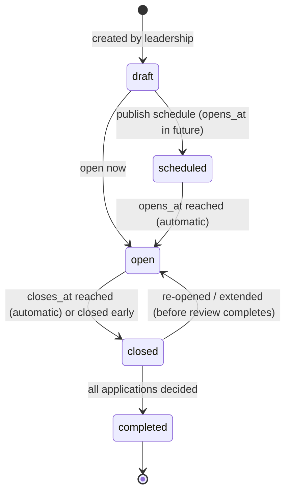
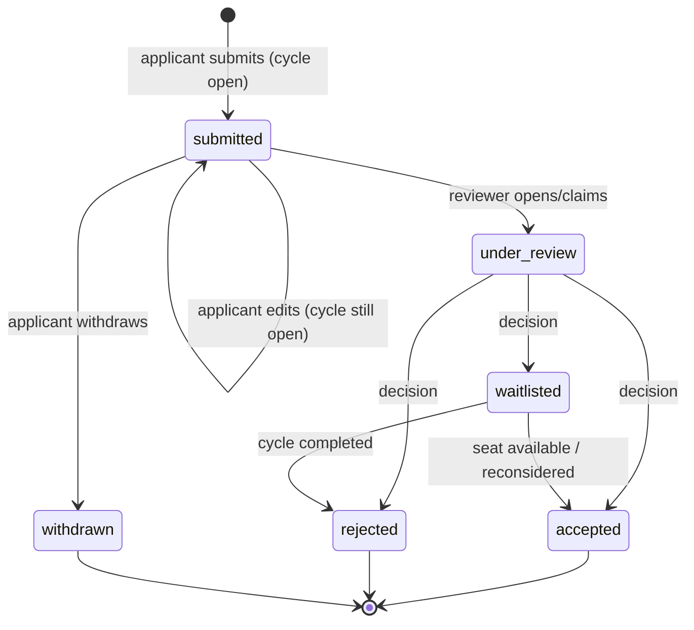
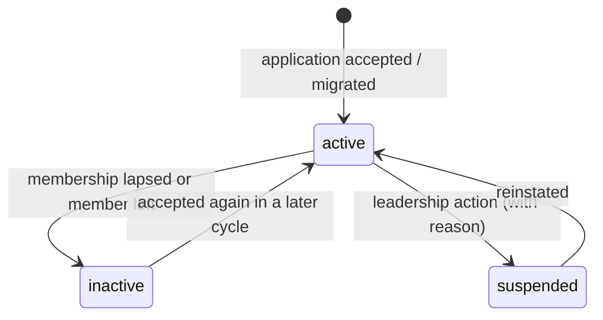

# Membership Lifecycle and Intake Cycles

| Field            | Value      |
| ---------------- | ---------- |
| **Last Updated** | 2026-10-02 |
| **Status**       | Draft      |

## 1. The fundamental rule

> **DECISION D-001 (stakeholder, 2026-10-02):** Joining the community is **not** done through the account registration page (`/register`). There is a **dedicated membership page** that **opens and closes for a limited period, about once a year**. Only applications submitted through it can lead to membership.

Consequences:

| Concept | Created by | Means |
| ------- | ---------- | ----- |
| **Account** (حساب) | `/register` — anyone, any time | Can sign in, register for events, track registrations, apply for membership when intake is open |
| **Membership application** (طلب عضوية) | `/join` — only while an intake cycle is open | A request to become a member, reviewed by leadership |
| **Member** (عضو) | Acceptance of an application | Appears in the member directory (if visible), can join committees, may access members-only features |

**CURRENT** — none of this exists. `/register` creates an account; `members` rows are inserted manually (seed script) and are not linked to accounts. No join page, no cycles, no applications.

## 2. Membership intake cycle (دورة استقبال طلبات العضوية)

An intake cycle is a configured time window during which the join page accepts applications.

### 2.1 Attributes (Proposed)

| Attribute | Notes |
| --------- | ----- |
| Name (ar/en) | e.g., "استقبال طلبات العضوية 2026" |
| `opens_at`, `closes_at` | Required before the cycle can be scheduled |
| `review_ends_at` | Optional target date for decisions |
| Description / eligibility text (ar/en) | Shown on the join page |
| Capacity | Optional cap on accepted members (**OPEN Q-011**) |
| Application questions | Optional cycle-specific questions in addition to the fixed profile fields (**OPEN Q-011**) |
| Status | See §2.2 |

### 2.2 Cycle states

| State | Join page shows | Applications accepted? |
| ----- | --------------- | ---------------------- |
| *(no cycle)* | "Applications are currently closed" + follow-us links | No |
| `draft` | Same as no cycle (draft is invisible) | No |
| `scheduled` | "Applications open on {opens_at}" | No |
| `open` | Application form (sign-in required — **OPEN Q-002**) | **Yes** |
| `closed` | "Applications closed on {closes_at}; decisions will be emailed" | No |
| `completed` | Same as no cycle | No |

`scheduled → open` and `open → closed` are **derived from dates** at read time (no cron dependency); the stored state changes only for manual actions (publish, close early, extend, complete). See [BR-MBR rules](./business-rules.md#membership-br-mbr).

### 2.3 Cycle rules

| # | Rule | Status |
| - | ---- | ------ |
| MC-1 | At most **one** cycle may be `open` at any time. | Proposed |
| MC-2 | Cycles normally run **about once a year**; the system does not enforce a frequency. | Confirmed (D-001) |
| MC-3 | Only the community leader (or a system administrator on their behalf) can create, schedule, extend or close a cycle. | Proposed — **OPEN Q-011** |
| MC-4 | Changing `closes_at` of an open cycle is allowed and audited ("extension"). | Proposed |
| MC-5 | A cycle cannot be deleted once it has applications. | Proposed |

## 3. Membership application (طلب عضوية)

### 3.1 Contents (Proposed)

Pre-filled from the applicant's account/profile where possible.

| Field | Required | Source of current requirement |
| ----- | -------- | ----------------------------- |
| Full name (ar), full name (en) | ar required | Members have bilingual names today |
| Email | From account (not editable) | — |
| Phone | Optional (**OPEN Q-011**) | — |
| Academic/professional status (student / graduate / employee) | Yes | `members.status` |
| University | If student/graduate | `members.university` |
| Major, sub-major | Yes / optional | `members.major`, `sub_major` |
| Track / specialization | Yes | `members.track` (**OPEN Q-004**) |
| Preferred committee | Optional | **OPEN Q-013** |
| Short bio (ar/en) | Optional | `members.bio` |
| Links (portfolio, GitHub, LinkedIn, X) | Optional | `members.*_url` |
| Motivation / cycle questions | Per cycle | **OPEN Q-011** |
| Consent to privacy notice + directory visibility choice | Yes | NFR-PRIV |

### 3.2 Application states

| # | Rule | Status |
| - | ---- | ------ |
| MA-1 | One application per account per cycle (unique). | Proposed |
| MA-2 | Applications can be created only while the cycle is `open` (checked on the server/database at insert time). | Confirmed (D-001) |
| MA-3 | The applicant may edit or withdraw while `submitted` **and** the cycle is open. | Proposed |
| MA-4 | An existing active member cannot apply. | Proposed |
| MA-5 | Decisions (`accepted`/`rejected`/`waitlisted`) record reviewer, timestamp and an optional internal note; the internal note is never shown to the applicant. | Proposed |
| MA-6 | Decisions may be made after the cycle closes; the cycle becomes `completed` when no application is `submitted`, `under_review` or `waitlisted`. | Proposed |
| MA-7 | Every submission and decision sends an email to the applicant ([notification rules](./notification-rules.md)). | Proposed |
| MA-8 | Rejected applicants may apply again in a later cycle. | Proposed — **OPEN Q-012** |
| MA-9 | Reviewers: the community leader decides; committee heads may be given read access to recommend (**OPEN Q-013**). | Proposed |

## 4. Member (عضو)

### 4.1 Becoming a member

On `accepted`, the system (in one transaction):

1. creates the member record linked to the applicant's account (or re-activates a previous one);
2. copies profile fields from the application;
3. records `joined_at` and the cycle the member joined through;
4. sends the acceptance email;
5. writes an audit entry.

Committee placement is a separate, later action (CM-6).

### 4.2 Member states

| # | Rule | Status |
| - | ---- | ------ |
| MS-1 | Only `active` members appear in the public directory, and only if they opted in to directory visibility. | Proposed — **OPEN Q-007** |
| MS-2 | Does membership expire each year (renewal at the next cycle) or last until ended? | **OPEN Q-012** |
| MS-3 | Suspension and reinstatement are leadership actions with a mandatory reason, audited. | Proposed |
| MS-4 | Ending membership ends all committee role assignments (CM-5). | Proposed |
| MS-5 | Members edit their own profile fields; status, membership dates and committee placement are not self-editable. | Proposed — **OPEN Q-030** (are edits moderated?) |

## 5. Existing members (migration)

**CURRENT** — the `members` table holds people with bilingual names, academic details, bios and social links, but **no email and no account link** (local: 3 sample rows; remote: unknown count — **OPEN Q-026**).

Migration path (Proposed):

1. Import existing rows as `members` with status `active`, `user_id` empty, `joined_via = 'legacy'`.
2. Leadership provides each existing member's email (or members claim their profile).
3. A **claim** flow links the record to the member's account after email verification (invite link sent to the provided email).
4. Unclaimed legacy profiles stay visible according to their current visibility until a cut-off decided by leadership (**OPEN Q-026**).

## 6. Pages involved

| Route | Purpose |
| ----- | ------- |
| `/register` | Account creation only. Copy must say it does **not** grant membership and point to `/join`. |
| `/join` | Dedicated membership page: shows the current cycle state and the application form when open. |
| `/account/membership` | Applicant/member view: application status, member status, profile editing. |
| `/dashboard/membership/cycles` | Leadership: manage cycles. |
| `/dashboard/membership/applications` | Leadership: review applications (filters, bulk decisions, export). |
