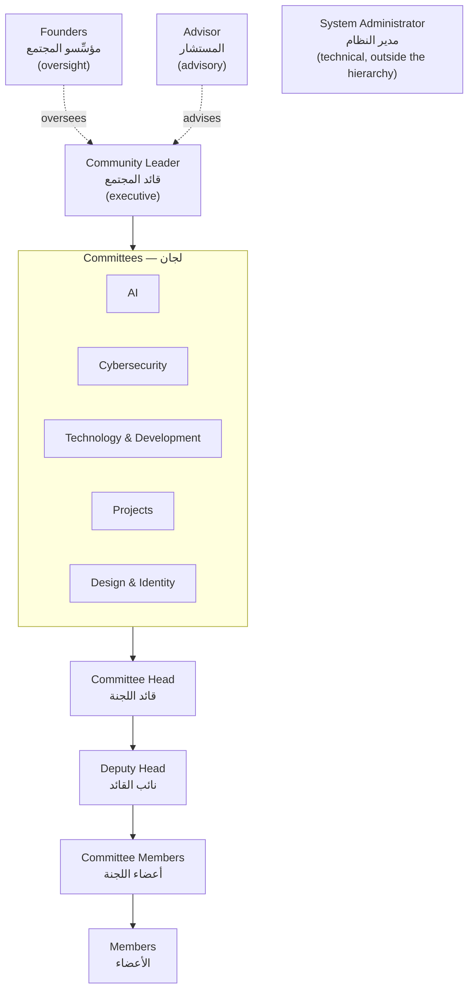

# Organizational Structure

| Field            | Value      |
| ---------------- | ---------- |
| **Last Updated** | 2026-10-02 |
| **Status**       | Draft — blocked on **OPEN Q-003** for final confirmation |

## 1. Current structure as published (CURRENT)

The only source of the organizational structure in the codebase is the hardcoded hierarchy on the members page (`app/members/page.js`). Names are omitted here; positions are reproduced exactly.

| Level (UI section) | Position (Arabic) | Position (English, as in code) | Count |
| ------------------ | ----------------- | ------------------------------ | ----- |
| مؤسِّستا المجتمع — Community founders | مؤسِّسة | Founder (co-founded the community "four years ago") | 2 |
| قائد المجتمع والمستشار — Leader & advisor | قائد المجتمع | Community Leader — "leading the vision and overseeing execution" | 1 |
| | المستشار | Advisor — "former community leader, now providing strategic support" | 1 |
| قادة المجتمع — Community leads | قائدة لجنة الذكاء الاصطناعي | Head of the AI Committee | 1 |
| | قائدة لجنة الأمن السيبراني | Head of the Cybersecurity Committee | 1 |
| | قائدة لجنة التقنية والتطوير | Head of the Technology & Development Committee | 1 |
| | نائبة قائدة لجنة التقنية والتطوير | Deputy Head of the Technology & Development Committee | 1 |
| | قائدة المشاريع | Head of Projects | 1 |
| | قائدة التصميم والهوية | Head of Design & Brand Identity | 1 |
| أعضاء المجتمع — Community members | — | Members (from the `members` table) | n |

Observations:

- Positions are held by named people with **terms**: the advisor is explicitly a *former* leader, so leadership rotates.
- Some leaders also exist as rows in `members` (the code excludes ids 10, 15, 3 to avoid showing them twice) — a person can be both a leader and a member.
- There is no "Vice President" or equivalent position (unlike KFUCS).
- "Head of Projects" and "Head of Design & Brand Identity" are not named as committees in the UI, unlike AI/Cybersecurity/Tech & Development (**OPEN Q-003**).
- Articles credit "AI Committee" as an author — committees act as publishing units.

## 2. Target structure (Proposed)

### 2.1 Position catalogue

| Position | Role key | Scope | Expected holders | Term | Status |
| -------- | -------- | ----- | ---------------- | ---- | ------ |
| Founder | `founder` | Global | 2 | Permanent (historical title) | Proposed |
| Community leader | `community_leader` | Global | 1 at a time | Time-bound (**OPEN Q-014**) | Proposed |
| Advisor | `advisor` | Global | 0..n | Time-bound | Proposed |
| Committee head | `committee_head` | One committee | 1 per committee at a time | Time-bound | Proposed |
| Committee deputy head | `committee_deputy` | One committee | 0..n per committee | Time-bound | Proposed |
| Committee member | `committee_member` | One committee | n | Time-bound | Proposed |
| Member | (member record, not a role) | — | n | Per membership rules ([membership lifecycle](./membership-lifecycle.md)) | Confirmed concept |
| System administrator | `system_admin` | Global | ≥ 2 (bus factor) | Until revoked | Proposed |

### 2.2 Responsibilities

| Position | Responsibilities (Proposed — **OPEN Q-003**, **Q-032**) |
| -------- | ------------------------------------------------------- |
| Founders | Strategic direction; visibility into all community statistics and committee performance. **Not** technical administrators and not approvers by default. |
| Community leader | Runs the community: approves events and articles for publication, runs membership intake (opens cycles, final decisions), appoints committee heads, sees all reports. |
| Advisor | Read access to community reports; no approval rights by default. |
| Committee head | Runs one committee: manages its members, creates and submits its events and articles, reviews registrations for its events, sees committee reports. |
| Committee deputy | Same operational rights as the head within the committee, except appointing/removing committee members (**Proposed**). |
| Committee member | Drafts events and articles for the committee; may help review registrations if granted. |
| Member | Maintains own profile and directory visibility; registers for events. |
| System administrator | Technical administration: users, role assignments, configuration, audit visibility, data repair. Organizational decisions remain with leadership. |

## 3. Terms and rotation (Proposed)

| Rule | Status |
| ---- | ------ |
| Every position is recorded with `starts_at` and an optional `ends_at`. | Proposed |
| A position is active when `starts_at <= now()` and (`ends_at` is null or in the future). | Proposed |
| Ending a term never deletes history; past holders remain visible in reports and, optionally, in an "alumni/former leadership" view (**OPEN Q-014**). | Proposed |
| At most one active `community_leader` and one active `committee_head` per committee at a time. | Proposed |
| A person may hold several positions simultaneously (e.g., member of two committees; head of one). | Assumed — **ASSUMPTION A-005** |
| Who appoints whom: founders/community leader appoint committee heads; committee heads appoint committee members; system admin records assignments on request. | Proposed — **OPEN Q-014** |

## 4. Comparison with KFUCS (reference only)

| KFUCS concept | SDC equivalent | Adopted? |
| ------------- | -------------- | -------- |
| `SUPER_ADMIN` | `system_admin` | Yes — but explicitly *technical*, not organizational |
| `CLUB_LEADER` | `community_leader` | Yes |
| `VICE_PRESIDENT` | — | **No** — not observed in SDC (**OPEN Q-003**) |
| `COMMITTEE_HEAD` / `COMMITTEE_VICE_HEAD` | `committee_head` / `committee_deputy` | Yes |
| `MEMBER` | Member record (+ `committee_member` when in a committee) | Adapted |
| `EXTERNAL_STUDENT` | Registered user (account without membership) | Adapted |
| Single `role` column + single `committee_id` on the profile | Many time-bound role assignments with optional committee scope | **Changed** — KFUCS cannot express "head of one committee and member of another" or term history |
| Hardcoded role arrays per feature | Permission keys granted to roles in the database | **Changed** — KFUCS audit F-53 documents eight drifting arrays |
| Presenter as event-scoped grant | Event-scoped grant (future) | Deferred |
| — | Founders (oversight without admin powers) | SDC-specific |
| — | Advisor | SDC-specific |
