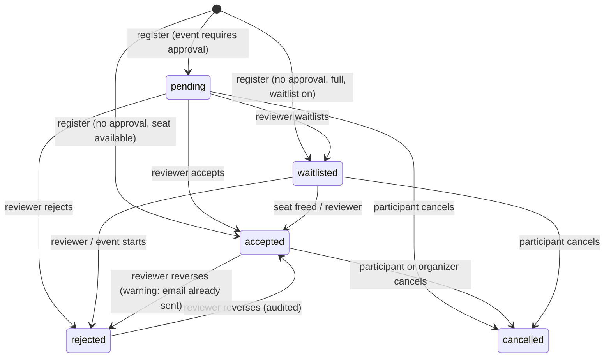

# Event Registration Lifecycle

| Field            | Value      |
| ---------------- | ---------- |
| **Last Updated** | 2026-10-02 |
| **Status**       | Draft      |

## 1. Registration today (CURRENT)

1. A signed-in user clicks *Register*; a modal shows their name (from `user_metadata`) and email.
2. The browser inserts `{ user_id, event_id, full_name, email }` into `event_registrations` (status defaults to `pending`).
3. The browser fires `send-registration-email` ("received, under review").
4. The single committee reviewer accepts or rejects in `/committee`; the browser updates `status` and fires `send-status-email`.
5. Registration is blocked in the UI when the event's translated status label is "Ended".

Problems: no uniqueness, no window/capacity, anyone can change statuses via the API, member/visitor badge by name matching, no cancellation, no attendance.

## 2. Target lifecycle (Proposed)

**Attendance** is a separate axis (KFUCS F-06): accepted registrants check in per session (one per scheduled day) by QR, online or manual marking; finalization writes `attendance_result` (`attended` / `absent`) and a frozen `attendance_percent` — see [event lifecycle §3a](./event-lifecycle.md#3a-attendance-and-certificates-kfucs-logic) and [ADR-012](../90-decisions/ADR-012-event-model-and-wizard-from-kfucs.md).

## 3. Rules

| # | Rule | Status |
| - | ---- | ------ |
| RG-1 | Registration requires a signed-in account with a confirmed email. | Confirmed (current behaviour) |
| RG-2 | **One registration per account per event**, enforced by a unique constraint. A cancelled registration may be re-activated by registering again while registration is open. | Proposed |
| RG-3 | Registration is possible only while the event is `published` and in the `registration_open` phase. | Proposed |
| RG-4 | Members-only events accept registrations only from active members. | Proposed — **OPEN Q-009** |
| RG-5 | Approval mode is a per-event setting (`requires_approval`, default **true** to match current practice). | Proposed — **OPEN Q-018** |
| RG-6 | If capacity is set: in approval mode, reviewers cannot accept beyond capacity; in auto mode, overflow goes to the waitlist (if enabled) or registration closes. | Proposed — **OPEN Q-029** |
| RG-7 | Name and email are **snapshotted from the profile** at registration time; participants cannot type someone else's email. | Proposed |
| RG-8 | Only reviewers scoped to the event's committee (or global approvers) can change a registration's status. | Proposed |
| RG-9 | Each decision records `decided_by`, `decided_at`, and an optional internal note. | Proposed |
| RG-10 | Participants see only their own registrations; reviewers see registrations of events in their scope. | Proposed |
| RG-11 | The registrant list shows a **member badge derived from the member record**, not from name matching. | Proposed |
| RG-12 | Participants may cancel until the event starts. | Proposed |
| RG-13 | Online meeting links are visible only to `accepted` registrants (and organizers). | Proposed |
| RG-14 | Check-in only for `accepted` registrations while the day's session is open (QR/online) or by an organizer (manual); one check-in per person per session. | Proposed (ADR-012) |
| RG-15 | Registration and decision emails are sent by the server after the database change commits, logged, and retryable; a failed email never rolls back the decision. | Proposed (KFUCS BR-1.6 lesson) |

## 4. Reviewer experience (Proposed)

- Per event: counts by status, capacity indicator, filter by status, member/non-member badge.
- Bulk accept / reject / waitlist with confirmation.
- Email delivery status per registrant (sent / failed / retry).
- CSV export of accepted registrants (personal data: restricted, audited).
