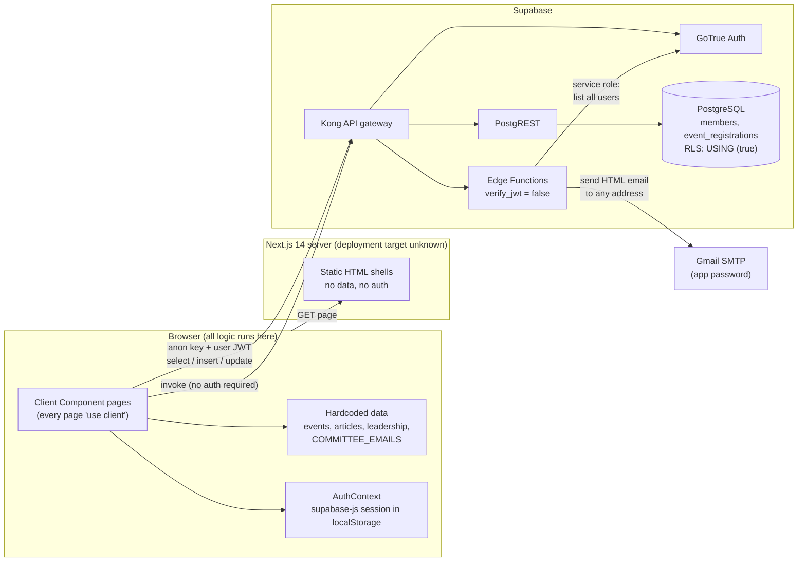

# Current Architecture (As-Is)

| Field            | Value      |
| ---------------- | ---------- |
| **Snapshot**     | 2026-10-02 |
| **Status**       | Draft      |

## 1. Overview

## 2. Characteristics

| Aspect | As-is |
| ------ | ----- |
| Rendering | Server sends a static shell; every page is a Client Component that renders hardcoded data or fetches from Supabase in `useEffect`. |
| Trust boundary | The **browser** decides what the user may see and do. The database accepts whatever the browser sends (open RLS). |
| Data access | Direct PostgREST calls from components; no data-access layer, no types. |
| Business logic | Inline in components (duplicated registration flow ×3). |
| Side effects | Emails sent by the browser calling unauthenticated Edge Functions after a write. |
| Auth | Browser-only session; server cannot identify users. |
| Configuration | Two public env vars (`NEXT_PUBLIC_SUPABASE_URL`, `NEXT_PUBLIC_SUPABASE_ANON_KEY`); Edge Function secrets `GMAIL_USER`, `GMAIL_APP_PASSWORD`. |
| Environments | Local Docker stack; one linked remote project (`sdc-members`); hosting unknown. |

## 3. Why it cannot be incrementally patched into the target

- The trust boundary is in the wrong place: authorization must move to RLS and the server, which changes every data access path.
- Hardcoded entities must become tables, which changes every page that displays them.
- Client-only rendering prevents SEO and server-side protection; the page shells must become Server Components.

The target therefore **keeps the visual layer** and **replaces the data, auth and logic layers** page by page (see [roadmap](../99-project-management/roadmap.md)).
