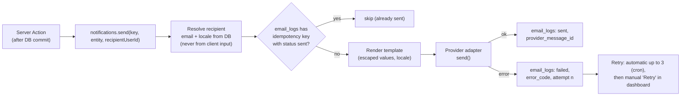

# Email Architecture

| Field            | Value      |
| ---------------- | ---------- |
| **Last Updated** | 2026-10-02 |
| **Status**       | Draft — provider pending [ADR-006](../90-decisions/ADR-006-email-provider.md) / **OPEN Q-010** |

## 1. Current (CURRENT / PROBLEM)

Two browser-invoked, unauthenticated Edge Functions send Arabic HTML emails through Gmail SMTP using an app password; a third checks whether an email exists. See [audit §7](../01-project/current-system-audit.md#7-edge-functions-and-email). Auth emails (confirm, reset) use Supabase's built-in mailer, which in hosted projects is rate-limited and intended for testing only unless custom SMTP is configured.

## 2. Two email paths (TARGET)

| Path | Emails | Sender | Templates |
| ---- | ------ | ------ | --------- |
| **Auth emails** | Confirm sign-up, reset password, change email, (invite/claim link) | Supabase Auth via **custom SMTP** of the chosen provider | Supabase Auth templates (versioned in `supabase/templates/`, referenced from `config.toml`), bilingual in one message (Arabic first) or by user metadata locale |
| **Application emails** | Membership, registration, event notifications ([catalogue](../03-business-domain/notification-rules.md)) | Next.js server module `lib/email` via provider HTTP API (or SMTP) | React Email / typed template functions with escaping, ar/en variants |

Both use the same sending domain (e.g., `noreply@<sdc-domain>`) with SPF, DKIM and DMARC records (**OPEN Q-017** — domain).

## 3. Application email design

| Component | Responsibility |
| --------- | -------------- |
| `lib/email/provider.ts` | Interface `send({ to, subject, html, text, tags, idempotencyKey })`; implementations: `ProviderX` (production/preview), `SmtpMailpit` (local), `Console` (tests) |
| `lib/email/templates/*` | One template per notification key, both locales, plain-text alternative |
| `modules/notifications` | `send()` orchestration, logging, idempotency, retries, quota awareness |
| `email_logs` table | One row per attempt ([entities/platform](../05-database/entities/platform.md)) |
| `api/cron/email-retry` | Re-attempts failed sends (bounded) |
| `api/webhooks/email` | Optional: delivery/bounce events from the provider |

Sending is **synchronous after commit** within the Server Action for single recipients (simple, immediate feedback), and **chunked** for bulk sends (≤ 20 per invocation, resumable), following the KFUCS lesson (BR-5.5).

## 4. Environments

| Environment | Auth emails | Application emails |
| ----------- | ----------- | ------------------ |
| Local | Supabase local SMTP → **Mailpit** (`http://127.0.0.1:54324`) | SMTP adapter → Mailpit (same inbox) |
| Preview / staging | Provider sandbox or restricted recipient allow-list | Provider with recipient allow-list (team only) |
| Production | Provider custom SMTP | Provider API |

## 5. Template rules

- Arabic RTL layout for `ar`, LTR for `en`; system font stack (web fonts unreliable in email).
- Brand header image hosted in the production public storage bucket or the site's `/public` (absolute URL from config — not hardcoded project refs).
- Every interpolated value HTML-escaped; URLs built server-side from config `SITE_URL`.
- Footer: community name, reason for receiving the email, contact address.
- No tracking pixels (**Proposed** — privacy).
