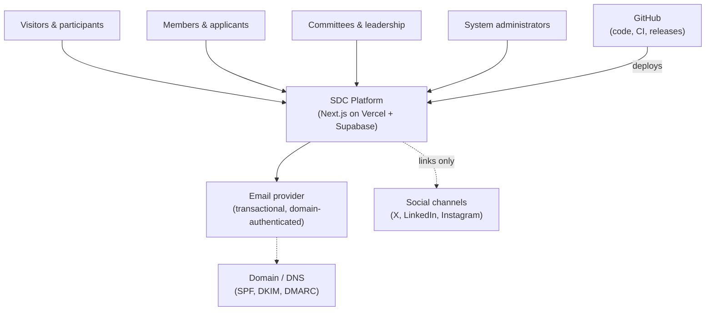
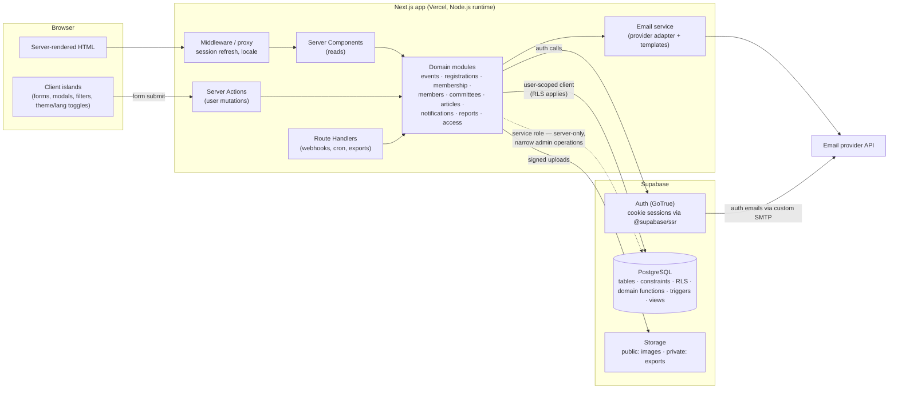
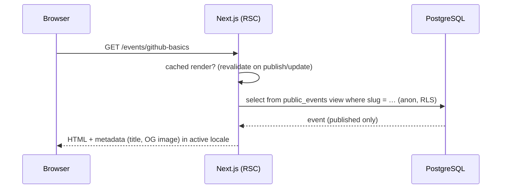
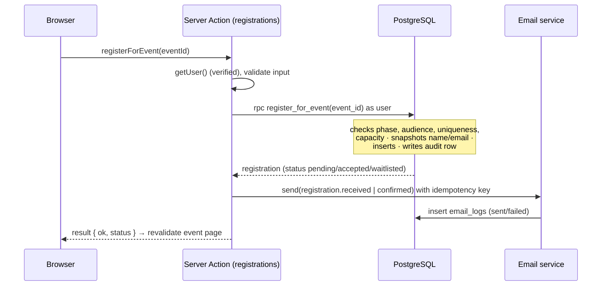
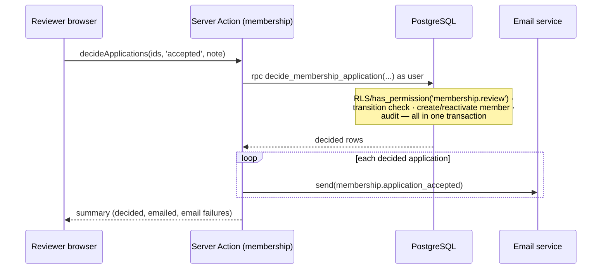

# Target Architecture

| Field            | Value      |
| ---------------- | ---------- |
| **Last Updated** | 2026-10-02 |
| **Status**       | Draft — see [ADR-001](../90-decisions/ADR-001-application-architecture.md) |

## 1. Architectural style

A **server-first modular monolith**: one Next.js application (App Router, TypeScript) deployed on Vercel, using Supabase as the backend platform (PostgreSQL with RLS, Auth, Storage). Business rules that protect data live in the **database** (constraints, RLS, transactional functions); orchestration and side effects live in **server-side modules** of the Next.js app. The browser receives rendered HTML and small interactive islands.

No microservices, message brokers, separate API servers or additional databases (principle PP-4).

## 2. System context

## 3. Containers

## 4. Responsibilities by layer

| Layer | Owns | Must not |
| ----- | ---- | -------- |
| **PostgreSQL** | Data integrity (FK, UNIQUE, CHECK), row-level authorization (RLS via `has_permission()`), atomic multi-step transitions (SQL functions), derived views for public data and reports, audit triggers | Send emails; call external services; encode UI concerns |
| **Domain modules (server)** | Input validation (Zod), orchestration (call DB function → then send email → log), mapping DB errors to domain errors, caching/revalidation | Re-implement rules already enforced by DB (they may pre-check for UX, but the DB is authoritative) |
| **Server Components** | Reading data for pages with the user's session; choosing what to render | Contain mutation logic |
| **Server Actions** | Entry point for authenticated form mutations from the app | Be called for public read endpoints; trust client-provided ids without authorization (RLS/permission check always applies) |
| **Route Handlers** | Machine-facing endpoints: email provider webhooks, scheduled jobs, CSV/file downloads | Duplicate Server Action logic (they call the same modules) |
| **Middleware / proxy** | Refresh Supabase session cookies; resolve locale; coarse redirects for unauthenticated access to `/dashboard` and `/account` | Make fine-grained authorization decisions (it lacks data; pages and DB enforce) |
| **Client islands** | Interactivity, optimistic UI, client-side validation for UX | Hold secrets; be the only enforcement of anything |
| **Supabase Edge Functions** | **Not used by default.** Allowed only for Supabase-native hooks or jobs that cannot run in Next.js (decided by ADR). The three existing functions are retired. | — |

## 5. Key flows

### 5.1 Public page read (e.g., `/events/[slug]`)

### 5.2 Registering for an event

### 5.3 Reviewer accepts a membership application

## 6. Cross-cutting concerns

| Concern | Approach | Detail |
| ------- | -------- | ------ |
| Authentication | Supabase Auth, cookie sessions with `@supabase/ssr`; `getUser()`/claims verification on the server | [authentication](../06-security/authentication.md) |
| Authorization | RBAC + committee scope + ownership; `has_permission()` in RLS and server modules | [authorization model](../06-security/authorization-model.md) |
| Validation | Zod schemas per module shared by forms and actions; DB constraints as last line | [server logic](./server-logic-and-data-access.md#4-validation) |
| Errors | Typed result objects with stable error codes; mapped from Postgres codes | [server logic](./server-logic-and-data-access.md#5-error-handling) |
| Logging | Structured server logs (Vercel), `audit_logs`, `email_logs` | [operations](../08-infrastructure/operations.md) |
| Caching | Static/ISR for public pages with tag-based revalidation on content change | [frontend](./frontend-architecture.md#5-data-fetching-and-caching) |
| Files | Supabase Storage: public bucket for published images; private bucket for exports; server-generated paths | [security model](../06-security/security-model.md#7-file-uploads) |
| Email | Provider adapter + templates + log + retry | [email architecture](./email-architecture.md) |
| i18n | Locale-aware routing, message catalogues, bilingual content columns | [frontend](./frontend-architecture.md#3-internationalization) |
| Scheduled work | Prefer derived state (no jobs). When needed: Vercel Cron → Route Handler (daily on free tier) | [operations](../08-infrastructure/operations.md) |

## 7. Portability

Supabase is open-source PostgreSQL + standard JWT auth. Keeping business rules in SQL migrations and server modules behind a thin data-access layer means the app could move to self-hosted Supabase or another Postgres host without rewriting the domain. No Vercel-proprietary services are required (Vercel Cron is replaceable by any scheduler hitting a protected endpoint).
