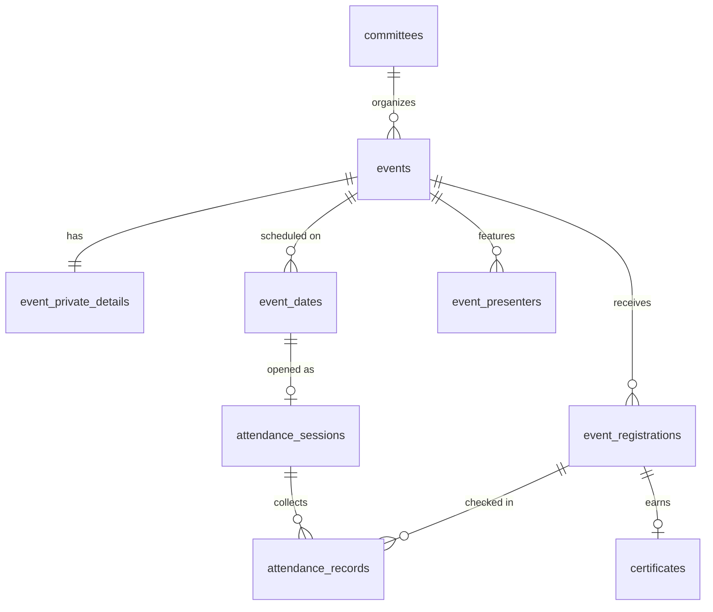

# Entities — Events, Registrations, Attendance, Certificates

| Field            | Value      |
| ---------------- | ---------- |
| **Last Updated** | 2026-10-02 |
| **Status**       | Draft (Proposed) — KFUCS-aligned per [ADR-012](../../90-decisions/ADR-012-event-model-and-wizard-from-kfucs.md); **OPEN Q-005, Q-009, Q-018, Q-019, Q-020, Q-029, Q-040** |

Business rules: [event lifecycle](../../03-business-domain/event-lifecycle.md), [registration lifecycle](../../03-business-domain/registration-lifecycle.md). Field-by-field origin: [KFUCS alignment](../../98-reference/kfucs-event-model-alignment.md).

## 1. `events`

| Column | Type | Null | Default / Constraint | Cls | Description |
| ------ | ---- | ---- | -------------------- | --- | ----------- |
| `id` | uuid | no | PK | P | — |
| `legacy_id` | integer | yes | UNIQUE | P | Old hardcoded id (1–6) for redirects and registration migration |
| `slug` | text | no | UNIQUE, `^[a-z0-9-]+$` | P | URL key; locked after first publish |
| `committee_id` | uuid | no | FK → `committees` RESTRICT | P | Organizer (**OPEN Q-005**: community-wide events?) |
| `type` | text | no | CHECK in (`workshop`,`bootcamp`,`hackathon`,`meeting`,`meetup`,`talk`) | P | KFUCS four + SDC two (**OPEN Q-040**) |
| `status` | text | no | `'draft'`; CHECK in (`draft`,`pending_review`,`changes_requested`,`published`,`cancelled`,`completed`,`archived`) | P* | *Only published/cancelled/completed/archived are public |
| `title_ar` / `title_en` | text | no / yes | 3–200 | P | Arabic required |
| `summary_ar` / `summary_en` | text | yes | ≤ 500 | P | Cards, SEO description |
| `description_ar` / `description_en` | text | yes | ≤ 5000, Markdown | P | — |
| `schedule_type` | text | no | `'single_day'`; CHECK in (`single_day`,`consecutive_range`,`specific_dates`) | P | KFUCS |
| `start_date` | date | yes | — | P | Null only while a draft says "to be announced" |
| `end_date` | date | yes | CHECK `end_date >= start_date`; required for `consecutive_range` | P | — |
| `start_time`, `end_time` | time | yes | same-day: `end_time > start_time` | P | Asia/Riyadh |
| `location_mode` | text | no | `'in_person'`; CHECK in (`in_person`,`online`,`hybrid`) | P | KFUCS |
| `location_ar`, `location_en` | text | yes | ≤ 500 | P | Venue name or "Online" |
| `map_url` | text | yes | `^https://` | P | SDC addition |
| `seats` | integer | yes | CHECK `> 0`; null = unlimited | P | KFUCS |
| `registration_start_at` | timestamptz | yes | — | P | SDC addition; null = open at publish |
| `registration_end_at` | timestamptz | yes | must be after the first day's start (server-side) | P | KFUCS; may be extended while in progress |
| `requires_approval` | boolean | no | true | P | RG-5 (**OPEN Q-018**) |
| `waitlist_enabled` | boolean | no | false | P | **OPEN Q-029** |
| `audience` | text | no | `'public'`; CHECK in (`public`,`members_only`) | P | **OPEN Q-009** |
| `goals` | jsonb | no | `{"ar":[],"en":[]}`; ≤ 15 each; ≥ 1 Arabic goal to submit | P | KFUCS |
| `faq` | jsonb | no | `[]`; items `{q_ar,q_en,a_ar,a_en}`; ≤ 15 | P | KFUCS |
| `details` | jsonb | no | `'{}'` | P | SDC blocks `{target_audience, requirements, responsibilities, deliverables, benefits}`, each `{ar[], en[]}` |
| `display_config` | jsonb | no | `{"show_presenters":false,"show_goals":true,"show_faq":true,"show_seats_remaining":false,"auto_close_registration":true,"show_details":true}` | P | KFUCS keys + `show_details` |
| `cover_image_path` | text | yes | storage path in `public-media` | P | — |
| `awards_ar`, `awards_en` | text | yes | — | P | SDC addition |
| `certificate_available` | boolean | no | false | P | Shown publicly; issuance per §8 (**OPEN Q-020**) |
| `contact_email`, `contact_phone` | text | yes | email; E.164 | P | SDC addition |
| `submission_note` | text | yes | — | I | Note from the submitter |
| `submitted_by`, `submitted_at` | uuid, timestamptz | yes | — | I | — |
| `reviewed_by`, `reviewed_at`, `review_note` | uuid, timestamptz, text | yes | note ≥ 10 chars when requesting changes | I | — |
| `published_at` | timestamptz | yes | set once | P | — |
| `cancelled_at`, `cancel_reason` | timestamptz, text | yes | reason required when cancelled | P | — |
| `attendance_finalized_at`, `attendance_finalized_by` | timestamptz, uuid | yes | — | I | KFUCS F-36: required before `completed` when sessions exist |
| `completed_at`, `archived_at` | timestamptz | yes | — | P | — |
| `created_by`, `created_at`, `updated_at` | — | — | standard | I | — |

Indexes: `slug` unique; `(status, start_date desc)`; partial `(start_date) where status = 'published'`; `(committee_id, status)`.

**Publish guards** (in `transition_event()`, not table CHECKs — see the KFUCS `NOT VALID` lesson):
- `start_date` is set.
- Location is set for in-person and hybrid events.
- `group_link` is set.
- At least one Arabic goal.

Derived (view `public_events`):
- `phase` per [event lifecycle §4](../../03-business-domain/event-lifecycle.md#4-timing-phase-derived-never-stored)
- `last_date` (the maximum of `event_dates`)
- `accepted_count`
- `seats_left`

RLS: anon/authenticated read `published`, `cancelled`, `completed`, `archived`; committee roles with `events.view_drafts` read their committee's non-public events; writes via `transition_event()` and direct updates only for editable states with `events.edit` in scope.

## 2. `event_private_details`

Separated because Postgres RLS is row-level, not column-level: links must be readable only by accepted registrants and organizers while the event row is public.

| Column | Type | Null | Constraint | Description |
| ------ | ---- | ---- | ---------- | ----------- |
| `event_id` | uuid | no | PK, FK → `events` ON DELETE CASCADE | — |
| `meeting_url` | text | yes | `^https://` | Online/hybrid link (optional, KFUCS 2026-09-16 rule) |
| `meeting_notes` | text | yes | ≤ 1000 | Passcode, joining instructions |
| `group_link` | text | yes | `^https://`; required to publish | WhatsApp/Telegram/Discord group, sent in the acceptance email |
| `organizer_notes` | text | yes | — | Internal notes |
| `updated_at` | timestamptz | no | now() | — |

RLS: read if `has_permission('events.edit', committee)` **or** the user has an `accepted` registration for the event; write with `events.edit` in scope.

## 3. `event_dates`

One row per scheduled day, which replaces the KFUCS `dates_array`. The trigger `sync_event_dates()` regenerates rows from `schedule_type`/`start_date`/`end_date` (single day and range) or from the wizard's date list (specific dates).

| Column | Type | Null | Constraint | Description |
| ------ | ---- | ---- | ---------- | ----------- |
| `id` | uuid | no | PK | — |
| `event_id` | uuid | no | FK → `events` ON DELETE CASCADE | — |
| `event_date` | date | no | UNIQUE (`event_id`, `event_date`) | — |
| `starts_at`, `ends_at` | time | yes | defaults to the event's times | Per-day override (rare) |

Removing a date that already has a finalized session is **blocked** (KFUCS F-20).

## 4. `event_presenters`

| Column | Type | Null | Constraint | Description |
| ------ | ---- | ---- | ---------- | ----------- |
| `id` | uuid | no | PK | — |
| `event_id` | uuid | no | FK → `events` CASCADE | — |
| `profile_id` | uuid | yes | FK → `profiles` SET NULL | Presenter with an account |
| `guest_name_ar`, `guest_name_en`, `guest_title_ar`, `guest_title_en`, `guest_photo_path`, `guest_link` | text | yes | required when `profile_id` is null | Guest presenter (SDC adaptation) |
| `role` | text | no | `'presenter'`; CHECK in (`presenter`,`mentor`,`judge`,`host`) | — |
| `sort_order` | smallint | no | 0 | — |

Limit: 10 per event (KFUCS). Public read follows the event; write with `events.edit` in scope.

## 5. `event_registrations`

| Column | Type | Null | Default / Constraint | Cls | Description |
| ------ | ---- | ---- | -------------------- | --- | ----------- |
| `id` | uuid | no | PK | R | — |
| `legacy_id` | integer | yes | UNIQUE | R | Old serial id |
| `event_id` | uuid | no | FK → `events` RESTRICT | R | — |
| `user_id` | uuid | yes | FK → `profiles` SET NULL | R | Null only after account deletion (anonymized) |
| `status` | text | no | CHECK in (`pending`,`accepted`,`rejected`,`waitlisted`,`cancelled`) | R | **Decision axis** only (KFUCS F-06) |
| `attendance_result` | text | yes | CHECK in (`attended`,`absent`); written by finalization only | R | **Attendance axis** roll-up |
| `attendance_percent` | smallint | yes | 0–100; frozen at finalization | R | From `attendance_percent()` |
| `full_name_snapshot` | text | no | filled by trigger from profile | R | — |
| `email_snapshot` | text | no | filled by trigger from profile | R | — |
| `was_member` | boolean | no | filled by trigger (`is_active_member`) | R | Participation reports, member badge |
| `answers` | jsonb | no | `'{}'` | R | Optional registration questions (future) |
| `decided_by`, `decided_at`, `decision_note` | — | yes | — | R | — |
| `notify_status` | text | no | `'not_sent'`; CHECK in (`not_sent`,`sending`,`sent`,`failed`) | R | KFUCS claim-before-send |
| `cancelled_by`, `cancelled_at` | — | yes | soft cancel (KFUCS F-27) | R | — |
| `created_at`, `updated_at` | — | — | standard | R | — |

Constraints: UNIQUE (`event_id`, `user_id`); insert only through `register_for_event()` (no direct INSERT grant).

Indexes: `(event_id, status)`, `(user_id)`.

RLS: participant reads own; reviewers (`registrations.review` in the event's committee scope, or global) read and decide; nobody updates directly — transitions via functions.

## 6. `attendance_sessions`

| Column | Type | Null | Constraint | Description |
| ------ | ---- | ---- | ---------- | ----------- |
| `id` | uuid | no | PK | — |
| `event_id` | uuid | no | FK → `events` CASCADE | — |
| `event_date_id` | uuid | no | FK → `event_dates` RESTRICT; UNIQUE | One session per scheduled day |
| `status` | text | no | CHECK in (`scheduled`,`open`,`closed`,`finalized`) | — |
| `opened_at`, `opened_by`, `closed_at` | — | yes | — | Self check-in window (online/QR) |
| `qr_secret` | text | yes | rotating token seed; never sent to clients except the organizer screen | QR check-in |
| `finalized_at`, `finalized_by` | — | yes | after finalization records are read-only (corrections audited) | KFUCS |

## 7. `attendance_records`

| Column | Type | Null | Constraint | Description |
| ------ | ---- | ---- | ---------- | ----------- |
| `id` | uuid | no | PK | — |
| `session_id` | uuid | no | FK → `attendance_sessions` CASCADE | — |
| `registration_id` | uuid | no | FK → `event_registrations` CASCADE; **UNIQUE (`registration_id`, `session_id`)** | KFUCS F-23 |
| `method` | text | no | CHECK in (`qr`,`online`,`manual`) | — |
| `checked_in_at` | timestamptz | no | now() | — |
| `recorded_by` | uuid | yes | null for self check-in | — |

Only `accepted` registrations can check in (function guard). `attendance_percent(registration_id)` = attended ÷ **finalized** sessions whose `event_date_id` is still on the schedule (KFUCS F-19). It is the only formula; the UI, reports and certificates all call it.

## 8. `certificates` (**OPEN Q-020**: whether SDC issues them, and the threshold)

| Column | Type | Null | Constraint | Description |
| ------ | ---- | ---- | ---------- | ----------- |
| `id` | uuid | no | PK | Also the public verification id |
| `registration_id` | uuid | no | FK → `event_registrations` CASCADE; UNIQUE | — |
| `event_id`, `user_id` | uuid | no / yes | FKs | Denormalized for listing |
| `recipient_name`, `recipient_email` | text | no | snapshot at issue | — |
| `attendance_percent`, `sessions_attended`, `sessions_expected` | smallint | no | frozen snapshot (KFUCS BR-4.6) | — |
| `pdf_path` | text | yes | `certificates` private bucket | Null while pending |
| `delivery_status` | text | no | CHECK in (`pending`,`generated`,`sent`,`failed`) | — |
| `attempt_count`, `last_attempt_at`, `sent_at`, `error_code` | — | — | — | Retry bookkeeping |
| `issued_at` | timestamptz | no | now() | — |

Eligibility = `attendance_result = 'attended'` and `attendance_percent >= site_settings.certificate_threshold` (KFUCS default **70**).

## 9. Functions

| Function | Purpose |
| -------- | ------- |
| `transition_event(event_id, action, note)` | All status changes with guards ([event lifecycle §3](../../03-business-domain/event-lifecycle.md#3-editorial-lifecycle-stored-status)) |
| `register_for_event(event_id, answers)` | Phase, seat and audience checks; snapshots |
| `decide_registrations(ids[], status, note)` | Bulk decision; queues emails |
| `open_session(event_date_id)` / `close_session(id)` | Check-in window |
| `check_in(session_id, token \| null)` | Self check-in (QR token or online window); idempotent |
| `record_attendance(session_id, registration_ids[], present bool)` | Manual marking |
| `finalize_session(session_id)` / `finalize_event_attendance(event_id)` | Freezes attendance; roll-up into `attendance_result` + `attendance_percent` |
| `attendance_percent(registration_id)` | Canonical percentage |
| `issue_certificates(event_id)` | Creates pending certificates for eligible registrations |
