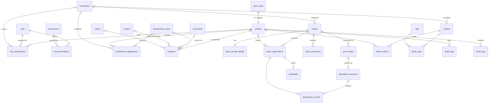

# Target Entity Model

| Field            | Value      |
| ---------------- | ---------- |
| **Last Updated** | 2026-10-02 |
| **Status**       | Draft (Proposed) |

## 1. ERD

## 2. Table inventory

| Table | Area | Purpose | Est. rows (3 yrs) | Doc |
| ----- | ---- | ------- | ----------------- | --- |
| `profiles` | Identity | One per account: names, locale, mirrored email | 2–5k | [identity](./entities/identity-and-access.md) |
| `roles` | Access | Role catalogue (seeded) | ~10 | same |
| `permissions` | Access | Permission catalogue (seeded) | ~40 | same |
| `role_permissions` | Access | Role → permission grants (seeded, editable by admin) | ~150 | same |
| `role_assignments` | Access / Org | Positions: user + role + optional committee + term | 100s | same |
| `committees` | Organization | Committees | ~5–10 | [organization](./entities/organization.md) |
| `membership_cycles` | Membership | Intake windows | ~1/year | [membership](./entities/membership.md) |
| `membership_applications` | Membership | Applications per cycle | 100s–1000s | same |
| `members` | Membership | Member records and directory profiles | 100s–1000s | same |
| `universities`, `majors`, `tracks` | Reference | Managed taxonomies | 10s–100s | [reference data](./entities/reference-data.md) |
| `tags` | Reference | Article tags | 10s | same |
| `events` | Activities | Events | 10s/year | [events](./entities/events.md) |
| `event_private_details` | Activities | Meeting links and organizer-only info | = events | same |
| `event_dates` | Activities | One row per scheduled day (KFUCS schedule model) | 10s/year | same |
| `event_presenters` | Activities | Presenters (accounts or guests) | 10s/year | same |
| `event_registrations` | Activities | Registrations (decision axis) + attendance roll-up | 1000s | same |
| `attendance_sessions` | Activities | One check-in session per scheduled day | = event_dates | same |
| `attendance_records` | Activities | Check-ins (QR / online / manual), unique per person per session | 1000s | same |
| `certificates` | Activities | Eligibility-based certificates with frozen snapshot (**OPEN Q-020**) | 100s | same |
| `articles` | Content | Articles/threads | 10s/year | [content](./entities/content.md) |
| `article_authors` | Content | Ordered authors (users or display names) | — | same |
| `article_tags` | Content | Tagging | — | same |
| `audit_logs` | Platform | Business audit trail | 10k+ | [platform](./entities/platform.md) |
| `email_logs` | Platform | Every email attempt | 10k+ | same |
| `site_settings` | Platform | Small key/value configuration (social links, contact email) | ~10 | same |

## 3. Views and functions (read models)

| Object | Kind | Exposes |
| ------ | ---- | ------- |
| `public_events` | view (`security_invoker`) | Published/completed/cancelled/archived events with public columns + derived timing phase |
| `public_articles` | view | Published articles with authors and tags |
| `member_directory` | view | Active, opted-in members, public columns only |
| `current_positions` | view | Active role assignments with public position roles (leadership page) |
| `event_registration_counts` | view | Counts per event and status (for capacity and dashboards) |
| `committee_stats`, `community_stats` | functions | Report metrics ([reporting model](../03-business-domain/reporting-model.md)) |

## 4. Domain functions (write models)

| Function | Transition |
| -------- | ---------- |
| `register_for_event(event_id)` | Create/reactivate registration with all guards (BR-REG-001..005) |
| `cancel_registration(registration_id)` | Participant/organizer cancellation |
| `decide_registrations(ids[], decision, note)` | Accept/reject/waitlist with capacity lock |
| `open_session` / `check_in` / `record_attendance` / `finalize_session` / `finalize_event_attendance` | Attendance sessions (KFUCS model, [ADR-012](../90-decisions/ADR-012-event-model-and-wizard-from-kfucs.md)) |
| `attendance_percent(registration_id)` | Canonical attendance percentage (single formula) |
| `issue_certificates(event_id)` | Pending certificates for eligible registrations |
| `transition_event(event_id, action, note)` | submit / approve / request_changes / withdraw / cancel / complete |
| `transition_article(article_id, action, note)` | submit / publish / request_changes / archive / restore |
| `submit_membership_application(cycle_id, payload)` | Create application with cycle-open guard |
| `decide_membership_applications(ids[], decision, note)` | Decision + member creation/reactivation |
| `assign_role(user_id, role_key, committee_id, starts_at, ends_at)` / `end_role_assignment(id, reason)` | With anti-escalation and last-admin guards |
| `claim_legacy_member(token)` | Link a legacy member record to the signed-in account |
