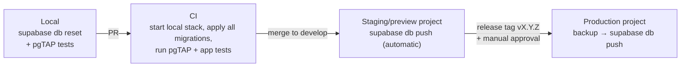

# Migration Strategy

| Field            | Value      |
| ---------------- | ---------- |
| **Last Updated** | 2026-10-02 |
| **Status**       | Draft — see [ADR-003](../90-decisions/ADR-003-database-migration-strategy.md) |

## 1. Rules

| # | Rule |
| - | ---- |
| MG-1 | Every schema change is a SQL migration in `supabase/migrations/`, created with `supabase migration new <name>`. |
| MG-2 | Never edit a migration that has been applied to any shared environment; write a new one. |
| MG-3 | A migration that creates a table also enables RLS, defines its policies and grants, and adds comments — in the same file. |
| MG-4 | Migrations are forward-only. "Rollback" = a new corrective migration, plus restore from backup for data loss. |
| MG-5 | Destructive changes (drop column/table) happen in a **later release** than the change that stops using them (expand → migrate → contract). |
| MG-6 | Local schema is always reproducible with `supabase db reset` (migrations + `supabase/seed.sql`). |
| MG-7 | `supabase/seed.sql` contains **synthetic** data only and runs only locally/preview. The current `seed_tables.sql` is retired (it deletes data). |
| MG-8 | Production-content data migrations (e.g., the six existing events and articles) are migrations, idempotent (`on conflict do nothing` by `legacy_id`), so every environment converges. |
| MG-9 | Generated TypeScript types are regenerated and committed with each migration. |
| MG-10 | Studio/dashboard edits on shared environments are prohibited; if an emergency edit happens, capture it immediately with `supabase db diff` into a migration. |

## 2. Promotion across environments

Details of environments and secrets: [environments](../08-infrastructure/environments.md), [deployment](../08-infrastructure/deployment.md).

## 3. Transition from today's database

The remote project already holds real data (likely members and registrations) created without migrations. Steps:

| Step | Action | Phase |
| ---- | ------ | ----- |
| 1 | **Inspect and back up** the remote project: `supabase db dump --linked` (schema) and a data dump stored privately (never committed). Record differences in [current schema](./current-schema.md). Answer **Q-025/Q-026**. | 0 |
| 2 | **Containment** (if production has the open policies): one reviewed migration that drops `"Allow write members"`, drops `"Allow read/insert/update registrations"` and replaces them with owner-scoped policies; revoke excess grants. Apply manually with approval; capture as the first versioned migration. | 0 (containment track) |
| 3 | **Baseline**: a migration reproducing the current remote schema exactly (`<ts>_baseline_legacy_schema.sql`), marked as applied on remote with `supabase migration repair --status applied`. From here on, history is consistent everywhere. | 1 |
| 4 | **Expand**: new schema (access, committees, profiles, reference data, cycles, applications, events, registrations v2, articles, platform tables) created alongside legacy tables. Legacy tables renamed with a `legacy_` prefix. | 1–3 |
| 5 | **Migrate data**: profiles backfilled for existing `auth.users`; legacy members → `members` (`joined_via = 'legacy'`, taxonomy mapped to reference tables); hardcoded events/articles → `events`/`articles` with `legacy_id`; legacy registrations → new registrations linked via `events.legacy_id` and `user_id`. Reconcile row counts; report unmapped rows. | 3 |
| 6 | **Switch** application code to the new tables (per module), with redirects from legacy ids. | 3 |
| 7 | **Contract**: drop `legacy_*` tables one release after the switch, after a fresh backup. | 4 |

## 4. Migration review checklist

- [ ] RLS enabled, policies match the [policy matrix](./rls-security-model.md#3-policy-matrix-target), grants minimal
- [ ] FKs, CHECKs, UNIQUEs and indexes per [conventions](./conventions.md)
- [ ] pgTAP tests added/updated and passing
- [ ] Types regenerated
- [ ] Backward compatible with the currently deployed app version (expand/contract)
- [ ] Data migration idempotent and reconciled
- [ ] Docs in `05-database/entities` updated
