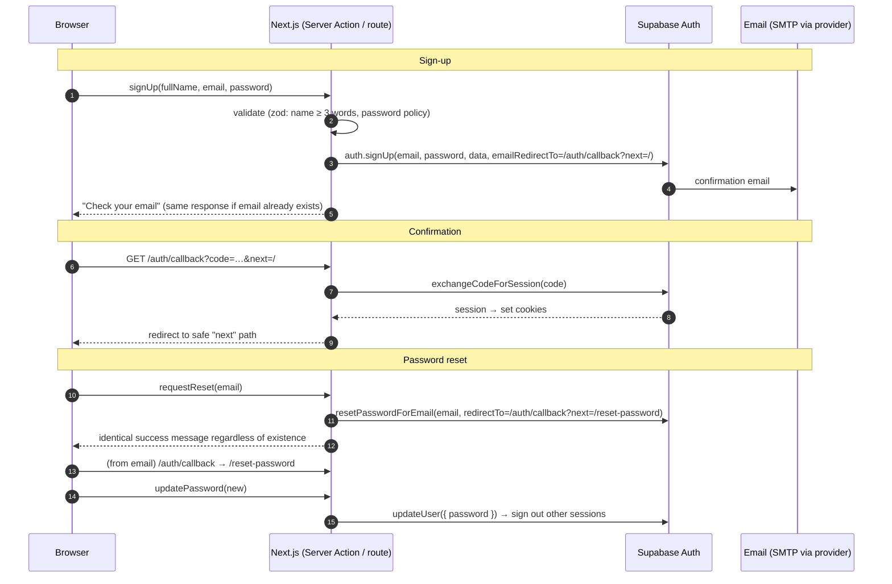

# Authentication

| Field            | Value      |
| ---------------- | ---------- |
| **Last Updated** | 2026-10-02 |
| **Status**       | Draft      |

## 1. Current (CURRENT)

Browser-only supabase-js session in `localStorage`; sign-up/sign-in/reset called from Client Components; server cannot identify users; validation client-side only; `check-email-exists` reveals registered emails. Details: [audit §5](../01-project/current-system-audit.md#5-authentication).

## 2. Target design

| Aspect | Decision |
| ------ | -------- |
| Provider | Supabase Auth (email + password). Social login not in scope (could be added later). |
| Session transport | HTTP-only cookies managed by `@supabase/ssr` (server, middleware and browser clients). |
| Session refresh | Middleware/proxy refreshes the session on each request to app routes. |
| Server identity | Server code obtains the user via a verified call (`auth.getUser()`, or `auth.getClaims()` with asymmetric JWT signing keys) — never trust an unverified cookie decode. |
| Email confirmation | Required (`enable_confirmations = true`). |
| Password policy | Server-enforced: min 8, requires lower, upper, digit, symbol (matches the current UI rule) — set in Auth config. Leaked-password protection if available on the plan. |
| Profile | Created by trigger on `auth.users` insert (name from sign-up metadata, locale). |
| Account ≠ membership | Sign-up never creates a member (BR-MBR-001). |
| Admin MFA | TOTP MFA **required** for `system_admin` and recommended for leadership (Supabase Auth MFA + AAL2 check in dashboard layout). **Proposed.** |
| Session lifetime | Access token 1 h; refresh-token rotation on; inactivity timeout per Auth settings. |

## 3. Flows

| Flow | Rules |
| ---- | ----- |
| Sign-in | Server Action; generic error on failure; specific message only for "email not confirmed" (does not leak existence beyond what Auth already returns — **Proposed**: show a "resend confirmation" link). Redirect to validated `next`. |
| Sign-out | Server Action → `auth.signOut()` → redirect home. |
| Email change | Secure email change (confirm on both addresses). |
| Account deletion | Request flow; executed by server with service role after confirmation; anonymization per [privacy](./data-protection-and-privacy.md). |
| Legacy member claim | Leadership triggers a claim email to `legacy_claim_email`; the link (signed, single-use, expiring) lets the recipient sign in/sign up and links the member record (`claim_legacy_member`). |

## 4. Route protection

| Route group | Protection |
| ----------- | ---------- |
| Public | None |
| `(auth)` pages | Redirect signed-in users away |
| `/account/*` | Middleware redirects unauthenticated users to `/login?next=…`; pages call `requireUser()` |
| `/dashboard/*` | `requireUser()` + `requireAnyPermission([...])` in the layout; each page/action checks its own permission; MFA AAL2 for admin pages |

## 5. Auth configuration (to version in `supabase/config.toml`)

| Setting | Value |
| ------- | ----- |
| `site_url` | `http://127.0.0.1:3000` (local); env-specific on hosted projects |
| `additional_redirect_urls` | Local, preview wildcard (`https://*-<team>.vercel.app/**`), production domain |
| `enable_signup` | true |
| `[auth.email] enable_confirmations` | true |
| `double_confirm_changes` / secure email change | true |
| `minimum_password_length` | 8 |
| `password_requirements` | `lower_upper_letters_digits_symbols` |
| `[auth.rate_limit]` | Defaults reviewed; email sends limited per hour |
| `[auth.email.smtp]` | Hosted: provider SMTP credentials (from secrets). Local: Mailpit |
| `[auth.email.template.*]` | `supabase/templates/*.html` (bilingual, branded) |
| `[auth.mfa.totp]` | enroll/verify enabled |

The current `config.toml` contains none of these (CLI defaults apply) — fixing that is a Phase 1 task.
