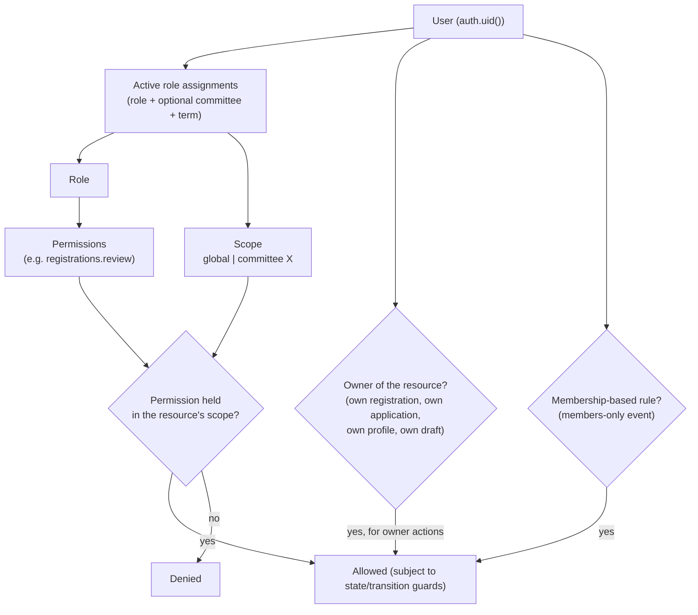

# Authorization Model — RBAC + Scope + Ownership

| Field            | Value      |
| ---------------- | ---------- |
| **Last Updated** | 2026-10-02 |
| **Status**       | Draft — [ADR-004](../90-decisions/ADR-004-authorization-model.md) Proposed |

## 1. Current (CURRENT / PROBLEM)

A hardcoded email array checked in two Client Components; no roles in the database; no server or database enforcement; no committee scope; no ownership checks. See [audit §6](../01-project/current-system-audit.md#6-authorization).

## 2. The model

An action is allowed when **any** of the following grants it, and the database agrees:

| Concept | Meaning | Stored in |
| ------- | ------- | --------- |
| **Role** | Named bundle of permissions; also an organizational position | `roles` |
| **Permission** | `<resource>.<action>` key | `permissions`, `role_permissions` |
| **Scope** | `global` roles apply everywhere; `committee` roles apply to resources of that committee | `roles.scope`, `role_assignments.committee_id` |
| **Term** | Assignments are active only between `starts_at` and `ends_at` | `role_assignments` |
| **Ownership** | Implicit rights over one's own records — no role needed | Rules in RLS (`user_id = auth.uid()`) |
| **Membership** | Being an active member enables member-only capabilities | `members.status` |
| **State guards** | Even with permission, actions are limited by lifecycle state | Domain functions |

### 2.1 Why not roles only (KFUCS style)?

KFUCS stores one `role` and one `committee_id` per profile and checks role arrays in code. Its own audit (F-53, F-10, F-51) found eight drifting copies of role lists and access bugs. SDC instead checks **permissions**, so changing what a role may do is a data change in one place, and supports **multiple simultaneous positions with terms** (observed need: leaders who are also members; advisor = former leader).

### 2.2 Why not a JWT custom claim?

Putting roles/permissions into the access token (Supabase custom access token hook) makes checks cheaper but stale for up to the token lifetime after a role change. SDC's data volume is small, so permissions are evaluated **fresh in the database** per request via `private.has_permission()`. The server loads the user's permission set once per request for UI decisions. This can be revisited if performance requires it.

## 3. Enforcement layers

| Layer | What it does | Is it security? |
| ----- | ------------ | --------------- |
| UI (components) | Hides navigation and buttons the user cannot use (`can()` on the server-provided permission set) | **No** — UX only |
| Middleware / proxy | Redirects anonymous users away from `/account` and `/dashboard` | Coarse |
| Server (layouts, pages, Server Actions, Route Handlers) | `requirePermission(key, scope)` before rendering protected data or performing actions; returns `FORBIDDEN` | **Yes** |
| Database (RLS + functions + constraints) | Final authority: rows invisible / writes rejected regardless of caller | **Yes — authoritative** |

Every permission-protected operation must be enforced at **both** the server and the database. Tests cover the database layer directly (pgTAP) so that a server bug cannot open access.

## 4. Role catalogue (Proposed)

| Role | Scope | Organizational meaning | Default capabilities (summary) |
| ---- | ----- | ---------------------- | ------------------------------ |
| `system_admin` | global | Technical administrator (not a position) | Everything, incl. role management and audit; MFA required |
| `founder` | global | Founder | Community-wide reports; read-only oversight of committees, events, membership statistics — **no** approval or admin powers by default (**OPEN Q-032**) |
| `community_leader` | global | Community leader | Approve/publish events and articles; run membership intake; manage committees and committee heads; all reports |
| `advisor` | global | Advisor | Community-wide reports (read-only) |
| `committee_head` | committee | Head of committee X | Full operational control of committee X: events (create→submit→cancel/complete), registrations review/attendance/export, articles (publish), committee members, committee reports |
| `committee_deputy` | committee | Deputy head of X | Same as head except managing committee members |
| `committee_member` | committee | Member of X | Draft events and articles for X; view X's drafts |

Implicit (no role):

| Actor | Capabilities |
| ----- | ------------ |
| Anonymous | Read public content |
| Signed-in user | Own profile; register for public events; own registrations; apply for membership during an open cycle; own applications |
| Active member | Member-only events; own member profile and directory visibility |

The full matrix: [permission catalog](./permission-catalog.md).

## 5. Guards

| Guard | Rule |
| ----- | ---- |
| Anti-escalation | A user may assign only roles whose every permission they themselves hold in the same scope; only `system_admin` can assign `system_admin`, `community_leader`, `founder`, `advisor` (**Proposed**) |
| Last admin | The last active `system_admin` assignment cannot be ended |
| Self-assignment | Users cannot create or extend assignments for themselves (except `system_admin` bootstrap via migration/CLI) |
| Membership prerequisite | Committee roles require an active member record |
| Term integrity | Overlapping duplicate assignments of the same role/scope for the same user are rejected |

## 6. Bootstrap

The first `system_admin` assignment(s) are created by a one-off, reviewed SQL script run by a maintainer (not committed with real user ids — parameterized), after which all assignments happen through the admin UI. At least two system admins (NFR-OPS-005).

## 7. Mapping from today

| Today | Target |
| ----- | ------ |
| `COMMITTEE_EMAILS` contains the reviewer | That user receives the appropriate role assignment (e.g., `committee_head` of the right committee, or `community_leader`) — **OPEN Q-039** |
| Hardcoded founders/leader/advisor/leads | Role assignments with `display_title_*` where needed ("Head of Projects") |
| `/committee` page | `/dashboard/events/[id]/registrations`, scoped by committee |
