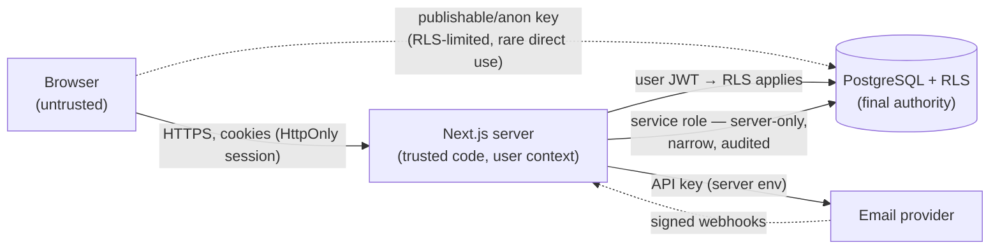

# Security Model

| Field            | Value      |
| ---------------- | ---------- |
| **Last Updated** | 2026-10-02 |
| **Status**       | Draft      |

## 1. Assets

| Asset | Why it matters |
| ----- | -------------- |
| Personal data (names, emails, phones, academic info, applications) | Privacy of members/participants; legal exposure (PDPL) |
| Community reputation (brand, sending domain) | Phishing in SDC's name damages trust |
| Integrity of decisions (acceptances, membership, roles) | Fairness; prevents self-acceptance and privilege escalation |
| Content integrity (events, articles, leadership display) | Defacement risk |
| Credentials and keys (service role, email provider, Vercel/Supabase accounts) | Full compromise |
| Availability on free tiers | Abuse can exhaust quotas (email, egress) |

## 2. Trust boundaries

Everything arriving from the browser — ids, roles, emails, statuses, prices of anything — is untrusted input.

## 3. Threats and controls (summary)

| Threat | Example against SDC | Primary control | Ref |
| ------ | ------------------- | --------------- | --- |
| Broken access control | Reading all registrants; accepting own registration; editing another committee's event | RLS + server checks + function-only transitions | §5, [RLS](../05-database/rls-security-model.md) |
| Privilege escalation | User grants self `committee_head` | `assign_role()` anti-escalation; audit trigger on `role_assignments` | [authorization](./authorization-model.md) |
| Injection (SQL) | Crafted filter values | Parameterized Supabase client/RPC; no string-built SQL; `search_path` fixed in definer functions | §6 |
| XSS | Markdown article body, member bio, social link `javascript:` | Escaping by default; sanitized Markdown; `https://` URL validation; CSP | §6, §10 |
| HTML/email injection & open relay | Current Edge Functions | Server-side recipient resolution; escaped templates; authenticated triggers | §9 |
| CSRF | Cross-site form posts to mutate data | Server Actions' origin check; SameSite cookies; no mutations via GET | §6 |
| Account enumeration | `check-email-exists` | Uniform responses; remove function | [authentication](./authentication.md) |
| Credential stuffing / brute force | Login | Supabase Auth rate limits; password policy; optional CAPTCHA on abuse | §11 |
| Spam registrations/applications | Bots filling forms | Auth required; per-user uniqueness; rate limits | §11 |
| Malicious uploads | Script disguised as image | MIME allow-list, size limits, server-generated paths, no SVG uploads | §7 |
| Secret leakage | Service key in client bundle; keys in repo | Env separation; `server-only`; secret scanning | §8 |
| Data loss | Running the old seed script on production; bad migration | Seed retired; backups; migration review | [migrations](../05-database/migration-strategy.md) |
| Supply chain | Vulnerable npm packages | Lockfile, Dependabot, `npm audit` gate | §13 |

## 4. Authentication and sessions

See [authentication.md](./authentication.md).

## 5. Authorization

See [authorization-model.md](./authorization-model.md) and [permission-catalog.md](./permission-catalog.md).

## 6. Input validation, output handling, injection, CSRF

| Control | Rule |
| ------- | ---- |
| Server-side validation | Zod schema on every Server Action/Route Handler input; reject unknown keys |
| Database validation | CHECK/FK/UNIQUE constraints as last line |
| SQL | Only via supabase-js query builder or RPC with typed parameters; dynamic SQL in functions uses `format()` with `%I/%L`; all definer functions `set search_path = ''` |
| Output | React escapes by default; **no** `dangerouslySetInnerHTML` except the theme init script (static) and the sanitized Markdown renderer |
| Markdown | Render with a sanitizing pipeline (e.g., `react-markdown` without raw HTML, links `rel="noopener noreferrer"`, `https`/`mailto` only) |
| URLs from users | Must match `^https://`; rendered with `rel="noopener noreferrer nofollow"` |
| Redirect parameters | Only same-origin relative paths (`/^\/(?!\/)/`) |
| CSRF | Server Actions (Next.js checks `Origin` against host); session cookies `SameSite=Lax`; Route Handlers that mutate verify a secret (cron/webhook) or origin |

## 7. File uploads

| Rule | Detail |
| ---- | ------ |
| Buckets | `public-media` (public read: event covers, article covers, avatars of visible members); `private-files` (exports, if stored) |
| Allowed types | `image/jpeg`, `image/png`, `image/webp` (no SVG, no HTML) |
| Size | ≤ 2 MB (covers), ≤ 1 MB (avatars) — enforced by bucket config and server validation |
| Paths | Server-generated: `<entity>/<uuid>.<ext>`; user filenames never used |
| Authorization | Storage RLS policies mirror the entity's edit permission |
| Processing | Images served via `next/image` with remote pattern allow-list for the Supabase storage host |

## 8. Secrets and environment variables

| Rule | Detail |
| ---- | ------ |
| Location | Vercel project env (per environment), Supabase project secrets, GitHub Actions secrets — never the repository |
| Browser exposure | Only `NEXT_PUBLIC_SUPABASE_URL`, `NEXT_PUBLIC_SUPABASE_PUBLISHABLE_KEY` (or anon key), `NEXT_PUBLIC_SITE_URL` |
| Server-only | `SUPABASE_SECRET_KEY` (service role), `EMAIL_PROVIDER_API_KEY`, `CRON_SECRET`, `EMAIL_WEBHOOK_SECRET` — accessed only in `server-only` modules |
| Validation | `lib/env.ts` validates required variables at startup (Zod) |
| Rotation | Rotate on personnel change and after any suspected exposure; the current Gmail app password should be revoked once the new provider is live |
| Secret scanning | GitHub secret scanning + push protection enabled |

Catalogue: [environment variables](../08-infrastructure/environment-variables.md).

## 9. Email security

- Sending domain with SPF, DKIM and DMARC (`p=quarantine` after monitoring).
- No open relays: recipients resolved server-side from the database.
- Templates escape all values; links built from `SITE_URL`.
- Provider webhooks verified by signature.
- Daily quota monitoring to detect abuse.

## 10. HTTP security headers

Configured in `next.config` `headers()` (or middleware) for all routes:

| Header | Value (initial) |
| ------ | --------------- |
| `Content-Security-Policy` | `default-src 'self'; img-src 'self' data: https://<supabase-host>; script-src 'self' 'nonce-…'; style-src 'self' 'unsafe-inline' https://fonts.googleapis.com; font-src 'self' https://fonts.gstatic.com; connect-src 'self' https://<supabase-host>; frame-ancestors 'none'; base-uri 'self'; form-action 'self'` (start in Report-Only) |
| `Strict-Transport-Security` | `max-age=63072000; includeSubDomains; preload` (production) |
| `X-Content-Type-Options` | `nosniff` |
| `Referrer-Policy` | `strict-origin-when-cross-origin` |
| `Permissions-Policy` | `camera=(), microphone=(), geolocation=()` |

Fonts move to `next/font` (self-hosted at build), which removes the Google Fonts origins from CSP.

## 11. Rate limiting and abuse

| Surface | Control |
| ------- | ------- |
| Sign-up, sign-in, reset, OTP | Supabase Auth rate limits configured in `config.toml` / dashboard |
| Registration, application submission | Require auth + uniqueness; per-user throttle in the domain function (e.g., max N registrations per hour) |
| Public pages | Static/cached; Vercel platform DDoS protection |
| Bot abuse (if observed) | Add CAPTCHA (Supabase Auth supports hCaptcha/Turnstile) — not by default |

## 12. Error handling and logging

- Users see generic messages with a stable error code; details go to server logs.
- Logs exclude secrets, tokens, passwords, other users' emails, meeting links.
- Postgres error details are never returned to the client.

## 13. Dependency and supply-chain security

- `package-lock.json` committed; `npm ci` in CI.
- Dependabot (security updates) weekly; `npm audit --omit=dev --audit-level=high` in CI fails the build on high/critical.
- New dependencies require justification in the PR (NFR-MAINT-005).
- Next.js and Supabase libraries kept within supported versions.

## 14. Audit logging

Business and security actions are written to `audit_logs` ([platform entities](../05-database/entities/platform.md)): role changes, decisions (registrations, applications), event/article transitions, member status changes, exports, settings changes. Append-only; reviewed by system admins.

## 15. Incident response (lightweight)

1. **Contain**: revoke keys / disable the affected feature / tighten the policy (a migration if possible, otherwise emergency SQL captured into a migration immediately).
2. **Assess**: what data, which users, since when (audit and provider logs).
3. **Notify**: leadership immediately; affected users and authorities as required by law (**OPEN Q-031**).
4. **Fix and review**: root cause, regression test, post-incident note in `docs/99-project-management/releases/`.

Contacts and access owners are listed in [environments](../08-infrastructure/environments.md#5-access-and-ownership).

## 16. Containment of current critical findings

These are recommended **before** any feature work if the production project has the same configuration as local (**OPEN Q-025**). They are minimal, reversible changes and require explicit approval because the foundation phase otherwise forbids code changes.

| # | Finding | Containment |
| - | ------- | ----------- |
| C-1 | `members` writable by anyone | Drop `"Allow write members"` policy; revoke INSERT/UPDATE/DELETE/TRUNCATE from `anon`, `authenticated` |
| C-2 | Registrations readable/updatable by anyone | Replace read policy with `user_id = auth.uid()`; drop update policy; insert policy `with check (user_id = auth.uid())`. The `/committee` page will stop working for the reviewer until Phase 2 — acceptable, or temporarily allow reads/updates for the reviewer's `auth.uid()` explicitly in the policy |
| C-3 | Open email relay | Set `verify_jwt = true`; in `send-status-email` restrict callers to the reviewer's user id; in `send-registration-email` send only to the caller's own email; escape HTML. Or disable the functions until Phase 3 |
| C-4 | Account enumeration | Disable `check-email-exists`; make forgot-password always show the same success message |
| C-5 | Credentials | Rotate the Gmail app password if there is any sign of abuse |

## 17. Implemented headers (Sprint 12)

`src/lib/security-headers.ts` builds the headers and `next.config.ts` sends them on **every** route. The Content-Security-Policy is **enforced**:

`default-src 'self'; script-src 'self' 'unsafe-inline'; style-src 'self' 'unsafe-inline' https://fonts.googleapis.com; font-src 'self' data: https://fonts.gstatic.com; img-src 'self' data: blob: https:; connect-src 'self' <supabase origin> <supabase ws>; object-src 'none'; base-uri 'self'; form-action 'self'; frame-ancestors 'none'; report-uri /api/csp-report` (plus `upgrade-insecure-requests` on the hosted https deployment and `'unsafe-eval'` only in development).

Also `X-Content-Type-Options: nosniff`, `X-Frame-Options: DENY`, `Referrer-Policy: strict-origin-when-cross-origin`, `Permissions-Policy: camera=(), microphone=(), geolocation=()` and HSTS (2 years, preload) in production builds. Violations are posted to `/api/csp-report`, which logs a trimmed line (no query strings) and answers 204.

Recorded concessions (the plan's follow-ups): `script-src` keeps `'unsafe-inline'` because Next.js and the theme-init script emit inline scripts — a nonce-based policy needs per-request rendering; `img-src` allows any https host because administrators can set partner logos by link. `tests/e2e/security-headers.spec.ts` asserts the headers on public, auth, 404 and API routes and that the main pages run without a policy violation.
