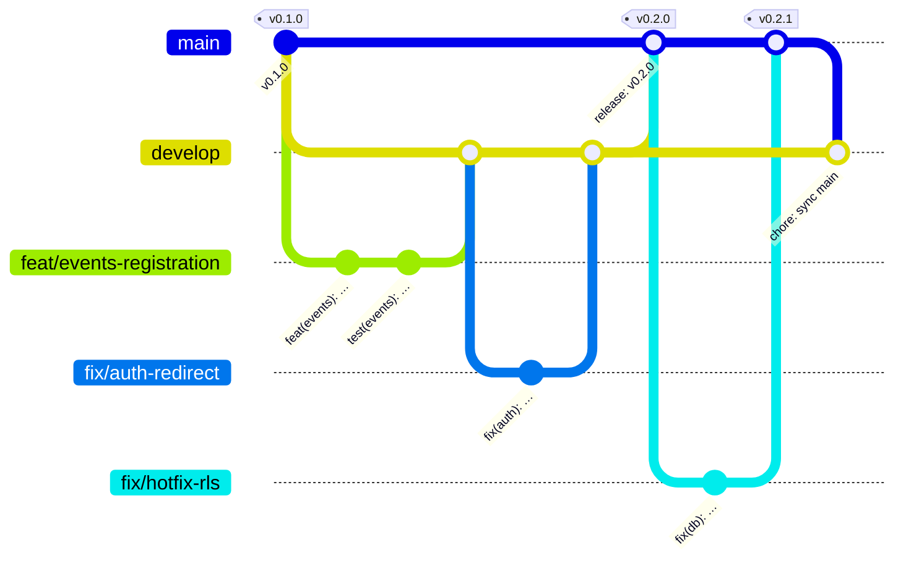

# Git Workflow

| Field            | Value      |
| ---------------- | ---------- |
| **Last Updated** | 2026-10-02 |
| **Status**       | Draft — repository location pending **OPEN Q-024** |

## 1. Repository

- Host: **GitHub** (stakeholder baseline), under an SDC-owned organization — not a personal account.
- At least two organization owners (bus factor).
- **CURRENT** — the working copy is not a Git repository; the canonical remote is unknown. Phase 0 task: establish the repository, import the current code as the initial commit, and protect branches.

## 2. Branches

Adapted from Innosoft's Git Flow, simplified: no long-lived `version/*` branches (single deployed version), `release/*` only when a stabilization period is needed.

| Branch | Purpose | Created from | Merges into | Deploys to |
| ------ | ------- | ------------ | ----------- | ---------- |
| `main` | Production-ready code; every release is a tag on `main` | — | — | Production (tags only) |
| `develop` | Integration of completed work | `main` (once) | `main` via release PR | Staging |
| `feat/<scope>-<short-desc>` | New capability | `develop` | `develop` | Preview |
| `fix/<scope>-<short-desc>` | Bug fix | `develop` (or `main` for hotfix) | source branch (+ `develop` for hotfixes) | Preview |
| `docs/<short-desc>` · `chore/<…>` · `refactor/<…>` · `test/<…>` · `ci/<…>` | Non-feature work | `develop` | `develop` | Preview |
| `release/vX.Y.Z` | *Optional* stabilization with RC tags | `develop` | `main` and back to `develop` | Staging |

Naming: lowercase, hyphenated, ≤ 50 chars, include the issue number when one exists: `feat/events-123-registration-window`.



## 3. Commit messages — Conventional Commits

Format (Innosoft standard):

```text
<type>(<scope>): <description>

[optional body: what and why]

[optional footer(s): BREAKING CHANGE: …, Refs: #123]
```

| Type | Use for | Version impact |
| ---- | ------- | -------------- |
| `feat` | New user-visible capability | minor |
| `fix` | Bug fix | patch |
| `perf` | Performance improvement | patch |
| `refactor` | Restructure without behaviour change | patch |
| `docs` | Documentation only | patch |
| `style` | Formatting only | patch |
| `test` | Tests only | patch |
| `chore` | Tooling, deps, config | patch |
| `ci` | CI configuration | patch |
| `build` | Build system | patch |
| `revert` | Revert a commit | patch |

Breaking changes: `feat!:` or a `BREAKING CHANGE:` footer → major bump (after v1.0.0; during 0.x a breaking change bumps **minor**).

Scopes (SDC modules): `auth`, `access`, `membership`, `members`, `committees`, `events`, `registrations`, `articles`, `notifications`, `reports`, `admin`, `public`, `db`, `ui`, `i18n`, `email`, `ci`, `deps`, `docs`.

Rules: imperative mood, ≤ 72-char subject, no trailing period, English. Enforced by `commitlint` in CI on PR titles (squash merges use the PR title as the commit).

## 4. Pull requests

| Rule | Detail |
| ---- | ------ |
| Every change goes through a PR | No direct pushes to `main` or `develop` |
| PR title | A valid Conventional Commit (becomes the squash commit) |
| Size | Aim for < 400 changed lines excluding generated files; split otherwise |
| Description | Template: what/why, linked issue & requirement ids (FR-/NFR-/BR-), screenshots (ar + en, dark + light) for UI, migration notes, test evidence, docs updated |
| Checks | All CI checks green ([CI/CD](../08-infrastructure/ci-cd.md)) |
| Approvals | 1 approval; **2** for changes touching `supabase/migrations`, RLS, auth, permissions, or secrets handling |
| Merge method | **Squash** into `develop`; **merge commit** for release PRs into `main` (preserves the release boundary) |
| Draft PRs | Encouraged for early feedback; not reviewed until marked ready |
| Stale branches | Deleted after merge |

## 5. Code review

Reviewers check, in order:

1. **Correctness** against the requirement and business rules (BR ids).
2. **Security**: authorization at server + DB, input validation, no secrets, no PII in logs.
3. **Data**: migration safety (expand/contract), RLS tests, generated types updated.
4. **Design**: right layer (see [server logic matrix](../04-architecture/server-logic-and-data-access.md#1-where-does-logic-go-decision-matrix)), no duplication, design-system primitives used.
5. **i18n/a11y**: both languages, RTL/LTR, keyboard, labels.
6. **Tests and docs** updated.

Review etiquette: comment on code, not people; prefix non-blocking remarks with `nit:`; the author resolves threads they addressed; aim to review within 2 days (volunteer team).

## 6. Branch protection (GitHub)

For `main` and `develop`:

- Require a pull request before merging; required approvals as in §4; dismiss stale approvals on new commits.
- Require status checks: `lint`, `typecheck`, `test-unit`, `test-db`, `build` (and `e2e-smoke` on `main`).
- Require branches to be up to date before merging.
- Block force pushes and deletions; no bypass for admins except documented emergencies.
- `CODEOWNERS`: `supabase/**` and `src/lib/auth/**` require a maintainer with security responsibility.

## 7. Hotfixes

1. Branch `fix/<scope>-<desc>` from `main`.
2. PR into `main` (2 approvals, CI green) → tag patch version → production deploy.
3. Merge `main` back into `develop` immediately (`chore: sync main into develop`).

## 8. Tags

Tags are immutable, created only on `main` (stable) or `release/*` (RC), never moved or deleted. See [versioning and releases](./versioning-and-releases.md).
