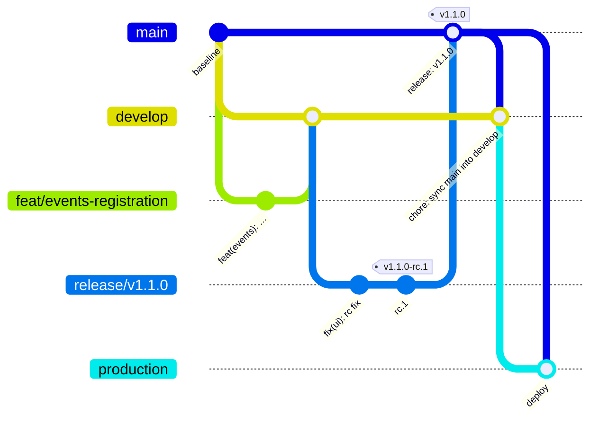

# Git Workflow

| Field            | Value |
| ---------------- | ----- |
| **Last Updated** | 2026-10-04 |
| **Status**       | Active. Adapted from the Innosoft *Version Control*, *Version Control Tags* and *Deployment Standards Gate* standards and the *Release Cycle* quick steps |

Companions: [versioning and releases](versioning-and-releases.md) · [CI/CD](../08-infrastructure/ci-cd.md) ·
[environments](../08-infrastructure/environments.md) · [dev environment setup](dev-environment-setup.md) ·
[push and release checklist](push-and-release-checklist.md).

## 1. Repositories

- **Canonical repository:** the one where `RELEASE_AUTOMATION` is `true`. It holds pull requests, branch protection, releases, tags and the changelog. The target is `sdc-saudi/SDC_website` (remote `upstream`); until access is complete it can be `Hussain560/sdc_web` (remote `origin`).
- The other repository, if any, is only a deployment mirror. How the two are kept in sync, which variables and secrets decide what each repository does, and how Vercel gets its code are in [dev environment setup](dev-environment-setup.md#repositories-and-environments).
- At least two organisation owners (bus factor). Direct pushes to the protected branches below are not allowed for anyone in the canonical repository.

## 2. The flow in one picture

```text
feat/* ─┐
fix/*  ─┼─► develop ─► release/vX.Y.Z ─► main ─► production
docs/* ─┘      │             │  (rc tags)   │       │
            Dev site     Staging (UAT)   tag vX.Y.Z  Live site
          (Dev Supabase) (Dev Supabase)  CHANGELOG   (Prod Supabase)
                                         sync main ► develop
```

| Branch | Purpose | Created from | Merges into | Vercel | Supabase |
| ------ | ------- | ------------ | ----------- | ------ | -------- |
| `feat/<scope>-<desc>` · `fix/…` · `docs/…` · `chore/…` · `refactor/…` · `test/…` · `ci/…` | One change | `develop` | `develop` (squash PR) | Preview | Dev project |
| `develop` | Integration of finished work; always deployable | `main` (once) | `release/*` | **Dev site** (developer's Vercel, whose production branch is `develop`) | **Dev project** |
| `release/vX.Y.Z` | Stabilisation, release candidates (`vX.Y.Z-rc.N` tags) | `develop` | `main` **and** back to `develop` | Preview in the developer's Vercel (**Staging / UAT**) | Dev project |
| `main` | Released code. Every stable tag `vX.Y.Z` is on `main` | `develop` once | `production` | not built in the production Vercel project | none |
| `production` | **What the production Vercel project serves live.** Merging here is the deploy | `main` | none | **Production branch of the production Vercel project** | **Production Supabase project** |
| `version/<major>` | Optional: patches for an old major | last stable tag of that major | itself | Preview | Dev project |

All long-lived branches (`develop`, `release/*`, `main`, `production`, `version/*`) are **protected**: pull request only, required checks,
no force push, no deletion. **Do not tick "delete source branch" when merging into or out of a long-lived branch**; the chain needs them. Delete only `feat/*`-style branches.

Naming: lowercase, hyphenated, at most 50 characters, with the issue number when there is one: `feat/events-123-registration-window`.



### 2.1 Release cycle, step by step

| # | Step | Who | Result |
| - | ---- | --- | ------ |
| 1 | Open a PR from your `feat/*` branch into `develop`, squash merge once the checks are green | Developer | Dev site and Dev Supabase update (migrations apply automatically) |
| 2 | Test on the Dev site. Repeat 1 for every change of the release | Developers | `develop` is the next release |
| 3 | Create `release/vX.Y.Z` from `develop` (the version follows the commits since the last tag: see §3 and [versioning](versioning-and-releases.md)) | Release owner | Release branch |
| 4 | Tag `vX.Y.Z-rc.1` on the release branch (`git tag -a vX.Y.Z-rc.1 -m "…"`, push the tag). The preview of the release branch is **Staging**; run the [event lifecycle guide](event-lifecycle-test-guide.md) and the checklist there | Release owner + QA | Sign-off, or fixes |
| 5 | Bug found: branch `fix/<issue>` from `release/*`, PR into `release/*`, then merge the same fix into `develop`; tag `rc.2`, retest | Developer | Next candidate |
| 6 | QA approves: PR `release/vX.Y.Z` → `main` titled `release: vX.Y.Z` (merge commit, not squash) | Release owner | `main` updated |
| 7 | **Automatic on merge to `main`:** the release workflow (release-please) computes the version from the commits and opens a PR `chore(main): release X.Y.Z` that bumps `package.json` and prepends `CHANGELOG.md`; merge it and the workflow creates the tag `vX.Y.Z` and the GitHub Release. The same workflow then opens a PR `main` → `develop` (`chore: sync main into develop`); merge it with a merge commit. The very first release, `v1.0.0`, is tagged by the owner at the cutover (the manifest already says 1.0.0) | Automation + release owner | Tag, changelog, `develop` aligned |
| 8 | **Stop and check:** backup, migrations reviewed, secrets present ([cutover runbook](../08-infrastructure/cutover-runbook.md)) | Release owner | Go / no-go |
| 9 | PR `main` → `production` titled `deploy: vX.Y.Z`, approved by the production owner and merged. This triggers the Vercel production deploy and the production database workflow (protected environment) | Production owner | **Live** |
| 10 | Smoke test the live site, watch for 24 hours, fill the release record | Release owner | Done |

Step 9 is the live deploy: only the production owner presses it.

### 2.2 Hotfix

1. `fix/<scope>-<desc>` from `main` (or from the tag running in production), PR into `main` (2 approvals, CI green).
2. The release workflow tags the patch (`vX.Y.Z+1`), then a PR `main` → `production` deploys it.
3. Merge the sync PR `main` → `develop` so the fix is not lost.

### 2.3 Old major versions

When a new major is released, create `version/<old-major>` from the last stable tag of the old major (`git checkout -b version/1 v1.5.2`) so patches can continue. It only gets patch and minor versions of that major and is deleted when support ends.

## 3. Commit messages — Conventional Commits

Format (Innosoft standard):

```text
<type>(<scope>): <description>

[optional body: what and why]

[optional footer(s): BREAKING CHANGE: …, Refs: #123]
```

| Type | Use for | Version impact |
| ---- | ------- | -------------- |
| `feat` | New user-visible capability | minor |
| `fix` | Bug fix | patch |
| `perf` | Performance improvement | patch |
| `refactor` | Restructure without behaviour change | patch |
| `docs` | Documentation only | patch |
| `style` | Formatting only | patch |
| `test` | Tests only | patch |
| `chore` | Tooling, deps, config | patch |
| `ci` | CI configuration | patch |
| `build` | Build system | patch |
| `revert` | Revert a commit | patch |

Breaking changes: `feat!:` or a `BREAKING CHANGE:` footer → major bump (after v1.0.0; during 0.x a breaking change bumps **minor**).

Scopes (SDC modules): `auth`, `access`, `membership`, `members`, `committees`, `events`, `registrations`, `articles`, `notifications`, `reports`, `admin`, `public`, `db`, `ui`, `i18n`, `email`, `ci`, `deps`, `docs`.

Rules: imperative mood, ≤ 72-char subject, no trailing period, English. Enforced by `commitlint` in CI on PR titles (squash merges use the PR title as the commit).

## 4. Pull requests

| Rule | Detail |
| ---- | ------ |
| Every change goes through a PR | No direct pushes to `develop`, `release/*`, `main`, `production` |
| PR title | A valid Conventional Commit (it becomes the squash commit and drives the version) |
| Size | Aim for fewer than 400 changed lines excluding generated files; split otherwise |
| Description | Template: what and why, linked issue and requirement ids (FR-/NFR-/BR-), screenshots (ar + en, dark + light) for UI, migration notes, test evidence, docs updated |
| Checks | All CI checks green ([CI/CD](../08-infrastructure/ci-cd.md)); the gate runs on every PR whatever the target |
| Approvals | 1 approval; **2** for `supabase/migrations`, RLS, auth, permissions, secrets, and for every PR into `main` or `production` |
| Merge method | **Squash** into `develop`; **merge commit** into `release/*`, `main`, `production` and for sync PRs (keeps the release boundary and the tag ancestry) |
| Draft PRs | Encouraged for early feedback; not reviewed until marked ready |
| Stale branches | `feat/*`-style branches are deleted after merge; long-lived branches never |

## 5. Code review

Reviewers check, in order:

1. **Correctness** against the requirement and business rules (BR ids).
2. **Security**: authorization at server and database, input validation, no secrets, no personal data in logs.
3. **Data**: migration safety (expand, migrate, contract), RLS tests, generated types updated.
4. **Design**: right layer (see [server logic matrix](../04-architecture/server-logic-and-data-access.md#1-where-does-logic-go-decision-matrix)), no duplication, design-system primitives.
5. **i18n and accessibility**: both languages, RTL and LTR, keyboard, labels.
6. **Tests and docs** updated.

Etiquette: comment on code, not people; prefix non-blocking remarks with `nit:`; the author resolves threads they addressed; review within 2 days (volunteer team).

## 6. Branch protection (GitHub) and the standard gate

Following the Innosoft *Deployment Standards Gate*: **tools produce evidence, the gate evaluates it, policy decides**. A gate that runs on pull
requests can only judge changes that arrive through pull requests, so the protection below is a prerequisite, not decoration.

For `develop`, `release/*`, `main`, `production` (and `version/*`):

- Require a pull request; required approvals as in §4; dismiss stale approvals on new commits.
- Required status checks: `Lint · types · unit tests`, `Build`, `E2E + visual regression`, `Auth E2E (local Supabase)`, `Database policy tests (pgTAP)`, `Conventional Commits (PR title)`.
- Require branches to be up to date; block force pushes and deletions; allowed to push: **no one**.
- `CODEOWNERS`: `supabase/**` and `src/lib/auth/**` need a maintainer with security responsibility.
- Rollout is progressive: a new check starts as a warning and becomes required once the team is ready ([CI/CD §4](../08-infrastructure/ci-cd.md)).
- The release and sync workflows use the repository token and open pull requests; they never bypass protection with a personal token.

## 7. Tags

Tags are immutable, never moved or deleted, and are what we deploy and roll back to:

| Tag | Where | Meaning |
| --- | ----- | ------- |
| `vX.Y.Z-rc.N` | `release/*` | Release candidate for staging and QA (`N` starts at 1) |
| `vX.Y.Z` | `main` | Stable release, created by the release workflow |

Why: every environment runs exactly the same code (staging tested `rc.2`, production runs the `vX.Y.Z` that came out of the same release branch), bugs are bisected between tags (`git diff v1.0.0 v1.1.0`), and rollback is "deploy the previous tag". Never deploy untagged code to production.
No tag is created for every commit. Keep all tags forever. See [versioning and releases](versioning-and-releases.md).

Optional baseline for a big jump: on `release/vX.0.0` run `git commit --allow-empty -m "chore: prepare vX.0.0-rc.0"` and tag `vX.0.0-rc.0` so the RC counter starts from a known point.
