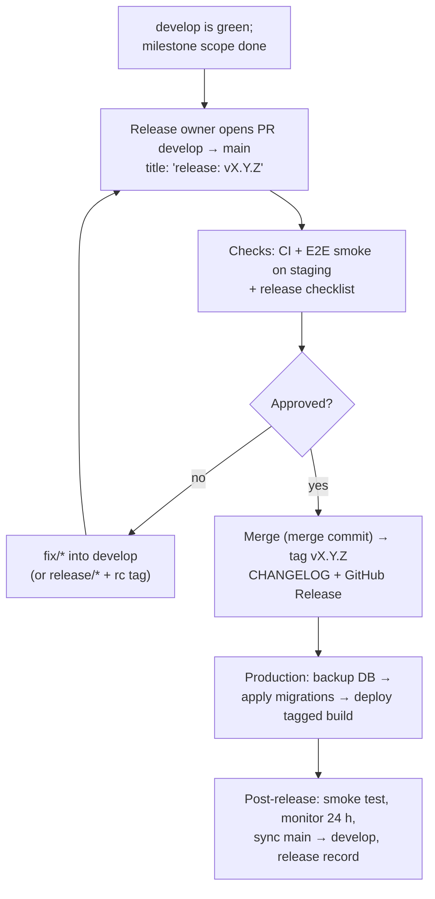

# Versioning and Releases

| Field            | Value      |
| ---------------- | ---------- |
| **Last Updated** | 2026-10-02 |
| **Status**       | Draft — no tags will be created until this strategy is approved |

## 1. Semantic Versioning

`vMAJOR.MINOR.PATCH` ([semver.org](https://semver.org)), applied to the **platform as a whole** (app + migrations + email templates ship together).

| Part | Increments when |
| ---- | --------------- |
| MAJOR | Breaking change for users or operators after v1.0.0 (e.g., removed URLs without redirect, incompatible data change) |
| MINOR | New capabilities (`feat`); during 0.x also breaking changes |
| PATCH | Fixes, performance, internal changes |

Pre-releases: `vX.Y.Z-rc.N` from `release/*` for every candidate sent to Staging (tagged by hand, see [git workflow §2.1](./git-workflow.md)). The `package.json` `version` matches the latest tag.

**0.x phase**: the platform is under transformation; `v1.0.0` marks the point where the new platform fully replaces the current one in production (all **Must** requirements delivered, Phase 6 exit).

## 2. Version plan (aligned with the roadmap)

| Version | Content | Phase |
| ------- | ------- | ----- |
| `v0.1.0` | Foundation: documentation set, repository established, branch protection; **no application behaviour change** (containment fixes, if approved, ship as `v0.1.1`) | 0 |
| `v0.2.0` | Engineering baseline: TypeScript, lint/format, test harness, CI, Next.js upgrade, complete `config.toml`, migration baseline, staging environment, design tokens | 1 |
| `v0.3.0` | Identity & access: SSR auth, profiles, roles/permissions/assignments, committees, dashboard shell, retirement of `COMMITTEE_EMAILS` | 2 |
| `v0.4.0` | Events & registrations from the database (+ data migration, new review dashboard, email module) | 3A |
| `v0.5.0` | Membership intake (`/join`), applications, members & directory (+ legacy migration/claim) | 3B |
| `v0.6.0` | Articles/threads from the database; notifications catalogue complete | 3C |
| `v0.7.0` | Internal management & reports: dashboards, attendance, exports, audit UI, settings | 4 |
| `v0.8.0` | Hardening: accessibility, CSP enforcement, performance, privacy pages, backup drill | 5 |
| `v1.0.0` | Production launch of the transformed platform | 6 |

## 3. Changelog and release notes

| Artifact | Source | Audience |
| -------- | ------ | -------- |
| `CHANGELOG.md` (repo root) | Generated from Conventional Commits at release time (sections: ⚠️ Breaking Changes, Features, Fixes, Maintenance, Documentation) — Innosoft format | Developers |
| GitHub Release | Same content + migration notes + known issues | Developers/operators |
| Release notes (ar/en, short) | Written by the release owner for user-visible changes | Leadership and community |
| `docs/99-project-management/releases/vX.Y.Z.md` | Release record from the [template](../99-project-management/releases/_template.md): scope, checks, sign-off, rollback plan | Project record |

Tooling (**Configured**, `release-please-config.json`, `.release-please-manifest.json`, `.github/workflows/release-please.yml`): on every push to `main`, release-please opens a release PR that bumps `package.json` and prepends `CHANGELOG.md`; merging it creates the tag and the GitHub Release. The same workflow then opens the `main` → `develop` sync PR. This mirrors the Innosoft automated release pipeline (version from commits, tag, changelog, sync main) using GitHub-native tooling. The first release `v1.0.0` is tagged by hand at the cutover; the manifest already holds `1.0.0`.

Commit type → version and changelog section (same table as Innosoft): `feat` → minor, Features; `fix`/`perf` → patch, Fixes; `refactor`/`revert` → Maintenance; `docs` → Documentation; `chore`, `style`, `test`, `ci`, `build` are kept out of the changelog and do not create a release by themselves. A breaking change (`feat!:` or a `BREAKING CHANGE:` footer) adds a **Breaking Changes** section and bumps major (minor while below 1.0.0).

## 4. Release process

Release checklist (copied into each release record):

- [ ] All milestone stories meet the Definition of Done
- [ ] Migrations reviewed (2 approvals), tested on staging with production-like data volume
- [ ] Production backup taken and restore point recorded
- [ ] Environment variables/secrets for new features set in production
- [ ] E2E smoke passes on staging
- [ ] Release notes (ar/en) ready
- [ ] Rollback plan written (previous tag + forward-fix migration plan)

## 5. Rollback

| Layer | Rollback |
| ----- | -------- |
| Application | Promote the previous production deployment in Vercel (instant) or redeploy the previous tag |
| Database | Forward-fix migration; restore from backup only for data loss (expand/contract makes app rollback safe without DB rollback) |
| Email templates (Auth) | Re-apply previous `config.toml` templates |

## 6. Rules

- Never deploy untagged code to production (Innosoft tag standard).
- Never modify or delete tags; keep all tags.
- Hotfixes produce a PATCH tag on `main` (see [git workflow §2.2](./git-workflow.md#22-hotfix)).
- The **release owner** for each release is named in the release record (default: tech lead).
