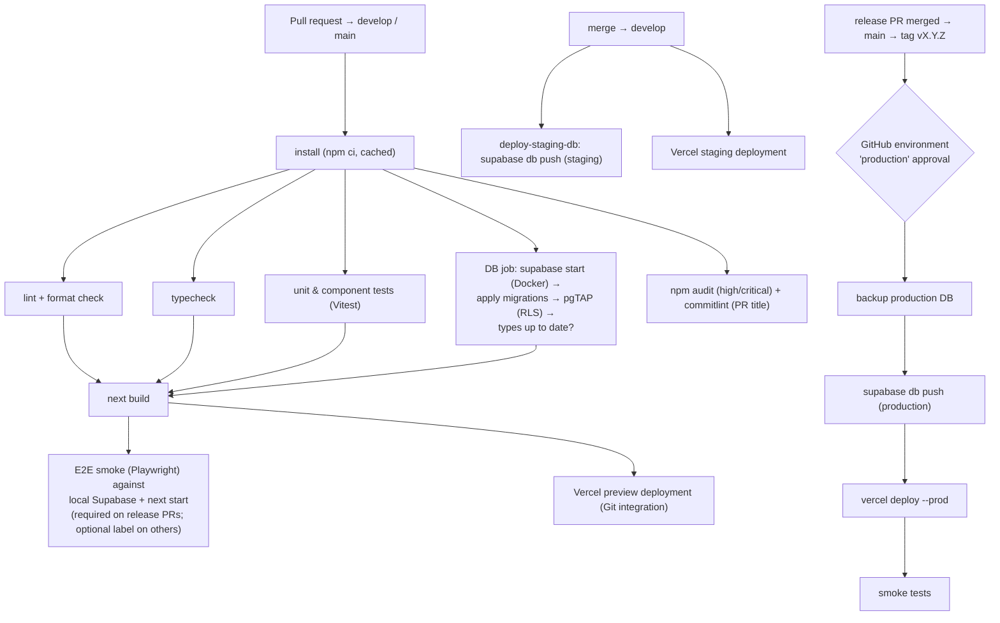

# CI/CD

| Field            | Value      |
| ---------------- | ---------- |
| **Last Updated** | 2026-10-02 |
| **Status**       | Draft — [ADR-007](../90-decisions/ADR-007-ci-cd-strategy.md) Proposed |

## 1. Current (CURRENT)

No CI/CD. No `.github/` directory. Lint cannot run (ESLint not installed). The production build succeeds locally.

## 2. Pipeline design

## 3. Workflows (files to create in Phase 1)

| Workflow | Trigger | Jobs |
| -------- | ------- | ---- |
| `ci.yml` | `pull_request`, `push` to `develop`, `release/**`, `main`, `production` | install, lint, typecheck, unit, db (migrations + pgTAP + types check), build, e2e-smoke (conditional), audit, commitlint |
| `deploy-database.yml` | `push` to `develop`/`release/**` (job `dev`, environment `dev`) or `production` (job `production`, environment `production`, required reviewers); paths `supabase/migrations/**`. A job without `SUPABASE_DB_URL` in that repository is skipped; release automation and backups run only where the variables `RELEASE_AUTOMATION` / `PRODUCTION_BACKUPS` are `true` | `db push --dry-run`, `db push --db-url` |
| `release-please.yml` | `push` to `main` | `release-please` (release PR with version bump and CHANGELOG, tag and GitHub Release on merge) and `sync-develop` (PR `main` → `develop`) |
| Vercel Git integration | `push` to `production` (the Vercel Production Branch) | production build and deploy; other branches are previews. The matching database migration runs in `deploy-database.yml` (protected environment). Backup and smoke steps are in the [cutover runbook](./cutover-runbook.md) |
| `backup.yml` | Nightly schedule | Encrypted logical dump of production, retained 30 days ([operations](./operations.md#1-backups)) |
| `keepalive.yml` | Daily schedule | Health check of staging/production (prevents free-tier pause, alerts on failure) |
| `dependabot.yml` | Weekly | npm + GitHub Actions updates |

## 4. Quality gates

Inspired by the Innosoft *Standards Gate* (tools produce evidence → gate evaluates → policy decides), scaled down to GitHub's required status checks:

| Gate | Blocks merge to `develop` | Blocks release to `main` |
| ---- | :-----------------------: | :----------------------: |
| Lint, format, typecheck clean | ✅ | ✅ |
| Unit/component tests pass | ✅ | ✅ |
| Migrations apply from scratch + pgTAP pass + types current | ✅ | ✅ |
| Build succeeds | ✅ | ✅ |
| PR title is a Conventional Commit | ✅ | ✅ |
| `npm audit` no high/critical in production deps | ⚠️ warn | ✅ |
| Browser e2e (visual + authenticated) | local before a release; on demand in CI (`E2E (manual)`) | local before a release |
| Coverage thresholds | ⚠️ warn (report) | ⚠️ warn — becomes blocking in Phase 5 |
| Accessibility (axe) on key pages | ⚠️ warn | ✅ from Phase 5 |

"Warn first, block later" follows the Innosoft progressive-enforcement approach.

## 5. Cost notes

GitHub Actions minutes are free for public repositories and limited for private ones (**OPEN Q-024**: public or private repository?). The DB job (Docker + Supabase stack) is the most expensive; it runs only when `supabase/**` or `src/**` changes, and uses `supabase db start` (database only) where full services are not needed.

## 6. Implemented (local — workflows not yet pushed; first-push steps in the [push checklist](../07-engineering/push-and-release-checklist.md))

| File | Purpose |
| ---- | ------- |
| `.github/workflows/ci.yml` | Fast gate: `quality` (format · lint · typecheck · unit), `build`, `db` (pgTAP + generated-types drift), `commits` (PR title is a Conventional Commit) |
| `.github/workflows/e2e.yml` | `E2E (manual)`: the Playwright visual and authenticated suites, started by hand from the Actions tab; not a required check |
| `.github/workflows/release-please.yml` | SemVer release PRs, tags, `CHANGELOG.md` from `main`, and the sync PR `main` → `develop` |
| `.github/workflows/deploy-database.yml` | Applies migrations to the Dev project (from `develop`, `release/**`) or production (from `production`) |
| `scripts/smoke.mjs` (`npm run smoke -- <url>`) | Read-only remote smoke test of a deployed site |
| `.github/dependabot.yml` | Weekly npm (grouped minor/patch) and monthly Actions updates, targeting `develop` |
| `.github/CODEOWNERS`, `pull_request_template.md` | Review ownership and the Definition-of-Done checklist (replace the placeholder team handles) |

The same checks run locally through the npm scripts in [local development](./local-development.md), so nothing depends on GitHub being reachable. Required status checks are enabled in the branch-protection step of Sprint 00 (FND-004) once the repository receives the code.
