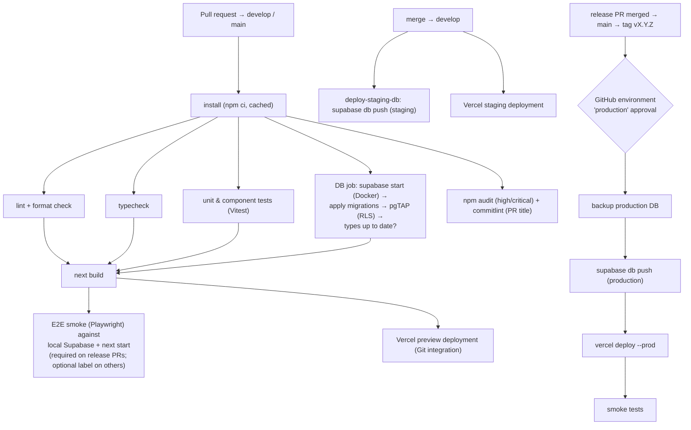

# CI/CD

| Field            | Value      |
| ---------------- | ---------- |
| **Last Updated** | 2026-10-02 |
| **Status**       | Draft — [ADR-007](../90-decisions/ADR-007-ci-cd-strategy.md) Proposed |

## 1. Current (CURRENT)

No CI/CD. No `.github/` directory. Lint cannot run (ESLint not installed). The production build succeeds locally.

## 2. Pipeline design

## 3. Workflows (files to create in Phase 1)

| Workflow | Trigger | Jobs |
| -------- | ------- | ---- |
| `ci.yml` | `pull_request`, `push` to `develop`/`main` | install, lint, typecheck, unit, db (migrations + pgTAP + types check), build, e2e-smoke (conditional), audit, commitlint |
| `deploy-staging-db.yml` | `push` to `develop` (paths: `supabase/migrations/**`) | `supabase link` + `db push` to staging |
| `release.yml` | `push` to `main` | `release-please` (version bump, changelog, tag, GitHub Release) |
| `deploy-production.yml` | Release published (tag `v*`) | environment `production` (required reviewers) → backup → `db push` → `vercel deploy --prebuilt --prod` → smoke |
| `backup.yml` | Nightly schedule | Encrypted logical dump of production, retained 30 days ([operations](./operations.md#1-backups)) |
| `keepalive.yml` | Daily schedule | Health check of staging/production (prevents free-tier pause, alerts on failure) |
| `dependabot.yml` | Weekly | npm + GitHub Actions updates |

## 4. Quality gates

Inspired by the Innosoft *Standards Gate* (tools produce evidence → gate evaluates → policy decides), scaled down to GitHub's required status checks:

| Gate | Blocks merge to `develop` | Blocks release to `main` |
| ---- | :-----------------------: | :----------------------: |
| Lint, format, typecheck clean | ✅ | ✅ |
| Unit/component tests pass | ✅ | ✅ |
| Migrations apply from scratch + pgTAP pass + types current | ✅ | ✅ |
| Build succeeds | ✅ | ✅ |
| PR title is a Conventional Commit | ✅ | ✅ |
| `npm audit` no high/critical in production deps | ⚠️ warn | ✅ |
| E2E smoke | optional (label `e2e`) | ✅ |
| Coverage thresholds | ⚠️ warn (report) | ⚠️ warn — becomes blocking in Phase 5 |
| Accessibility (axe) on key pages | ⚠️ warn | ✅ from Phase 5 |

"Warn first, block later" follows the Innosoft progressive-enforcement approach.

## 5. Cost notes

GitHub Actions minutes are free for public repositories and limited for private ones (**OPEN Q-024**: public or private repository?). The DB job (Docker + Supabase stack) is the most expensive; it runs only when `supabase/**` or `src/**` changes, and uses `supabase db start` (database only) where full services are not needed.
