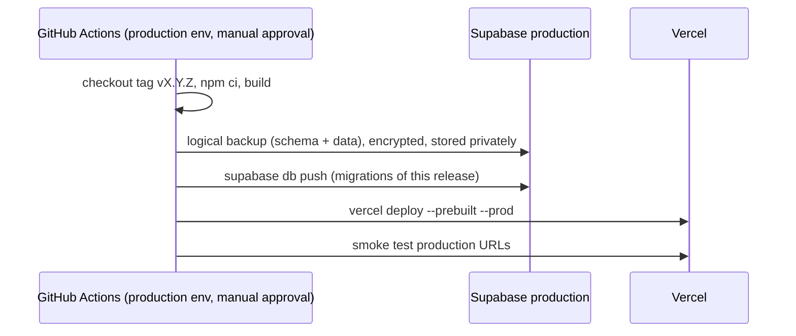

# Deployment

| Field            | Value      |
| ---------------- | ---------- |
| **Last Updated** | 2026-10-02 |
| **Status**       | Draft      |

## 1. What gets deployed

| Artifact | Tool | Target |
| -------- | ---- | ------ |
| Next.js app | Vercel | Preview / Staging / Production deployments |
| Database migrations | Supabase CLI (`supabase db push`) from GitHub Actions | Staging / Production projects |
| Auth configuration & email templates | `supabase/config.toml` + `supabase config push` (where supported) or documented dashboard steps | Staging / Production |
| Storage buckets & policies | Migrations (buckets created in SQL) | Staging / Production |
| Scheduled jobs | `vercel.json`/`vercel.ts` crons → `/api/cron/*` | Production (and staging if needed) |

## 2. Order of operations (production)

Migrations run **before** the new app version goes live; expand/contract ([migration strategy](../05-database/migration-strategy.md#1-rules)) guarantees the old app still works on the new schema during the window.

Vercel production auto-deploy from Git is **disabled** for `main` so production deploys happen only through this workflow (deterministic ordering, tag-only deploys). Preview and staging deployments use the normal Vercel Git integration. **Proposed** in [ADR-007](../90-decisions/ADR-007-ci-cd-strategy.md).

## 3. Staging

On every merge into `develop`: Vercel builds the staging deployment; the `deploy-staging-db` workflow runs `supabase db push` against the staging project. If the migration fails, the workflow fails and the team is notified; fix forward on `develop`.

## 4. Rollback

| Situation | Action |
| --------- | ------ |
| App regression | Vercel "Promote to Production" of the previous deployment (instant), then fix forward |
| Bad migration (no data loss) | Forward-fix migration via hotfix |
| Data loss/corruption | Restore from the pre-release backup into a new project or selected tables; incident procedure |

## 5. Domains

| Environment | Domain (Proposed) |
| ----------- | ----------------- |
| Production | `<sdc-domain>` and `www.` redirect (**OPEN Q-017**) |
| Staging | `staging.<sdc-domain>` (Vercel branch alias for `develop`) |
| Preview | Vercel-generated URLs |

Supabase Auth `site_url` and `additional_redirect_urls` must list each of these.
