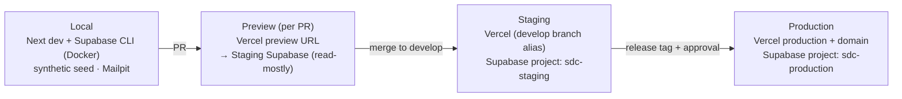

# Environments

| Field            | Value      |
| ---------------- | ---------- |
| **Last Updated** | 2026-10-02 |
| **Status**       | Draft — [ADR-005](../90-decisions/ADR-005-environment-strategy.md) Proposed |

## 1. Current (CURRENT)

| Environment | State |
| ----------- | ----- |
| Local | Supabase CLI stack in Docker (containers `supabase_*_sdc_web`), `.env.local` → `http://127.0.0.1:54321`; schema from a manual script |
| Remote Supabase | One linked project named `sdc-members` (ref in `supabase/.temp/project-ref`); role unknown — production? (**OPEN Q-025**) |
| Hosting | Unknown (**OPEN Q-027**) |
| Staging / preview | None |

## 2. Target environment model

| Environment | App | Database | Data | Email | Who uses it |
| ----------- | --- | -------- | ---- | ----- | ----------- |
| **Local** | `next dev` | Local Supabase (Docker) | `supabase/seed.sql` synthetic | Mailpit | Developers |
| **Preview** | Vercel preview per PR | Staging project (shared) | Synthetic staging data | Provider sandbox / allow-list | Reviewers (UI review) |
| **Staging** | Vercel, `develop` branch (stable alias, e.g., `staging.<domain>`) | `sdc-staging` | Synthetic, production-like volume | Provider with recipient allow-list | Team, acceptance testing |
| **Production** | Vercel production (`main`), custom domain | `sdc-production` | Real | Provider, verified domain | Community |

Setup steps for the hosted dev/staging project (named `sdc-dev`), Vercel and GitHub are in [dev environment setup](../07-engineering/dev-environment-setup.md); the branch to environment mapping is in [git workflow §2](../07-engineering/git-workflow.md). Vercel serves **only the `production` branch** live.

Why previews share the staging database: Supabase Free allows only two active projects and branching is a paid feature. Schema changes in a PR are therefore validated in **CI against an ephemeral local stack** ([CI/CD](./ci-cd.md)), not on the preview. A preview of a PR whose UI depends on unmerged migrations will show errors — acceptable; reviewers use the CI result for schema review.

**Decision needed** (**OPEN Q-025**): is the existing `sdc-members` project production? If yes, it becomes `sdc-production` (renaming optional) and a new free project is created for staging.

## 3. Promotion rules

| From → To | Trigger | Gate |
| --------- | ------- | ---- |
| Local → Preview | Push to a PR branch | CI green |
| Preview → Staging | Merge PR into `develop` | Approvals + CI green; migrations auto-applied to staging |
| Staging → Production | Release PR merged into `main` and tagged | Release checklist; manual approval in the GitHub `production` environment; DB backup first |

Production configuration changes (Auth settings, SMTP, storage buckets) are made through versioned config (`supabase/config.toml` + `supabase config push` where supported) or documented in the release record when only possible via dashboard.

## 4. Data rules

- Production data never flows to staging/preview/local (NFR-PRIV-006).
- Staging uses generated data that covers every role and state (seed scripts in `supabase/seed/`).
- Test accounts on staging use a shared team mailbox domain or plus-addressing; credentials stored in the team password manager.

## 5. Access and ownership

| Service | Owner accounts (min. 2) | Admin actions |
| ------- | ----------------------- | ------------- |
| GitHub organization | **OPEN Q-024** | Branch protection, secrets, releases |
| Vercel team/project | **OPEN Q-027** | Env vars, domains, deployments |
| Supabase organization (staging, production) | **OPEN Q-025** | Projects, secrets, backups |
| Email provider | **OPEN Q-010** | API keys, domain verification |
| Domain registrar / DNS | **OPEN Q-017** | DNS records |

Credentials are stored in a shared password manager owned by the community, not in personal accounts (R-013).
