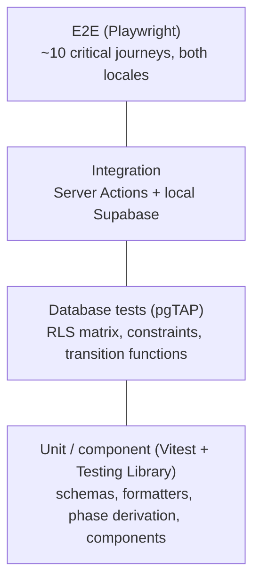

# Testing Strategy

| Field            | Value      |
| ---------------- | ---------- |
| **Last Updated** | 2026-10-02 |
| **Status**       | Draft      |

## 1. Philosophy

Test where the risk is. For SDC the highest risks are **authorization leaks** and **broken lifecycles** (registrations, membership decisions), so the database layer gets the strongest tests. UI tests stay few and focused on critical journeys.

## 2. Levels

| Level | Tool | Scope | Runs |
| ----- | ---- | ----- | ---- |
| Unit | Vitest | Zod schemas, `localized()`, date formatting, timing-phase derivation, permission helper `can()`, email template rendering (escaping) | Every PR |
| Component | Vitest + Testing Library (jsdom) | Interactive islands: registration button states, filters, dialogs (focus, Escape), forms (errors in ar/en) | Every PR |
| Database | pgTAP via `supabase test db` | RLS policy matrix per actor; constraints (uniqueness, checks); transition functions (happy + guard failures); anti-escalation; triggers (snapshots, audit) | Every PR touching `supabase/**` (and nightly) |
| Integration | Vitest (node) against local Supabase | Server Actions end-to-end with real DB and an in-memory email adapter: e.g., accept application → member created → email logged | Every PR |
| E2E | Playwright | Critical journeys in a browser against the local stack | Release PRs; label-triggered on others |
| Accessibility | `@axe-core/playwright` | Home, events list/detail, join, login, dashboard key pages, both directions/themes | With E2E |
| Visual (optional) | Playwright screenshots | RTL/LTR × dark/light for core components | Phase 5 decision |
| Manual | [Checklist](./manual-qa-checklist.md) | Exploratory + release regression | Each release |

## 3. Critical E2E journeys

| # | Journey | Requirements |
| - | ------- | ------------ |
| J1 | Visitor browses home → events → event detail (ar and en) | FR-PUB-001/004, FR-EVT-003 |
| J2 | Sign up → confirm via Mailpit → sign in → redirected back | FR-AUTH-001/003/004 |
| J3 | Signed-in user registers for an open event → sees status → cancels | FR-REG-001/002 |
| J4 | Committee head reviews registrations of own event → accepts → email logged; cannot see another committee's event | FR-REG-003, BR-REG-006 |
| J5 | Intake closed → `/join` shows closed; open cycle → apply → reviewer accepts → user appears in directory after opting in | FR-MBR-003/004/006/007, FR-MEM-001 |
| J6 | Committee member drafts event → head submits → leader approves → public | FR-EVT-001/002 |
| J7 | Article draft → publish → visible; archived → 404 | FR-ART-002/003 |
| J8 | Anonymous user cannot access `/dashboard`; plain user gets 403 page | FR-AUTH-010 |
| J9 | Password reset flow (same message for unknown email) | FR-AUTH-005 |
| J10 | Language and theme toggles persist; server renders correct `dir` | FR-PUB-006, NFR-I18N-002 |

## 4. Incremental adoption plan

| Phase | Testing deliverables |
| ----- | -------------------- |
| 1 | Vitest + Testing Library + Playwright + pgTAP set up; CI jobs; first tests: smoke E2E (J1, J10), pgTAP regression for the Critical audit findings (anon cannot write `members` / read registrations) |
| 2 | pgTAP for access tables, `has_permission`, anti-escalation; unit tests for permission helpers; E2E J2, J8, J9 |
| 3 | Per module: pgTAP matrix + transition tests, integration tests for Server Actions, E2E J3–J7 |
| 4 | Report functions tested with fixture data; exports tested for scope |
| 5 | Coverage thresholds enforced; axe blocking; restore drill |

## 5. Coverage targets

| Area | Target |
| ---- | ------ |
| Domain logic (`modules/*/schemas.ts`, helpers, phase derivation) | ≥ 80% lines |
| Server Actions (via integration tests) | Every action has at least one success and one authorization-failure test |
| RLS | 100% of tables × actors in the policy matrix |
| UI components | Behavioural tests for interactive islands; no coverage target |

Coverage is a signal, not a goal; untested authorization paths are blocking regardless of percentage.

## 6. Test data

- `supabase/seed.sql` (+ `supabase/seed/*.sql`) creates: one user per role (system admin, founder, leader, advisor, head/deputy/member of two committees, plain member, plain user), committees, cycles in each phase, events in each status/phase, registrations in each status, articles in each status.
- Tests create their own data inside transactions (pgTAP) or with unique suffixes (integration/E2E) and never depend on production data.
- Test naming references requirement/rule ids: `it('BR-REG-002 rejects a second registration for the same event')`.

## 7. Implemented scaffolding (Sprint 01)

| Level | Tool | Location | State |
| ----- | ---- | -------- | ----- |
| Unit / component | Vitest + Testing Library (jsdom) | `tests/unit/` | Language, theme, env validation, UI primitives (14 tests) |
| E2E + visual | Playwright (Chromium) | `tests/e2e/` | 12 public pages × ar/en × dark/light × desktop/mobile = 96 baselines + locale and shell tests; since Sprint 06 the suite runs against the local Supabase stack (server-rendered event pages read `public_events`; the six legacy events are seeded by migration). Browser-side calls that remain are still mocked (`tests/e2e/fixtures.ts`) |
| Database | pgTAP (`supabase test db`) | `supabase/tests/` | Smoke tests + `todo` regression tests that document the legacy exposure (they flip to hard assertions in the containment/RBAC migration) |

Visual-regression rules: threshold 0.1 % of pixels, animations disabled, copyright text masked, one retry; baselines change only in a PR that explicitly approves a redesign (D-009).
