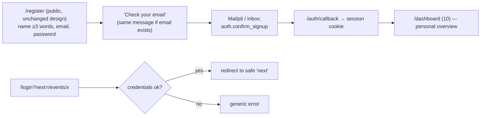
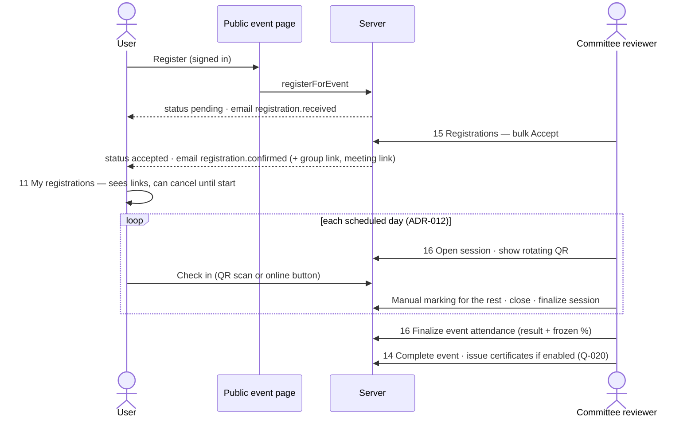
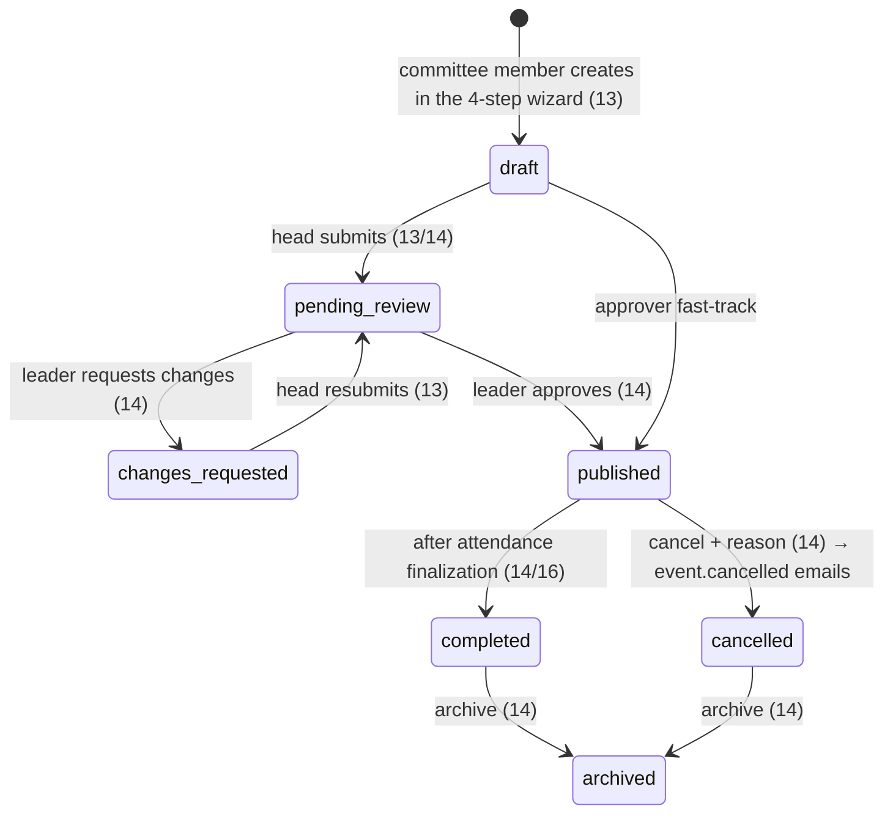
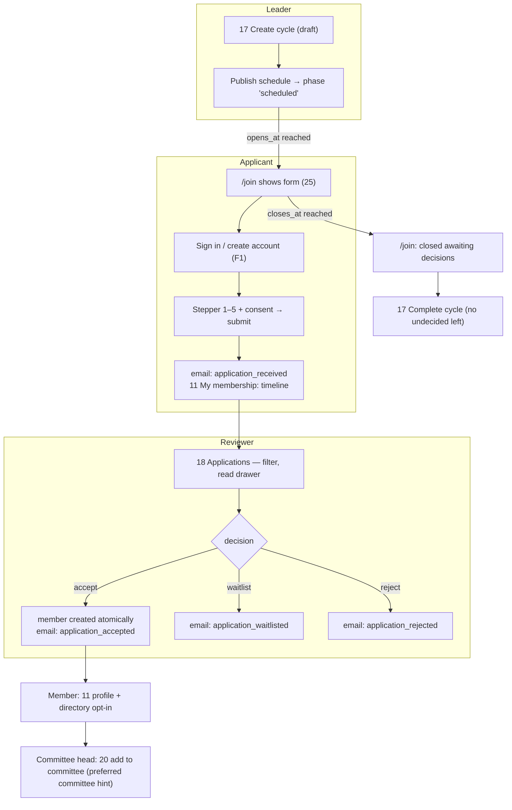
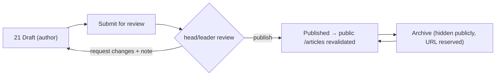
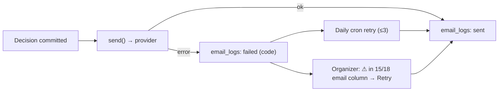

# User Flows — End to End

Every flow lists the actors, the screens it passes through (by blueprint number), the state changes, and the emails sent. Business rules: [03-business-domain](../../03-business-domain/README.md). Notification keys: [notification rules](../../03-business-domain/notification-rules.md).

| # | Flow | Actors |
| - | ---- | ------ |
| F1 | Account sign-up and sign-in | Visitor |
| F2 | Event registration → review → attendance | User, committee reviewer |
| F3 | Event lifecycle: draft → review → publish → cancel/complete | Committee member, committee head, community leader |
| F4 | Membership intake: cycle → application → decision → member → committee | Leader, applicant, reviewer, committee head |
| F5 | Article: draft → review → publish → archive | Committee member, head/leader |
| F6 | Positions & access: bootstrap → leader → heads → members (retiring `COMMITTEE_EMAILS`) | System admin, leader, head |
| F7 | Legacy member claim | Leader, legacy member |
| F8 | Access denied, out-of-scope, session expiry | Any |
| F9 | Email failure and retry | System, organizer |
| F10 | First landing per role | All |

---

## F1 — Account sign-up and sign-in



| Step | Screen | Note |
| ---- | ------ | ---- |
| Sign-up copy | `/register` | One added line: "إنشاء حساب لا يعني العضوية — للانضمام: /join" (FR-AUTH-002) |
| After sign-in | 10 | Non-members see the membership CTA only while a cycle is open |

## F2 — Event registration → review → attendance



| Branch | Behaviour |
| ------ | --------- |
| Event has no approval | Status `accepted` immediately (or `waitlisted` when full and waitlist on) |
| Capacity reached during review | Accept disabled for overflow; `CAPACITY_REACHED` on race |
| Reject | `registration.rejected` (neutral wording — *Q-028*) |
| User cancels | `cancelled`; seat freed; waitlisted can be accepted |
| Event cancelled | All active registrants get `event.cancelled` |
| Day removed from the schedule | Blocked if that day's session is finalized; otherwise the session is dropped and percentages recompute (KFUCS F-20) |
| Registration reopened while in progress | Extending `registration_end_at` reopens it (KFUCS rule) |

## F3 — Event lifecycle



Who sees what along the way: the committee member sees *Save draft* only; the head sees *Submit*; the leader sees the item in sidebar **بانتظار الاعتماد** with a count badge and the *Approve / Request changes* bar ([03 §2](./03-conditional-rendering.md#2-decision-rules)).

## F4 — Membership intake (the annual join page)



| Edge case | Behaviour |
| --------- | --------- |
| Cycle closes while filling | Submit returns `CYCLE_CLOSED`; draft kept locally; message explains |
| Applicant already a member | `/join` shows "you're a member" |
| Reviewer is the applicant | No decision actions on own application |
| Capacity set and reached | Further accepts blocked; waitlist suggested |
| Rejected applicant next year | May apply again (*Q-012*) |

## F5 — Article publishing



## F6 — Positions & access (retiring the hardcoded email list)

```mermaid
sequenceDiagram
    actor SA as System admin (bootstrapped by script)
    actor CL as Community leader
    actor CH as Committee head
    actor M as Member
    SA->>SA: 23 Assign community_leader to CL
    CL->>CL: 20 Appoint heads per committee (ends previous terms)
    CH->>CH: sidebar shows "Committee" group for their committee
    CH->>M: 20 Add M as committee_member
    M->>M: sidebar gains "Committee" group (drafting)
    Note over SA,M: COMMITTEE_EMAILS removed; /committee → /dashboard/events (redirect)
```

Every assignment change writes an audit entry and changes navigation on the affected user's next request.

## F7 — Legacy member claim

| Step | Actor | Screen | Result |
| ---- | ----- | ------ | ------ |
| 1 | Leader | 19 Members → *Unclaimed* tab → enter email → *Send claim link* | Signed, single-use, expiring link emailed |
| 2 | Legacy member | `/claim/[token]` → sign in or create account | Member record linked to the account (`claim_legacy_member`) |
| 3 | Member | 11 Profile | Reviews profile, sets directory visibility |
| Expired/used link | — | Claim page error state | "Ask leadership for a new link" |

## F8 — Access denied, out of scope, session expiry

| Situation | Result |
| --------- | ------ |
| Anonymous opens `/dashboard/...` | Middleware → `/login?next=…` → back after sign-in |
| Signed-in user opens a page without permission | 403 view inside the shell ([03 §5](./03-conditional-rendering.md#5-forbidden-and-not-found-presentation)) |
| Opens a record outside their scope (other committee's draft) | 404 view (existence not revealed) |
| Stale tab performs a now-invalid action | Toast with domain message; state refreshes |
| Session expires mid-action | `UNAUTHENTICATED` → toast + redirect to login with `next` |

## F9 — Email failure and retry



The decision is never rolled back because of an email failure (BR-NOT-002).

## F10 — First landing per role

| Role | Lands on | Sees first |
| ---- | -------- | ---------- |
| Plain user | 10 personal | My registrations, open events, join CTA (when open) |
| Member | 10 personal | + membership card, profile completeness hint |
| Committee member | 10 + committee tiles | Drafts needing changes |
| Committee head | 10 + queues | Pending registrations, drafts to submit |
| Community leader | 10 community | Pending approvals, applications, failed emails |
| Founder / advisor | 10 community (view only) | Community tiles + report snapshot |
| System admin | 10 + admin tiles | Failed emails, admins without MFA |
