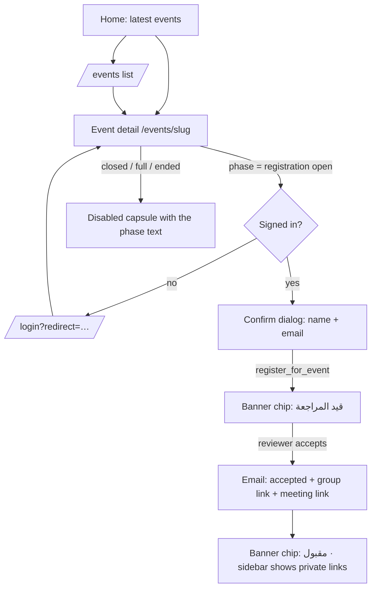
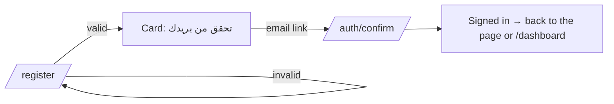
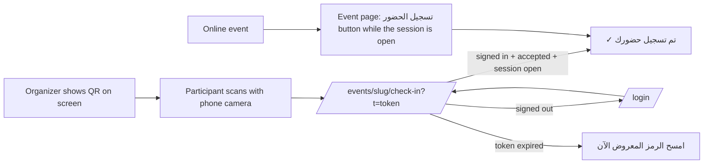

# Public Flows — Visitor Journeys

End-to-end journeys that start on the public site. The internal counterparts are in [INTERNAL-SCREENS/80-user-flows](../INTERNAL-SCREENS/80-user-flows.md); the numbering continues from there (P1–P6).

---

## P1 — Browse and register for an event (TARGET)

| Step | Screen | Guard / message |
| ---- | ------ | --------------- |
| 1 | [03-events-list](./03-events-list.md) | Badges from the derived phase |
| 2 | [04-event-detail](./04-event-detail.md) | Button reflects phase, seats, audience and the user's registration |
| 3 | Login | Returns to the event |
| 4 | Confirm dialog | Duplicate → "أنت مسجّل مسبقًا" |
| 5 | Email (`registration.received`) | Logged per recipient |
| 6 | Reviewer decision ([15](../INTERNAL-SCREENS/15-event-registrations.md)) | Acceptance email includes the **group link** (KFUCS rule) |

## P2 — Create an account

The register page states that an account is not membership (D-001) and links to `/join`.

## P3 — Forgot and reset password

`/forgot-password` → the same success message whether or not the e-mail exists → e-mail link → `/reset-password` (verifying → form → "تم تحديث كلمة المرور بنجاح") → `/login`.

## P4 — Join the community (annual intake)

Full flow: [INTERNAL-SCREENS/80-user-flows F5](../INTERNAL-SCREENS/80-user-flows.md). Public side:
1. `/join` shows *closed*, *upcoming* (with the opening date) or *open*.
2. While open: sign in → 5-step application → *تم استلام طلبك*.
3. The applicant follows the status in `/account/membership`.
4. A decision e-mail is sent. On acceptance, the member appears in the directory if they opted in.

## P5 — Check in on the event day (ADR-012)

## P6 — Verify a certificate (**Q-020**)

A third party opens `/certificates/<id>` (from the QR code or link on the PDF) and sees whether it is valid, plus the name, event, dates and attendance %. Unknown id → 404.

---

## Public route map (TARGET)

| Route | Today | After the rebuild |
| ----- | ----- | ----------------- |
| `/` | Hardcoded | DB-driven blocks, same look |
| `/about` | Static | Static (i18n messages) |
| `/events`, `/events/[slug]` | Hardcoded, numeric ids | DB, slugs; `/events/1…6` → 301 |
| `/events/[slug]/check-in` | — | New |
| `/articles`, `/articles/[slug]` | Hardcoded, numeric ids | DB, slugs; old ids → 301 |
| `/members`, `/members/[id]` | Open table read | `member_directory`; `/members/all` → 301 `/members` |
| `/join` | — | New (3B) |
| `/login`, `/register`, `/forgot-password`, `/reset-password` | Client auth | SSR auth, same look |
| `/committee` | Legacy review page | 301 → `/dashboard/registrations` |
| `/certificates/[id]`, `/privacy`, `/search` | — | New (Q-020, Q-031, 3C) |
| All of the above | No locale prefix | `/ar/…` (default) and `/en/…` (ADR-010) |
