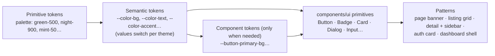

# 10 — Design System

| Field            | Value      |
| ---------------- | ---------- |
| **Last Updated** | 2026-10-02 |
| **Status**       | Draft      |
| **Owner**        | Design & Identity committee + Technology & Development committee |

## 1. Purpose

Documents the SDC visual language **as it exists today** (extracted from the CSS, not invented) and defines the **target token and component system** that will carry it into the rebuilt platform. The visual identity is one of the assets worth keeping ([audit §10](../01-project/current-system-audit.md#10-what-is-worth-keeping)); the problem is not how it looks but how it is built.

## 2. Character

**"Green signal on deep night."** A dark-first, technical aesthetic: near-black green-tinted canvases, a neon-green signal color (`#00E676`) for emphasis and interaction, capsule-shaped buttons, softly rounded cards with thin green-tinted borders and green glows on hover. The light theme is a calm **mint-and-forest** counterpart (mint canvas `#F4FAF6`, forest text `#123B35`, sage accents). Arabic-first typography (IBM Plex Sans Arabic) with Rubik for Latin.

| Principle | Meaning |
| --------- | ------- |
| Dark first | Dark is the default theme; light is a full peer, not an afterthought |
| One signal color | Neon green is reserved for emphasis, active states and primary actions — never for large surfaces |
| Capsules for actions, soft rectangles for content | Buttons and pills are fully rounded; cards are 16–20 px rounded |
| Quiet borders, green glow | Separation by 1 px translucent borders; elevation by soft green-tinted shadows, not heavy black shadows |
| Arabic-first, mirrored correctly | Every layout works RTL and LTR from one stylesheet |
| Accessible contrast | Token pairs are chosen to meet WCAG AA |

## 3. Current implementation (CURRENT)

| Aspect | State |
| ------ | ----- |
| Styling technology | ~5,800 lines of plain global CSS in 16 files + 80 inline styles; Tailwind v4 imported but not configured or used |
| Tokens | Only `--background` and `--foreground` exist; ~60 distinct hex values hardcoded across files |
| Theming | `data-theme="light"` on `<html>`; light theme via ~250 `:root[data-theme='light'] .class` overrides |
| Naming | `sdc-` prefixed classes; same class names redefined in several files (collisions) |
| Breakpoints | 8 different `max-width` values (400–1024 px) |
| Direction | Mostly physical properties (`left/right`, `margin-left`) with `direction: inherit`; 1 logical property |
| Components | Visual patterns repeated per page rather than shared components |

## 4. Target architecture

- Tokens are **CSS custom properties** defined once in `src/styles/tokens.css`, with theme values under `:root` (dark) and `:root[data-theme='light']`.
- Components consume **semantic** tokens only; no raw hex values in component code.
- The styling technology for components is decided in [ADR-009](../90-decisions/ADR-009-styling-and-design-tokens.md) (Proposed: Tailwind CSS v4 with `@theme` mapped to the same CSS variables; legacy CSS migrated when a page is touched).

## 5. Assets

| Rule | Detail |
| ---- | ------ |
| File names | `kebab-case`, no spaces: `logo-full-white.png`, not `Full whiteLogo 1.png` |
| Location | `public/brand/` (logos), `public/illustrations/` (hero, 404 icons); content images (event covers) in Supabase Storage, not `public/` |
| Formats | SVG for logos/icons when available (**OPEN Q-041** for vector masters); WebP/PNG for raster |
| Theme variants | Logos and hero art have dark and light variants, selected by theme token or `<picture>` with `data-theme` aware CSS |
| Icons | `lucide-react` (already used), 16–20 px, stroke 1.5–2; direction-sensitive icons mirrored in RTL |
| No external placeholders | Remove `via.placeholder.com` fallbacks; use local fallback assets |

## 6. Documents

| Document | Contents |
| -------- | -------- |
| [foundations/colors.md](./foundations/colors.md) | Observed palette (dark + light), semantic token mapping, contrast, token sketch |
| [foundations/typography.md](./foundations/typography.md) | Typefaces, observed scale, target scale, Arabic rules |
| [foundations/layout-and-shape.md](./foundations/layout-and-shape.md) | Containers, breakpoints, grid, spacing, radii, elevation, motion |
| [foundations/theming.md](./foundations/theming.md) | Dark/light mechanism, no-flash script, theme-aware assets |
| [foundations/rtl-and-i18n.md](./foundations/rtl-and-i18n.md) | Direction rules, logical properties, bilingual text, numerals and dates |
| [components.md](./components.md) | Inventory of current UI components with specs, and the target primitive library |
| [patterns.md](./patterns.md) | Page and interaction patterns: public pages, listings, detail pages, forms, dashboard, states |
| [accessibility.md](./accessibility.md) | Contrast findings, focus, keyboard, motion, screen readers |
| [INTERNAL-SCREENS/](./INTERNAL-SCREENS/README.md) | Screen blueprints for the internal dashboard: shell & sidebar, conditional rendering, skeletons, 16 screens (incl. the KFUCS 4-step event wizard and attendance sessions), `/join`, end-to-end flows, design brief |
| [PUBLIC-SCREENS/](./PUBLIC-SCREENS/README.md) | Blueprints of every **current** public page as rendered today (frozen look), target states/data for each, new public pages (check-in, certificate verification, privacy, search) and visitor flows |

> **Identity is frozen (D-009).** Design skills and redesigns may improve layout consistency, states and accessibility, but never the palette, typefaces or shapes — see [AI agent skills §2](../07-engineering/ai-agent-skills.md#2-design-guardrail--the-identity-is-frozen-d-009).
