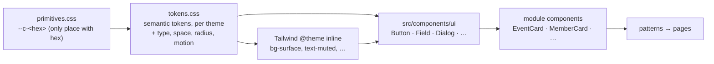

# 10 — Design System

| Field            | Value      |
| ---------------- | ---------- |
| **Last Updated** | 2026-10-10 |
| **Status**       | **v2** for public pages — approved by the owner 2026-10-10 ([ADR-014](../90-decisions/ADR-014-public-redesign-design-system-v2.md), Accepted) |
| **Owner**        | Design & Identity committee + Technology & Development committee |

## 1. Purpose

This folder defines the SDC visual language, the tokens that carry it, the components built on them, and the patterns that combine them into pages. **v2** is the system for the public redesign ([brief](./CLAUDE-DESIGN-PROMPT-PUBLIC-REDESIGN.md)). It keeps the SDC identity and takes structure, type scale and rhythm from the [reference study](./reference-notes.md). The internal dashboard keeps D-009 until a separate decision. It shares the tokens, so it inherits v2's token values ([impact](./token-mapping.md#impact-of-the-changed-values)).

## 2. Character

**"Green signal on deep night, set large."** Dark first: a near-black green canvas, green-tinted surfaces, and one neon-green signal for the action that matters. Headlines are big and confident (display ≈ 4.5× body), with generous space between sections, soft large radii, capsule buttons, and colour carried by tinted surfaces rather than borders. The light theme is a complete mint-and-forest peer. Arabic first, mirrored from one stylesheet.

| Principle | Meaning |
| --------- | ------- |
| Dark first, light complete | Dark is the default; every component and page is designed and checked in light too |
| One signal | `--accent` marks one action per view, the active item and focus; never a large area or a paragraph |
| Say it big, then quietly | One large headline, a short muted lede, then content. No eyebrow labels. |
| Capsules act, soft rectangles hold | Buttons, pills and chips are capsules; cards are 24 px; bands are 32 px |
| Tone before line, line before shadow | Separate by surface tone, then hairlines; shadows only for things that float |
| Arabic is the reference | Designed RTL, mirrored to LTR with logical properties only; English can run 30% longer |
| Honest content | Real data or labelled placeholders; status always in words |
| Accessible by construction | Every token pair passes WCAG 2.2 AA in both themes; 44 px targets; reduced motion honoured |

## 3. Architecture

## 4. Documents

| Document | Contents |
| -------- | -------- |
| [reference-notes.md](./reference-notes.md) | What we learned from the three Tuwaiq sites, and what SDC takes from each |
| [foundations/colors.md](./foundations/colors.md) | Colour roles, semantic tokens (dark and light), rules |
| [foundations/typography.md](./foundations/typography.md) | Families and pairing, the fluid type scale, measure, rules |
| [foundations/layout-and-shape.md](./foundations/layout-and-shape.md) | Breakpoints, grid, containers, no-sideways-scroll, spacing, section rhythm, radius, elevation, z-index, the SDC motif |
| [foundations/motion-icons-focus.md](./foundations/motion-icons-focus.md) | Motion tokens and catalogue, reduced motion, iconography (lucide 1.75), the focus ring |
| [foundations/rtl-and-i18n.md](./foundations/rtl-and-i18n.md) | Direction rules, own-direction content, the +30% rule, copy rules |
| [foundations/theming.md](./foundations/theming.md) | The theme mechanism, theme-aware assets, the toggle |
| [components.md](./components.md) | 40+ components: anatomy, variants, states, sizes, AR/EN examples, and the implementation map to `src/components/ui` |
| [patterns.md](./patterns.md) | Hero, section header, grids, filterable list, detail + side facts, timeline, CTA band, stats, quote, partners, directory, forms, feedback (incl. the registration flow), the auth split layout |
| [accessibility.md](./accessibility.md) | WCAG 2.2 AA requirements and **the contrast table of every token pair in both themes** |
| [token-mapping.md](./token-mapping.md) | Semantic token → primitive for both themes, what changed, the paste-ready `tokens.css` |
| [tools/contrast.py](./tools/contrast.py) | The script that computes the contrast table |
| [PUBLIC-SCREENS-V2/](./PUBLIC-SCREENS-V2/README.md) | **The v2 page specs**: every public route with wireframes, states, data, copy; the media list, suggested additions and open questions |
| [artifact/](./artifact/ARTIFACT-README.md) | **Export of the Design System artifact** (v7): `tokens.json`, `tokens.css`, 44 component previews with READMEs, logos, hero art, fonts. Reference only; the docs and `src/styles` win on any difference |
| [PUBLIC-SCREENS/](./PUBLIC-SCREENS/README.md) | Blueprints of the current (v1) public pages, kept as the record of today's pages |
| [INTERNAL-SCREENS/](./INTERNAL-SCREENS/README.md) | Dashboard blueprints (unchanged) |
| [reference-images/tuwaiq/](./reference-images/tuwaiq/README.md) | The owner's reference screenshots (design reference only, never copied) |

## 5. Assets

| Rule | Detail |
| ---- | ------ |
| Logos | Use the existing files; never redraw or recolour ([logo](./components.md#41-logo)). Rename to kebab-case under `public/brand/` without changing pixels. SVG masters: Q-041. |
| Icons | lucide-react only, stroke 1.75 ([iconography](./foundations/motion-icons-focus.md#2-iconography)). The legacy PNG icons are retired. |
| Content images | Event covers, member photos and article covers live in Supabase Storage, with a required localized `alt`. |
| Placeholders | No external placeholder services. Missing media → [image fallback](./components.md#33-image-with-fallback). Design files label placeholders "PLACEHOLDER". |
