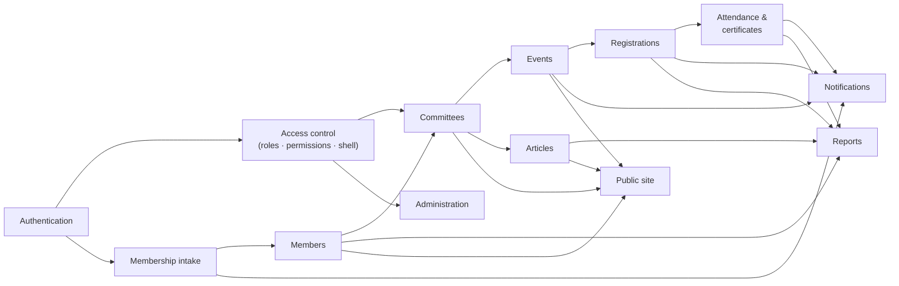

# 11 — Modules

| Field            | Value      |
| ---------------- | ---------- |
| **Last Updated** | 2026-10-02 |
| **Status**       | Draft — full specification per module, ready for sprint planning |

## Purpose

There is one folder per functional module. Each module document is the **implementation spec** for its sprints. It contains:
- the business process, lifecycle and key sequences (Mermaid)
- the data it owns
- its logic and validation rules
- routes and screens
- Server Actions with error codes
- edge cases
- tests
- an implementation plan

It **links** to requirements (FR-), rules (BR-), entities and permissions rather than restating them. New modules start from [`_template.md`](./_template.md).

Cross-module, end-to-end processes (the annual calendar, the event journey, the intake journey, the term handover) are in [business processes](../03-business-domain/business-processes.md).

## Module index

| # | Module | Code folder | Current state | Phase · Sprints | Doc |
| - | ------ | ----------- | ------------- | --------------- | --- |
| 1 | Access control (RBAC, access context, dashboard shell) | `modules/access` | Hardcoded e-mail list | 2 · S04 | [access-control](./access-control/README.md) |
| 2 | Authentication & account | `modules/auth`, `modules/account` | Browser-only Supabase Auth | 2 · S03 | [authentication](./authentication/README.md) |
| 3 | Committees & positions | `modules/committees` | Hardcoded on the members page | 2 · S04, 4 · S10 | [committees](./committees/README.md) |
| 4 | Membership intake | `modules/membership` | **Not built** | 3B · S07–S08 | [membership](./membership/README.md) |
| 5 | Members & directory | `modules/members` | Open table, not linked to accounts | 3B · S08 | [members](./members/README.md) |
| 6 | Events | `modules/events` | Hardcoded ×3 | 3A · S05–S06 | [events](./events/README.md) |
| 7 | Event registrations | `modules/registrations` | Open table, single reviewer | 3A · S06 | [registrations](./registrations/README.md) |
| 8 | Attendance & certificates | `modules/attendance` | **Not built** | 4 · S10 | [attendance](./attendance/README.md) |
| 9 | Articles / threads | `modules/articles` | Hardcoded ×2 | 3C · S09 | [articles](./articles/README.md) |
| 10 | Notifications | `modules/notifications`, `lib/email` | Open-relay Edge Functions + Gmail | 2–3C · S03, S06, S09 | [notifications](./notifications/README.md) |
| 11 | Reports & dashboards | `modules/reports` | None | 4 · S11 | [reports](./reports/README.md) |
| 12 | Administration | `modules/admin` | None | 2 · S04, 4 · S11 | [administration](./administration/README.md) |
| 13 | Public site | `app/[locale]/(public)` | Hardcoded, client-rendered | 1–4 | [public-site](./public-site/README.md) |

## Module dependency map

## Shared conventions (all modules)

| Concern | Convention | Reference |
| ------- | ---------- | --------- |
| Folder | `src/modules/<m>/{schemas,queries,actions,types}.ts` + `components/` | [frontend architecture §8](../04-architecture/frontend-architecture.md) |
| Server Action steps | authenticate → validate (Zod) → authorize (`can`) → one DB call → side effects → revalidate → `Result<T>` | [server logic §3](../04-architecture/server-logic-and-data-access.md#3-module-anatomy) |
| Errors | Domain functions raise `P0001` with a machine code; mapped to `ErrorCode` + an i18n message | [server logic §5](../04-architecture/server-logic-and-data-access.md#5-error-handling) |
| Authorization | Permission keys + committee scope, checked in the UI (hide/disable), the Server Action and RLS | [authorization model](../06-security/authorization-model.md) |
| Audit | Every state transition, decision, export and role change → `audit_logs` (BR-GOV-001) | [platform entities](../05-database/entities/platform.md) |
| i18n | Messages in `messages/{ar,en}.json` under the module namespace (`events.*`, `membership.*`) | [rtl-and-i18n](../10-design-system/foundations/rtl-and-i18n.md) |
| Loading | `loading.tsx` skeletons that match the final layout | [04-skeleton-loading](../10-design-system/INTERNAL-SCREENS/04-skeleton-loading.md) |
