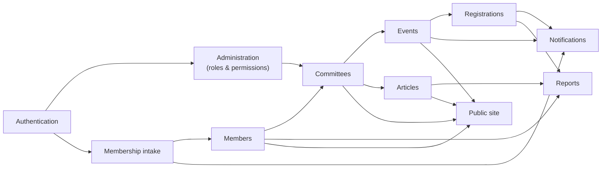

# 11 — Modules

| Field            | Value      |
| ---------------- | ---------- |
| **Last Updated** | 2026-10-02 |
| **Status**       | Draft      |

## Purpose

One folder per functional module. Module documents **link** to requirements, rules, entities and permissions (never restate them) and add what is module-specific: routes and screens, flows, edge cases, and test scenarios. New modules start from [`_template.md`](./_template.md).

## Module index

| Module | Current state | Target phase | Doc |
| ------ | ------------- | ------------ | --- |
| Public site | Hardcoded, client-rendered | 3 (pages), 4 (settings/partners) | [public-site](./public-site/README.md) |
| Authentication & account | Browser-only Supabase Auth | 2 | [authentication](./authentication/README.md) |
| Membership intake | **Not built** | 3B | [membership](./membership/README.md) |
| Members & directory | DB table, open policies, unlinked | 3B | [members](./members/README.md) |
| Committees & positions | Hardcoded on members page | 2 (model) / 4 (management UI) | [committees](./committees/README.md) |
| Events | Hardcoded ×3 | 3A | [events](./events/README.md) |
| Event registrations | DB table, open policies, single reviewer | 3A | [registrations](./registrations/README.md) |
| Articles / threads | Hardcoded ×2 | 3C | [articles](./articles/README.md) |
| Notifications | Unauthenticated Edge Functions + Gmail | 3A–3C | [notifications](./notifications/README.md) |
| Reports | None | 4 | [reports](./reports/README.md) |
| Administration | None | 2 (roles) / 4 (rest) | [administration](./administration/README.md) |

## Module dependency map

