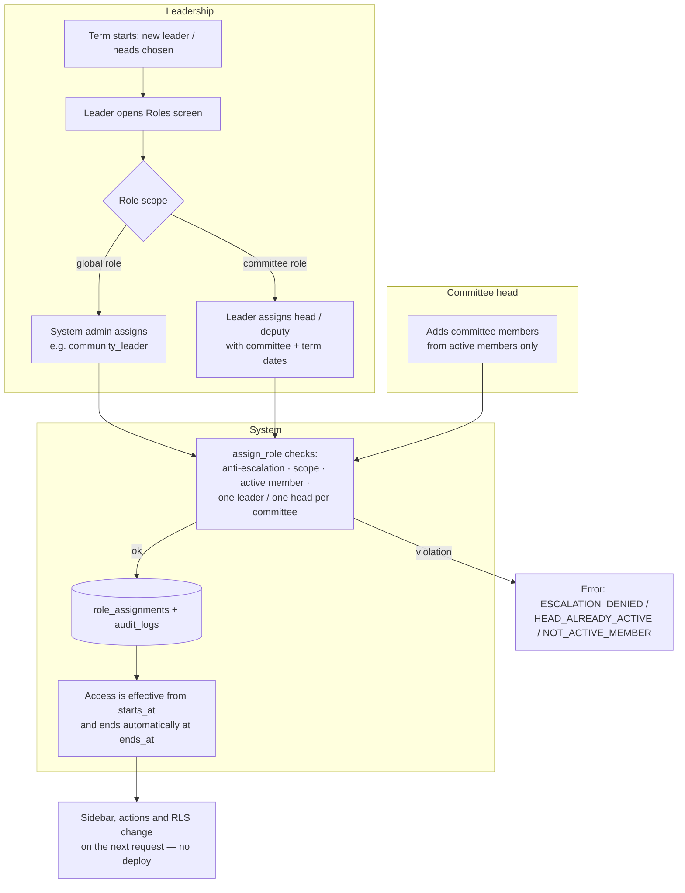
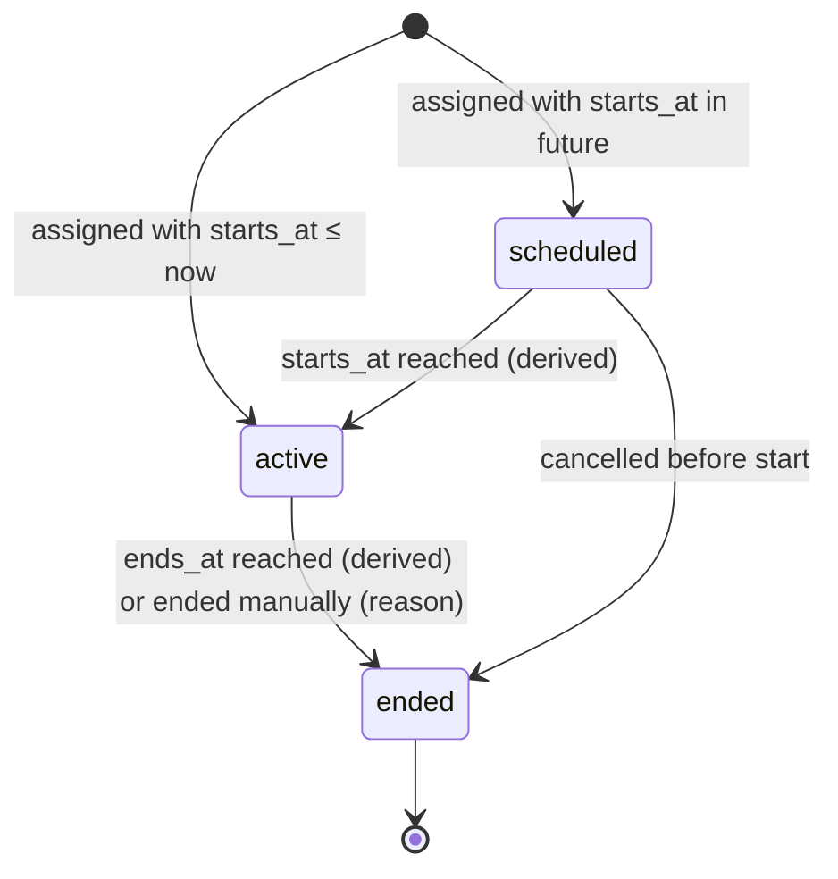
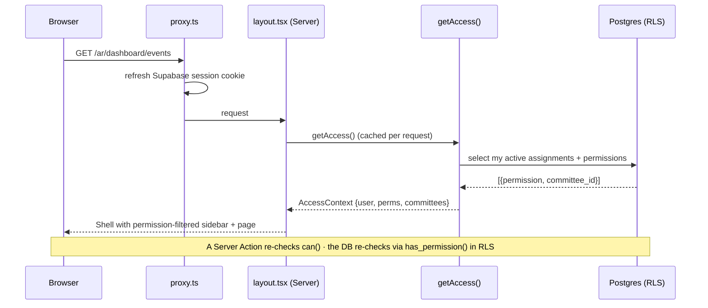
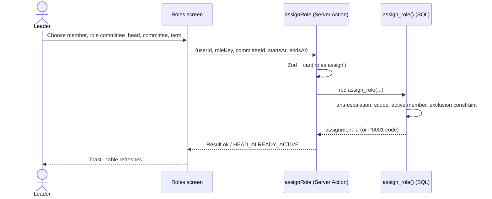
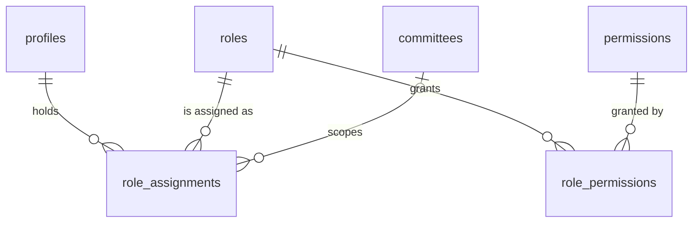

# Module — Access Control (RBAC, Access Context, Dashboard Shell)

| Field            | Value |
| ---------------- | ----- |
| **Last Updated** | 2026-10-02 |
| **Status**       | Draft |
| **Owner**        | Technology & Development committee |
| **Phase / Sprints** | Phase 2 / Sprint 04 |
| **Code**         | `src/modules/access/`, `src/lib/auth/permissions.ts`, `src/components/layout/DashboardShell/` |

## 1. Purpose and scope

This module decides **who may do what, where and until when**: roles, permissions and time-bound role assignments, optionally scoped to a committee. They are enforced by RLS in the database and mirrored in the UI. It replaces the hardcoded `COMMITTEE_EMAILS` list and the hardcoded leadership arrays. It also owns the **dashboard shell** (KFUCS-style sidebar), whose navigation is filtered by permissions.

| In scope | Out of scope |
| -------- | ------------ |
| `roles`, `permissions`, `role_permissions`, `role_assignments` | Admin screens to assign roles (→ [administration](../administration/README.md)) |
| `private.has_permission*` helpers used by every RLS policy | Committee CRUD (→ [committees](../committees/README.md)) |
| `getAccess()`, `can()`, `requirePermission()`, `AccessProvider` | Authentication itself (→ [authentication](../authentication/README.md)) |
| Dashboard shell, sidebar config, 403 page | Public header (→ [public site](../public-site/README.md)) |
| Anti-escalation and last-admin guards | Event-scoped grants (presenters) — deferred |

> **Implementation status (2026-10-02):** Sprint 04 is complete locally — see the [sprint plan](../../99-project-management/sprints/sprint-04-rbac-committees-shell/plan.md#implementation-status-updated-at-sprint-end). Differences from this first design: `end_role_assignment` also raises `REASON_REQUIRED`, `ALREADY_ENDED`, `SELF_ASSIGNMENT`; `assign_role` also raises `ALREADY_ASSIGNED`, `COMMITTEE_INACTIVE`; there are 30 permission keys.

## 2. Current state (CURRENT / PROBLEM)

- `src/data/committeeEmails.ts` holds a hardcoded list. The header link and `/committee` page are shown when the signed-in e-mail is in it ([audit](../../01-project/current-system-audit.md)).
- RLS is open: anon can write `members` and read and update `event_registrations`. There is **no server-side authorization at all**.
- Leadership names and titles are hardcoded in `app/members/page.tsx`.

## 3. Actors and permissions

| Actor | Can | Key | Scope |
| ----- | --- | --- | ----- |
| Any signed-in user | Read own assignments and permissions (`/account`) | ownership | — |
| Founder, community leader | View all assignments | `roles.view` | global |
| Community leader | Assign / end **non-global** roles (committee head, deputy, member) | `roles.assign` | global, anti-escalation |
| Committee head | Add / remove committee members of own committee | `committee_members.manage` | own committee |
| System admin | Everything, including global roles and `system_admin` | all | global |

Role × permission defaults: [permission catalog §2](../../06-security/permission-catalog.md#2-role--permission-matrix-proposed-defaults). Roles: `system_admin`, `founder`, `community_leader`, `advisor`, `committee_head`, `committee_deputy`, `committee_member`.

## 4. Business process — granting access (term-based)



## 5. Lifecycle — role assignment



The state is **derived** from `starts_at` and `ends_at` (no cron). Ending sets `ends_at = now()` plus `ended_by` and `end_reason`. Rows are never deleted (BR-ORG-001).

| Transition | Who | Guard | Side effects |
| ---------- | --- | ----- | ------------ |
| assign | `roles.assign` (non-global) / `system_admin` | BR-ORG-002 scope; BR-ORG-003 uniqueness; BR-ORG-004 active member; BR-ORG-006 anti-escalation | Audit `role.assigned`; optional `committee.assigned` e-mail |
| end | same | BR-ORG-007 last admin | Audit `role.ended` |
| membership ends / suspended | system (trigger) | — | All committee roles end (BR-MBR-011) |

## 6. Key sequences

### 6.1 Every authorized request



### 6.2 Assign a committee head



## 7. Data



| Object | Kind | Purpose |
| ------ | ---- | ------- |
| `roles`, `permissions`, `role_permissions` | tables (seeded by migration) | Catalogue ([identity and access §2–4](../../05-database/entities/identity-and-access.md)) |
| `role_assignments` | table | Positions with terms and optional committee |
| `private.has_permission(p, committee)` | SQL, `security definer`, `stable` | The only permission check used in RLS |
| `private.has_permission_any_scope(p)`, `private.committees_with_permission(p)` | SQL | List pages and `committee_id in (...)` policies |
| `my_permissions` | view (security invoker) | Feeds `getAccess()` |
| `current_positions` | view | Public leadership display ([committees](../committees/README.md)) |
| `assign_role()`, `end_role_assignment()` | SQL functions | The only write path |

## 8. Business logic and validation

| # | Rule | Enforced in | Source |
| - | ---- | ----------- | ------ |
| AC-1 | A permission is effective only while `starts_at ≤ now < coalesce(ends_at, ∞)` | DB helper | BR-ORG-001 |
| AC-2 | A committee-scoped role requires `committee_id`; a global role forbids it | DB trigger | BR-ORG-002 |
| AC-3 | At most one active `community_leader`, and one active `committee_head` per committee | Exclusion constraints | BR-ORG-003 |
| AC-4 | Only active members hold committee roles | DB trigger | BR-ORG-004 |
| AC-5 | Nobody grants a role whose permissions they do not hold (except `system_admin`) | `assign_role()` | BR-ORG-006 |
| AC-6 | The last active `system_admin` cannot be ended | `end_role_assignment()` | BR-ORG-007 |
| AC-7 | UI rule: **hide** what a user can never do, **disable with a reason** what they can do but not right now | UI | [03-conditional-rendering](../../10-design-system/INTERNAL-SCREENS/03-conditional-rendering.md) |
| AC-8 | Every assignment change is audited (trigger) | DB | BR-GOV-001 |
| AC-9 | No authorization decision is ever based on e-mail, name or client state | Code review + lint rule | ADR-004 |

## 9. Routes and screens

| Route | Audience | Purpose | Blueprint |
| ----- | -------- | ------- | --------- |
| `/[locale]/dashboard/**` (layout) | Anyone with ≥ 1 dashboard permission (others → `/account`) | Shell: sidebar + header + content | [01-shell-layout](../../10-design-system/INTERNAL-SCREENS/01-shell-layout.md), [02-sidebar-navigation](../../10-design-system/INTERNAL-SCREENS/02-sidebar-navigation.md) |
| Any dashboard route without permission | — | 403 page with a "back to dashboard" link (404 for out-of-scope records) | [03-conditional-rendering §5](../../10-design-system/INTERNAL-SCREENS/03-conditional-rendering.md) |
| `/[locale]/account/roles` | Signed-in user | My positions and terms (read-only) | [11-account-area](../../10-design-system/INTERNAL-SCREENS/11-account-area.md) |

## 10. Server operations

| Operation | Input | Authorization | DB call | Side effects | Error codes |
| --------- | ----- | ------------- | ------- | ------------ | ----------- |
| `getAccess()` (query, per request) | — | session | `my_permissions` | — | `UNAUTHENTICATED` |
| `assignRole` | `userId, roleKey, committeeId?, startsAt, endsAt?, displayTitle?` | `roles.assign` / `committee_members.manage` (member role, own committee) | `assign_role()` | audit; revalidate `positions` | `ESCALATION_DENIED`, `SCOPE_REQUIRED`, `SCOPE_FORBIDDEN`, `NOT_ACTIVE_MEMBER`, `HEAD_ALREADY_ACTIVE`, `LEADER_ALREADY_ACTIVE` |
| `endRoleAssignment` | `assignmentId, reason, endsAt?` | same | `end_role_assignment()` | audit; revalidate | `LAST_ADMIN`, `NOT_FOUND` |

`can(access, key, { committeeId })` is a pure function used by components and actions. `requirePermission(key, scope)` throws `FORBIDDEN` inside Server Actions and pages.

## 11. Notifications

`committee.assigned` (optional, Phase 4) — to a member added to a committee.

## 12. Error codes

| Code | When | Message (ar / en) |
| ---- | ---- | ----------------- |
| `FORBIDDEN` | Missing permission | ليس لديك صلاحية لهذا الإجراء / You don't have permission for this action |
| `ESCALATION_DENIED` | Granting more than you hold | لا يمكنك منح صلاحية لا تملكها / You can't grant a role you don't hold |
| `HEAD_ALREADY_ACTIVE` | Second active head | للجنة رئيس حالي — أنهِ فترته أولًا / This committee already has an active head — end that term first |
| `NOT_ACTIVE_MEMBER` | Committee role for a non-member | يجب أن يكون الشخص عضوًا فعّالًا / The person must be an active member |
| `LAST_ADMIN` | Ending the last system admin | لا يمكن إزالة آخر مسؤول نظام / The last system admin can't be removed |
| `SELF_ASSIGNMENT` | Changing your own positions (system admin excepted) | لا يمكنك تعديل مناصبك بنفسك / You can't change your own positions |
| `ALREADY_ASSIGNED` | Same person, same role, overlapping term | هذا الشخص يشغل هذا المنصب بالفعل / This person already holds this role for the same period |
| `REASON_REQUIRED` | Ending without a reason | يرجى كتابة السبب / Please provide a reason |

## 13. Edge cases

1. A term ends at midnight while the user is on a page → their next request has the new permissions, and a pending Server Action returns `FORBIDDEN` (the UI shows a toast and refreshes).
2. A user holds roles in two committees → the sidebar shows a committee switcher; lists default to "all my committees".
3. A leader assigns themselves as `system_admin` → `ESCALATION_DENIED`.
4. The role matrix changes (migration) → takes effect immediately for every user (permissions are data).
5. A head is suspended as a member → the trigger ends their committee roles, and the committee has no head (shown as a warning on the committee page).

## 14. Testing

| Level | Scenarios |
| ----- | --------- |
| Unit | `can()` truth table; sidebar config filtered per persona (snapshot) |
| pgTAP | The **full role × permission matrix** against RLS for every table; AC-2…AC-6; time-bound effectiveness (assignment starting tomorrow has no effect today); audit trigger writes |
| E2E | Six seeded personas log in and see exactly the sidebar of the [role → view matrix](../../10-design-system/INTERNAL-SCREENS/03-conditional-rendering.md); a head of committee A gets 404 on committee B's event |

## 15. Implementation plan (Sprint 04)

1. Migration `…_access_control.sql`: tables, seeds (roles, permissions, matrix), helpers, triggers, exclusion constraints, audit trigger.
2. Migration `…_rls_rewrite.sql`: replace every open policy with `has_permission` policies (paired with the containment tests from DB-004, which turn green).
3. `lib/auth/permissions.ts` (`can`, `requirePermission`), `modules/access/queries.ts` (`getAccess` with React `cache()`).
4. `components/layout/DashboardShell` + `config/sidebar.ts` ([02 §4 contract](../../10-design-system/INTERNAL-SCREENS/02-sidebar-navigation.md)).
5. Bootstrap seed: two `system_admin` users (Q-039), map the current reviewer to their real position, then delete `committeeEmails.ts`.

```text
src/modules/access/
├── queries.ts      getAccess(), listAssignments(filters)
├── actions.ts      assignRole, endRoleAssignment
├── schemas.ts      AssignRoleInput, EndAssignmentInput
├── types.ts        AccessContext, PermissionKey (generated union)
└── components/     AccessProvider, Can, RoleBadge
```

## 16. Open questions

Q-003 (role list), Q-014 (public positions), Q-032 (audit visibility), Q-039 (first admins).
