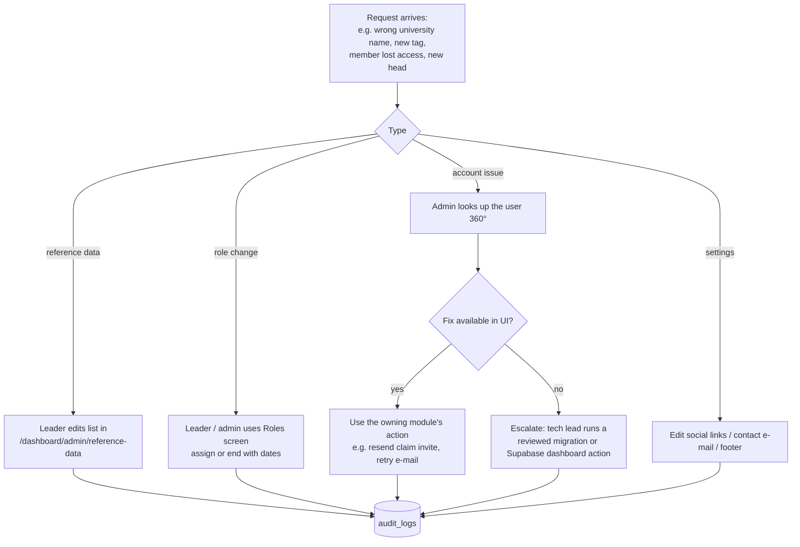
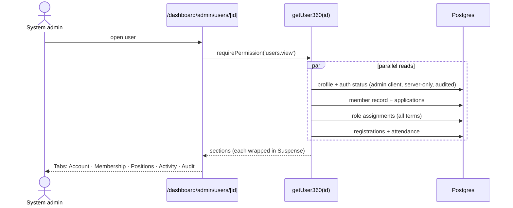

# Module — Administration

| Field            | Value |
| ---------------- | ----- |
| **Last Updated** | 2026-10-02 |
| **Status**       | Draft |
| **Owner**        | System administrators (Technology & Development) · community leader (limited) |
| **Phase / Sprints** | Phase 2 / Sprint 04 (users, roles) · Phase 4 / Sprint 11 (audit, e-mail log, reference data, settings) |
| **Code**         | `src/modules/admin/` |

## 1. Purpose and scope

This module covers technical and organizational administration **without database access**:
- who has which role
- managed lists (reference data)
- site settings
- traceability through the audit and e-mail logs

The rules behind roles live in [access control](../access-control/README.md); this module is its UI and the other admin screens.

| In scope | Out of scope |
| -------- | ------------ |
| Users: search, view the 360° profile (account, membership, positions, registrations) | Editing other users' credentials (Supabase Auth only) |
| Roles: list assignments, assign/end with terms | Changing the permission matrix (migration only) |
| Audit log viewer | Infrastructure (Vercel/Supabase dashboards) |
| E-mail log (global) | Backups (→ [operations](../../08-infrastructure/operations.md)) |
| Reference data: universities, majors, tracks, tags | — |
| Site settings: social links, contact e-mail, footer text, certificate settings | — |

## 2. Current state (CURRENT / PROBLEM)

None. Every data fix or permission change today needs someone with database access or a code deploy (`committeeEmails.ts`).

## 3. Actors and permissions

| Actor | Can | Key |
| ----- | --- | --- |
| System admin | Everything here | all admin keys |
| Community leader | Assign non-global roles; reference data; settings | `roles.assign`, `reference_data.manage`, `settings.manage` |
| Founders | View roles (read-only) | `roles.view` |
| Leadership (**Q-032**) | Audit entries for their scope | `audit.view` (scoped) — proposed |

## 4. Business process — admin request handling



## 5. Lifecycle — reference data item

```mermaid
stateDiagram-v2
    [*] --> active : created
    active --> inactive : deactivated (hidden from new forms; existing records keep it)
    inactive --> active : reactivated
    active --> [*] : deleted (only if never referenced)
```



## 6. Key sequence — view a user 360°



## 7. Data

| Object | Purpose |
| ------ | ------- |
| `profiles`, `role_assignments`, `members`, `event_registrations` | Read for the 360° view |
| `audit_logs` | Append-only ([platform §1](../../05-database/entities/platform.md#1-audit_logs)) |
| `email_logs` | [platform §2](../../05-database/entities/platform.md#2-email_logs) |
| `universities`, `majors`, `tracks`, `tags` | [reference data](../../05-database/entities/reference-data.md) |
| `site_settings` | Keys: `social_links`, `contact_email`, `footer`, `certificates_enabled`, `certificate_threshold` |

## 8. Business logic and validation

| # | Rule | Enforced in | Source |
| - | ---- | ----------- | ------ |
| AD-1 | Anti-escalation and last-admin guards on every role change | [access control AC-5/6](../access-control/README.md#8-business-logic-and-validation) | BR-ORG-006/007 |
| AD-2 | Audit is append-only: no UPDATE or DELETE grants, even for admins | DB grants | BR-GOV-002 |
| AD-3 | Every admin action writes an audit entry, including viewing exports | Server Actions | BR-GOV-001 |
| AD-4 | Reference values are deactivated, not deleted, once referenced | DB function | BR-GOV-003 |
| AD-5 | The admin (service-role) client is used only in `getUser360` for auth status, with a code comment + audit | Code review | server logic §2 |
| AD-6 | Settings values are validated per key (URLs `https://`, e-mail format, threshold 0–100) | Zod per key | FR-ADM-005 |

## 9. Routes and screens

| Route | Audience | Purpose | Blueprint |
| ----- | -------- | ------- | --------- |
| `/[locale]/dashboard/admin/users` (+ `/[id]`) | `users.view` | Search; 360° view | [23-admin-users-roles](../../10-design-system/INTERNAL-SCREENS/23-admin-users-roles.md) |
| `/[locale]/dashboard/admin/roles` | `roles.view` / `roles.assign` | Assignments by role/committee; assign/end | same |
| `/[locale]/dashboard/admin/audit` | `audit.view` | Filterable log (actor, entity, action, date) | [24-admin](../../10-design-system/INTERNAL-SCREENS/24-admin-audit-emails-settings.md) |
| `/[locale]/dashboard/admin/emails` | `email_logs.view` | Global e-mail log + retry | same |
| `/[locale]/dashboard/admin/reference-data` | `reference_data.manage` | Lists with ar/en labels, order, active flag | same |
| `/[locale]/dashboard/admin/settings` | `settings.manage` | Social links, contact e-mail, footer, certificates | same |

## 10. Server operations

| Operation | Authorization | Error codes |
| --------- | ------------- | ----------- |
| `searchUsers(q)`, `getUser360(id)` | `users.view` | `NOT_FOUND` |
| `assignRole`, `endRoleAssignment` | see [access control §10](../access-control/README.md#10-server-operations) | see there |
| `listAudit(filters)` | `audit.view` | — |
| `listEmails(filters)`, `retryEmail(id)` | `email_logs.view` | `NOTHING_TO_RETRY` |
| `upsertReferenceItem`, `setReferenceItemActive` | `reference_data.manage` | `DUPLICATE_LABEL`, `IN_USE` |
| `updateSetting(key, value)` | `settings.manage` | `VALIDATION_FAILED` |

## 11. Edge cases

1. Ending the last `system_admin` → blocked (`LAST_ADMIN`).
2. A leader tries to assign `system_admin` → `ESCALATION_DENIED`.
3. A deleted user with roles → assignments ended, history kept, actor shown as "deleted user".
4. A university is renamed → all members show the new label (FK), and the audit keeps the old one.
5. Audit search over a long period → paginated (50 per page), with an index on `(occurred_at desc)` and filters.

## 12. Testing

| Level | Scenarios |
| ----- | --------- |
| pgTAP | Audit append-only; reference delete blocked when in use; settings RLS |
| E2E | J8: admin assigns a head → the head's sidebar changes; the leader can't assign a global role; settings change shows in the footer |

## 13. Implementation plan

- **S04:** users list and 360° view (account + positions); roles screen.
- **S11:** audit viewer, e-mail log, reference data, settings (footer social links read `site_settings`, and the visual check stays unchanged).

```text
src/modules/admin/
├── queries.ts     searchUsers, getUser360, listAudit, listEmails, listReference(kind), getSettings
├── actions.ts     upsertReferenceItem, setReferenceItemActive, updateSetting, retryEmail
└── components/    UserTable, User360Tabs, AuditTable, EmailLogTable, ReferenceList, SettingsForm
```

## 14. Open questions

Q-032 (audit visibility for leadership/founders), Q-039 (first admins).
