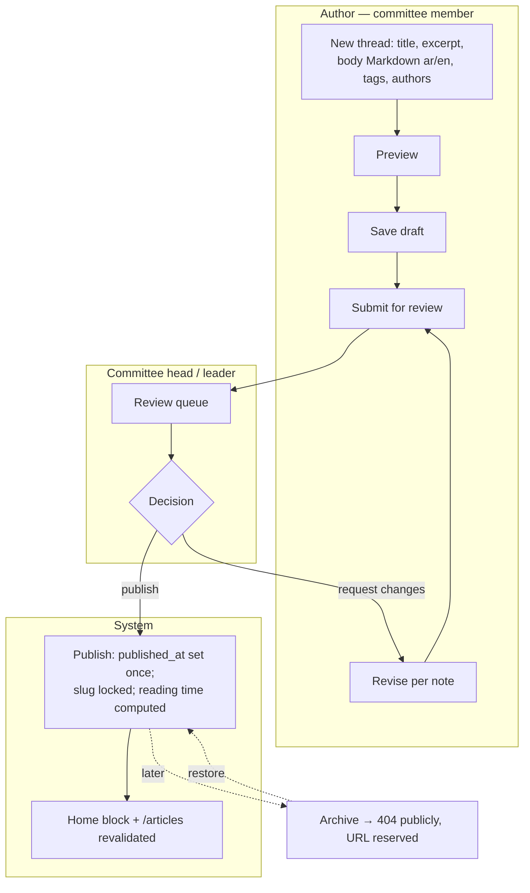
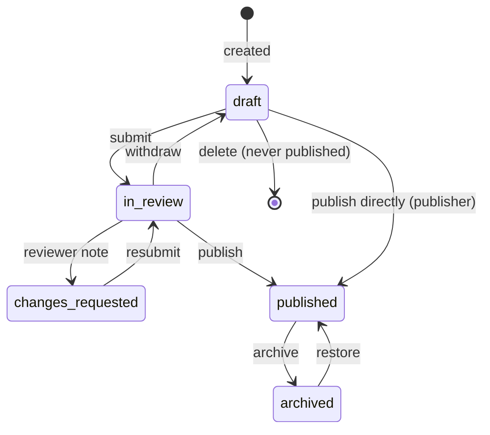
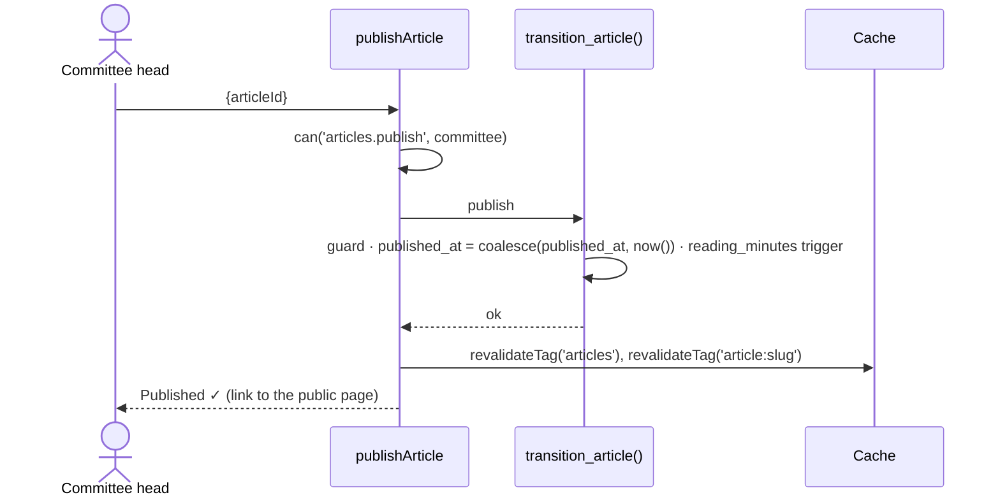
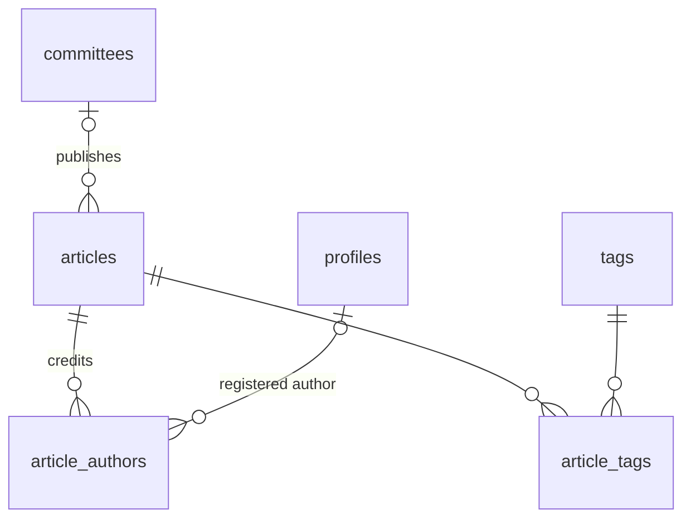

# Module — Articles (Threads / ثريدات)

| Field            | Value |
| ---------------- | ----- |
| **Last Updated** | 2026-10-02 |
| **Status**       | Implemented in Sprint 09 (local); Q-006 / Q-033 proposals in effect |
| **Owner**        | Committees (authoring) · committee heads / leader (publishing) |
| **Phase / Sprints** | Phase 3C / Sprint 09 |
| **Code**         | `src/modules/articles/` |

## 1. Purpose and scope

Committees and members publish **reviewed, bilingual technical content**. This serves SDC's mission of enriching Arabic technical content. Users see these posts as "ثريدات" (threads); the code and URLs call them `articles` (Q-033).

| In scope | Out of scope |
| -------- | ------------ |
| Bilingual Markdown drafts, authors (users, committee byline, guests), tags, cover, resource link | Comments and likes (not planned) |
| Review → publish → archive → restore | Newsletter |
| Public list/detail from `public_articles` (same look) | Rich WYSIWYG editor (Markdown + preview is enough) |
| Migration of the six existing articles + redirects | — |

## 2. Current state (CURRENT / PROBLEM)

- Six articles are hardcoded twice: in the list (`ArticlesSection.tsx`, `app/articles/page.tsx`) and in the detail page.
- Reading time is typed by hand.
- The label alternates between "ثريد" and "مقال".
- Unknown ids fall back to article 1.
- There is no authoring or review; publishing needs a developer.

## 3. Actors and permissions

| Actor | Can | Key | Scope |
| ----- | --- | --- | ----- |
| Everyone | Read published articles | — | public |
| Committee member | Create and edit own drafts; submit | `articles.create` (+ ownership) | own committee |
| Committee head / deputy | Edit any draft of the committee; publish, request changes, archive | `articles.edit`, `articles.publish` | own committee (**Q-006**) |
| Community leader | All, in every committee | all | global |

## 4. Business process



## 5. Lifecycle



| Transition | Who | Guard | Side effects |
| ---------- | --- | ----- | ------------ |
| submit | author / editor | Arabic title + body | audit |
| publish | `articles.publish` | body renders without errors | `published_at` once; revalidate; audit |
| request changes | `articles.publish` | note ≥ 10 | audit |
| archive / restore | `articles.publish` | — | revalidate |

## 6. Key sequences — publish



## 7. Data



| Object | Purpose |
| ------ | ------- |
| `articles`, `article_authors`, `article_tags`, `tags` | [content entities](../../05-database/entities/content.md) |
| `public_articles` (view) | Published only, with authors, tags, committee |
| `transition_article(id, action, note)` | Status writer |
| `article_slug_redirects` | **Not created** — the slug locks at the first publish and the old numeric URLs resolve through `legacy_id` (Sprint 09) |

## 8. Business logic and validation

| # | Rule | Enforced in | Source |
| - | ---- | ----------- | ------ |
| AR-1 | Only `published` is public; `archived` returns 404 but keeps its slug | View + route | BR-ART-001 |
| AR-2 | Slug unique, `^[a-z0-9-]+$`, stable after publish | DB | BR-ART-003 |
| AR-3 | Markdown rendered with a sanitizer (no raw HTML, script or iframe); links get `rel="noopener nofollow"` | Renderer (`react-markdown` + `rehype-sanitize`) | BR-ART-004 |
| AR-4 | `published_at` is set once | Trigger | BR-ART-005 |
| AR-5 | `reading_minutes` = words ÷ 200, minimum 1 | Trigger | content entity |
| AR-6 | Byline: at least one author line (user, committee, or display name) | Function | FR-ART-001 |
| AR-7 | Resource link is `https://` only | CHECK | — |
| AR-8 | Body ≤ 50,000 characters; title ≤ 200; excerpt ≤ 500 | Zod + CHECK | server logic §4 |

## 9. Routes and screens

| Route | Audience | Purpose | Blueprint |
| ----- | -------- | ------- | --------- |
| `/[locale]/articles` | Everyone | Grid of threads (tag filter optional) | [PUBLIC 05](../../10-design-system/PUBLIC-SCREENS/05-articles-list.md) |
| `/[locale]/articles/[slug]` | Everyone | Reading view; `/articles/1…6` → 301 | [PUBLIC 06](../../10-design-system/PUBLIC-SCREENS/06-article-detail.md) |
| `/[locale]` (home block) | Everyone | Latest 6 threads | [PUBLIC 01](../../10-design-system/PUBLIC-SCREENS/01-home.md) |
| `/[locale]/dashboard/articles` | Committee roles | Drafts, review queue, published, archived | [21-articles](../../10-design-system/INTERNAL-SCREENS/21-articles.md) |
| `/[locale]/dashboard/articles/new`, `/[id]` | Committee roles | Bilingual Markdown editor with preview | same |

## 10. Server operations

| Operation | Input | Authorization | Side effects | Error codes |
| --------- | ----- | ------------- | ------------ | ----------- |
| `createArticleDraft` / `updateArticle` | title, excerpt, body (ar/en), tags, authors, cover, resource | `articles.create` / `articles.edit` or own draft | audit | `VALIDATION_FAILED`, `SLUG_TAKEN`, `NOT_EDITABLE` |
| `submitArticle` / `withdrawArticle` | `id` | author / editor | audit | `INVALID_TRANSITION` |
| `publishArticle` / `requestArticleChanges` | `id, note?` | `articles.publish` | revalidate; audit | `INVALID_TRANSITION`, `NOTE_TOO_SHORT` |
| `archiveArticle` / `restoreArticle` | `id` | `articles.publish` | revalidate | — |
| `uploadArticleCover` | file | editor | Storage | `FILE_TOO_LARGE`, `FILE_TYPE` |

## 11. Notifications

`review.pending` (optional digest) to publishers; there are no e-mails to readers.

## 12. Error codes

Uses the shared codes (`INVALID_TRANSITION`, `NOT_EDITABLE`, `SLUG_TAKEN`, `NOTE_TOO_SHORT`). Messages are in [events §12](../events/README.md#12-error-codes) and the shared i18n namespace `errors.*`.

## 13. Edge cases

1. Markdown with raw `<script>` → stripped; the editor preview shows the same result, so authors see what will publish.
2. An author's account is deleted → the byline keeps the display-name snapshot.
3. An article has only Arabic content → the English page shows the Arabic body with `lang="ar" dir="rtl"` and a notice "متوفر بالعربية فقط / Available in Arabic only".
4. A committee is deactivated → its articles stay published under "(inactive committee)".
5. A legacy article with a learning-resources file → migrated as `resource_url` + label.

## 14. Testing

| Level | Scenarios |
| ----- | --------- |
| Unit | Sanitizer (XSS payload list), reading time, slug generation |
| pgTAP | Visibility by status; scope for edit and publish; `published_at` immutability |
| E2E | J7 draft → submit → publish → visible on home and list; archive → 404 |
| Visual | Thread list and detail match the baseline after the switch to the DB |

## 15. Implementation plan (Sprint 09)

1. Migration `…_articles.sql` + tags seed + migration of the six articles (`legacy_id`, redirects).
2. Shared `MarkdownRenderer` (server component) used by the preview and public pages.
3. Dashboard list and editor; public pages from the view (same CSS).

```text
src/modules/articles/
├── queries.ts     listPublicArticles, getPublicArticle(slug), listDashboardArticles, getArticleForEdit
├── actions.ts     create/update/submit/withdraw/publish/requestChanges/archive/restore
├── schemas.ts
└── components/    ArticleCard (existing markup), ArticleEditor, MarkdownRenderer, TagPicker, AuthorsField
```

## 16. Open questions

Q-006 (who may publish; can non-committee members submit?), Q-033 (public label; guest authors).
