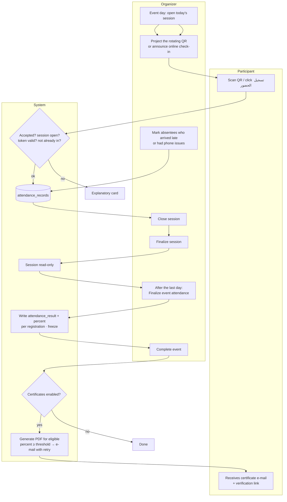
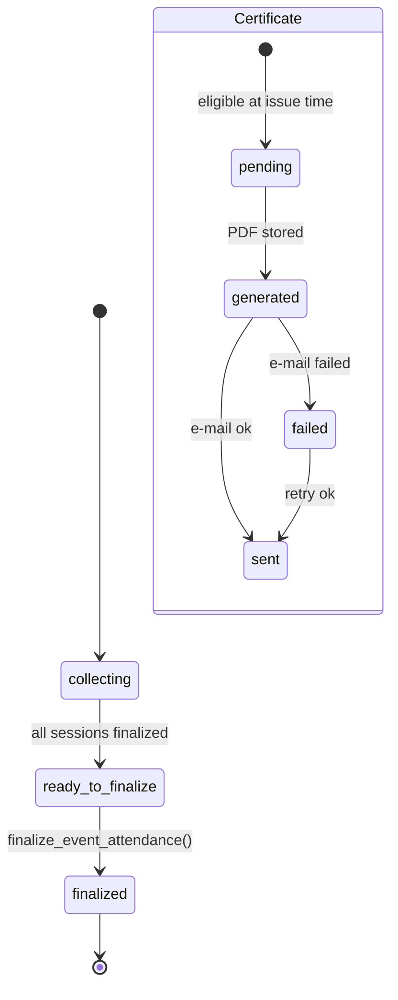
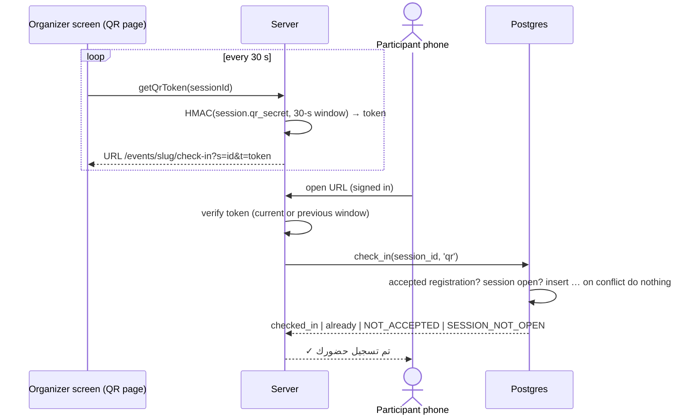
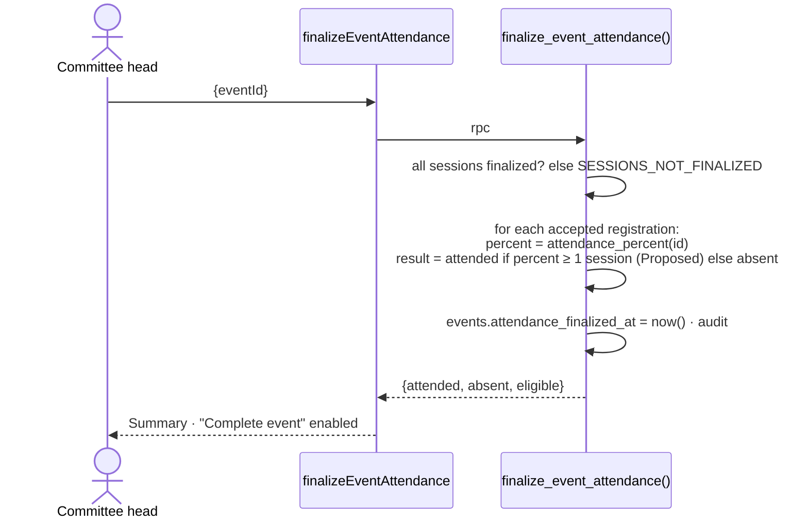
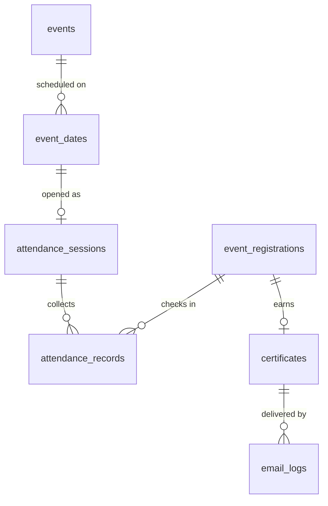

# Module — Attendance & Certificates

| Field            | Value |
| ---------------- | ----- |
| **Last Updated** | 2026-10-02 |
| **Status**       | Implemented in Sprint 10 (local) — KFUCS model ([ADR-012](../../90-decisions/ADR-012-event-model-and-wizard-from-kfucs.md)); certificate issuance behind a setting (**Q-020**), default off |
| **Owner**        | Committee heads (operation) · community leader (completion, certificates) |
| **Phase / Sprints** | Phase 4 / Sprint 10 |
| **Code**         | `src/modules/attendance/` |

## 1. Purpose and scope

This module records **who actually attended** each day of an event, the same way as KFUCS:
- one session per scheduled day
- QR, online or manual check-in
- organizers finalize each session and then the whole event, producing **one canonical attendance percentage** per registrant

That percentage drives event completion, reports and (when enabled) certificates.

| In scope | Out of scope |
| -------- | ------------ |
| Sessions: open, close, finalize; QR display; participant check-in | Registration decisions (→ [registrations](../registrations/README.md)) |
| Manual marking and corrections (audited) | Event scheduling (→ [events](../events/README.md), `event_dates`) |
| Event attendance finalization → `attendance_result`, `attendance_percent` | Badges and gamification |
| Certificates: eligibility, PDF, delivery, retry, public verification | Third-party certificate platforms |

## 2. Current state (CURRENT / PROBLEM)

Nothing exists. The current event pages mention "شهادة حضور" (certificate of attendance) as text only. KFUCS shows what goes wrong when attendance is bolted on later: three different percentage formulas (F-19), orphaned sessions (F-20), duplicate check-ins (F-23), and "completed" without sign-off (F-36). This module builds those fixes in from day one ([KFUCS alignment §5](../../98-reference/kfucs-event-model-alignment.md#5-kfucs-audit-lessons-built-in-from-day-one)).

## 3. Actors and permissions

| Actor | Can | Key | Scope |
| ----- | --- | --- | ----- |
| Accepted registrant | Check in (QR or online) while the session is open; see own attendance and certificate | ownership | own |
| Committee head / deputy / member | Open/close sessions, show the QR, mark manually, finalize sessions | `registrations.attendance` | event's committee |
| Committee head / leader | Finalize event attendance, correct finalized records (reason), issue/resend certificates | `events.complete` | event's committee / global |
| Anyone | Verify a certificate by id | — | public |

## 4. Business process — event day to certificate



## 5. Lifecycle

### 5.1 Session

```mermaid
stateDiagram-v2
    [*] --> scheduled : event_dates row exists
    scheduled --> open : organizer opens (on the day; early with confirm)
    open --> closed : organizer closes (self check-in stops)
    closed --> open : reopen (before finalize)
    closed --> finalized : finalize (non-checked-in = absent for this day)
    finalized --> finalized : correction (events.complete + reason, audited)
```



### 5.2 Event attendance and certificate



## 6. Key sequences

### 6.1 QR check-in



### 6.2 Finalize event attendance



## 7. Data



| Object | Purpose |
| ------ | ------- |
| `attendance_sessions`, `attendance_records`, `certificates` | [events entities §6–8](../../05-database/entities/events.md#6-attendance_sessions) |
| `attendance_percent(registration_id)` | **The only formula**: attended ÷ finalized sessions whose date is still scheduled |
| `session_summary` (view) | Live counts per session by method |
| `open_session`, `close_session`, `finalize_session`, `check_in`, `record_attendance`, `finalize_event_attendance`, `issue_certificates` | Write paths |
| Storage `certificates/<event>/<certificate>.pdf` (private bucket) | PDFs; signed URL for the owner |
| `site_settings.certificate_threshold` (default 70), `site_settings.certificates_enabled` (default false) | Settings |

## 8. Business logic and validation

| # | Rule | Enforced in | Source |
| - | ---- | ----------- | ------ |
| AT-1 | Only `accepted` registrations can check in or be marked | DB function | BR-REG-010 |
| AT-2 | One record per registration per session | UNIQUE + `on conflict do nothing` | KFUCS F-23 |
| AT-3 | Self check-in only while the session is `open`; the QR token is valid for the current or previous 30-s window | Function + HMAC | KFUCS |
| AT-4 | Percentage = attended ÷ **finalized** sessions on the **current** schedule; used by the UI, reports and certificates | SQL function | KFUCS F-19 |
| AT-5 | A scheduled date with a finalized session cannot be removed from the event | Trigger on `event_dates` | KFUCS F-20 |
| AT-6 | The event can be completed only after `attendance_finalized_at` is set (when sessions exist) | `transition_event()` | KFUCS F-36 |
| AT-7 | Corrections after finalization need `events.complete` + a reason; they are audited and re-run the roll-up | Function | — |
| AT-8 | Certificate eligibility: `attendance_result = attended` and percent ≥ threshold; the snapshot is frozen at issue | Function | KFUCS BR-4.6 |
| AT-9 | Certificate PDFs are private; verification shows only name, event, dates, % and validity | Storage RLS + view | Q-020 |
| AT-10 | One certificate per registration (idempotent issue) | UNIQUE | — |

## 9. Routes and screens

| Route | Audience | Purpose | Blueprint |
| ----- | -------- | ------- | --------- |
| `/[locale]/dashboard/events/[id]/attendance` | Organizers in scope | Sessions list, stats, finalize event, certificates panel | [16-event-attendance](../../10-design-system/INTERNAL-SCREENS/16-event-attendance.md) |
| `/[locale]/dashboard/events/[id]/attendance/[sessionId]` | same | Session detail, manual marking | same §2 |
| `/[locale]/dashboard/events/[id]/attendance/[sessionId]/qr` | same | Full-screen rotating QR | same §4 |
| `/[locale]/events/[slug]/check-in` | Accepted registrants | QR / online check-in | [PUBLIC 12 §2](../../10-design-system/PUBLIC-SCREENS/12-new-public-pages.md#2-event-check-in-eventsslugcheck-in) |
| `/[locale]/certificates/[id]` | Everyone | Verification | [PUBLIC 12 §3](../../10-design-system/PUBLIC-SCREENS/12-new-public-pages.md#3-certificate-verification-certificatesid--open-q-020) |
| `/[locale]/account/registrations` | Participant | Own attendance % and certificate download | [11-account-area](../../10-design-system/INTERNAL-SCREENS/11-account-area.md) |

## 10. Server operations

| Operation | Input | Authorization | Side effects | Error codes |
| --------- | ----- | ------------- | ------------ | ----------- |
| `openSession` / `closeSession` / `reopenSession` | `sessionId` | `registrations.attendance` | audit | `NOT_SESSION_DAY` (confirmable), `INVALID_TRANSITION` |
| `getQrToken` (query) | `sessionId` | same | — | `SESSION_NOT_OPEN` |
| `checkIn` | `sessionId, token?` | accepted registrant | record | `NOT_ACCEPTED`, `SESSION_NOT_OPEN`, `TOKEN_EXPIRED` (already → ok) |
| `recordAttendance` | `sessionId, registrationIds[], present` | `registrations.attendance` | records | `SESSION_FINALIZED` |
| `finalizeSession` | `sessionId` | `registrations.attendance` | lock | `SESSION_NOT_CLOSED` |
| `finalizeEventAttendance` | `eventId` | `events.complete` | roll-up; audit | `SESSIONS_NOT_FINALIZED` |
| `correctAttendance` | `sessionId, registrationId, present, reason` | `events.complete` | re-roll-up; audit | `REASON_REQUIRED` |
| `issueCertificates` / `resendCertificates` | `eventId` / `certificateIds[]` | `events.complete` | PDF + e-mail; retry bookkeeping | `CERTIFICATES_DISABLED`, `ATTENDANCE_NOT_FINALIZED` |

## 11. Notifications

`certificate.issued` (new; to the eligible participant, with the PDF link and verification URL); optional `attendance.session_open` push is **not** planned (e-mail only).

## 12. Error codes

| Code | Message (ar / en) |
| ---- | ----------------- |
| `NOT_ACCEPTED` | تسجيل الحضور متاح للمقبولين فقط / Check-in is for accepted participants only |
| `SESSION_NOT_OPEN` | الجلسة غير مفتوحة الآن / The session isn't open right now |
| `TOKEN_EXPIRED` | انتهت صلاحية الرمز — امسح الرمز المعروض الآن / The code expired — scan the one on screen now |
| `SESSIONS_NOT_FINALIZED` | اعتمد جميع الجلسات أولًا / Finalize all sessions first |
| `SESSION_FINALIZED` | الجلسة معتمدة — التصحيح يتطلب صلاحية / The session is finalized — corrections need permission |
| `CERTIFICATES_DISABLED` | الشهادات غير مفعّلة / Certificates are not enabled |

## 13. Edge cases

1. The participant scans a screenshot of an old QR → `TOKEN_EXPIRED`.
2. The participant is checked in by QR and manually → one record (AT-2); the method shown is the first one.
3. The organizer forgets to open a session and opens it the next morning → allowed with confirmation; it is audited as late.
4. A day is cancelled before it ran → remove the date (no finalized session) → percentages recompute on the remaining days.
5. An online event with no QR → `check-in` shows the *تسجيل حضوري* button during the open window.
6. The threshold changes after certificates were issued → existing certificates keep their frozen snapshot.
7. The certificate e-mail bounces → `failed`; the participant can still download it from `/account/registrations`.

## 14. Testing

| Level | Scenarios |
| ----- | --------- |
| Unit | QR token generation and verification across window boundaries; percentage display rounding |
| pgTAP | AT-1…AT-8 — port the KFUCS cases F-19, F-20, F-23, F-36; concurrent double check-in; finalized lock |
| E2E | Two-day event: open → QR scan from a mobile viewport → manual mark → finalize ×2 → finalize event → complete → certificate e-mail (setting on) → verification page |

## 15. Implementation plan (Sprint 10)

1. Migration `…_attendance.sql`: sessions, records, certificates, functions, triggers, settings keys.
2. Organizer screens (sessions, session detail, QR page) and the participant check-in page.
3. Roll-up and complete-event integration with [events](../events/README.md).
4. Certificates (P2): `@react-pdf/renderer` template in SDC branding (frozen identity), private bucket, delivery and retry through [notifications](../notifications/README.md).

```text
src/modules/attendance/
├── queries.ts     listSessions(eventId), getSession(id), getMyAttendance(eventId), verifyCertificate(id)
├── actions.ts     open/close/reopen/finalizeSession, checkIn, recordAttendance, finalizeEventAttendance, correctAttendance, issue/resendCertificates
├── qr.ts          token sign/verify (server-only)
├── pdf/           CertificateDocument.tsx
└── components/    SessionList, SessionTable, QrDisplay, CheckInCard, CertificatesPanel
```

## 16. Open questions

Q-020 (issue certificates? threshold?), Q-008 (attendance metrics in reports).

## 17. Revision — KFUCS parity (2026-10-03)

The first Sprint 10 screens split attendance across separate pages and asked participants to sign in. They now follow KFUCS:

- **One event page, tabs:** *Overview · Registrations · Attendance · Certificates · History* on `/dashboard/events/[id]?tab=…`. The breadcrumb shows the event name in the active language. *Certificates* appears once every session is finalized.
- **Registrations tab:** the event's registrants as a table (search, status tabs, pagination, CSV). A row opens a dialog (contact e-mail, registered/decided dates, attendance % after sign-off, e-mail state, resend, cancel with reason). Accept / waitlist / reject always ask for confirmation and report the outcome (also on the global `/dashboard/registrations`).
- **Attendance tab:** a day selector, the selected day's live numbers (checked in, remaining, daily rate, event overall, method split), then *Attendance list* (manual marking by the committee or presenter, with e-mails) or *QR display*.
- **QR display:** the code rotates every **120 seconds** (the database accepts this and the previous window), countdown bar, copy link, projector (full-screen) mode, live counters and the latest check-ins, polled every 4 s; the list refreshes itself when a check-in arrives.
- **Public check-in, no sign-in:** the QR opens `/events/[slug]/check-in?s=…&t=…`. The person types the e-mail they registered with (`check_in_by_email`: token required, e-mail matched case-insensitively to an *accepted* registration, expected failures answered with a code and throttled to 30 per session per minute). Signed-in participants with an accepted registration are checked in on arrival.
- **Certificates tab:** KPI cards, a table with each registrant's final percentage, eligibility and certificate state (not issued / waiting / sent / failed), *Issue and send*, per-row *Send / Retry* and *Resend failed*.
- **Database:** `20270314000000_event_ops.sql` — `session_qr_token` and `check_in` on 120 s windows, `check_in_public_context`, `check_in_by_email`, `check_in_failures`, `session_live`, `session_roster` with e-mail.
