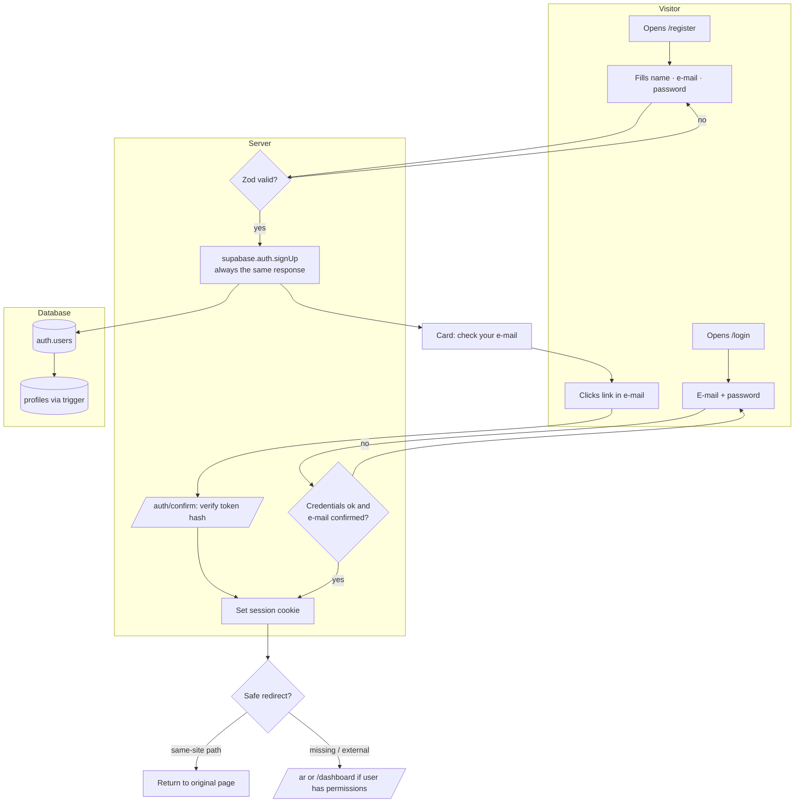
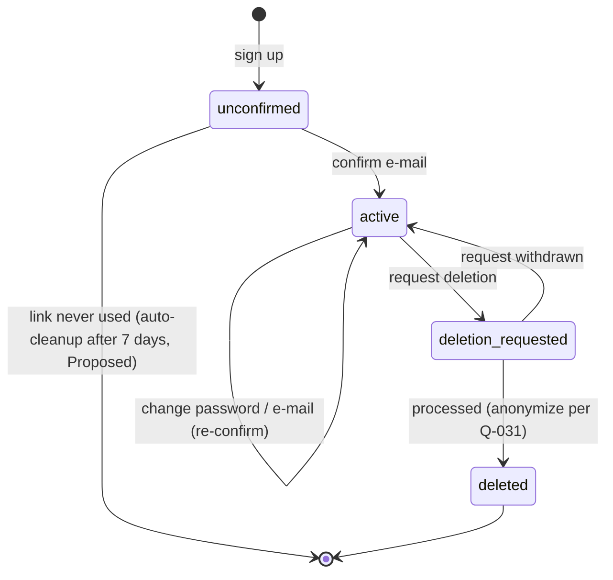
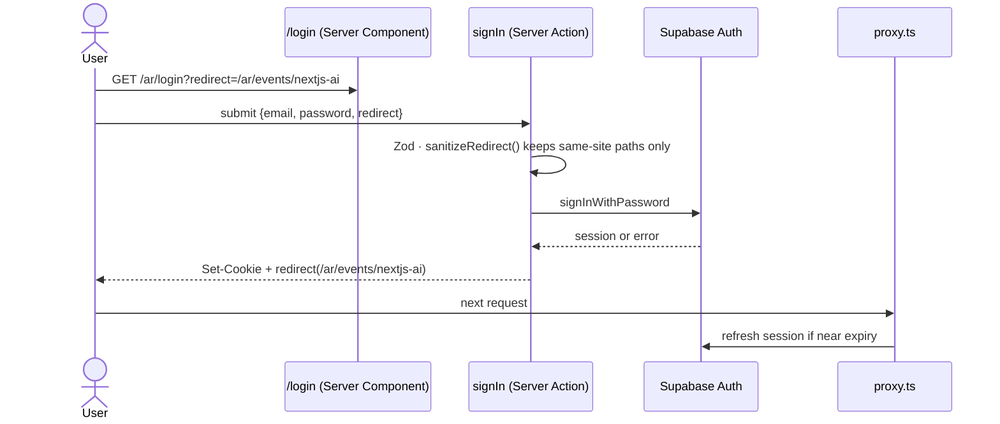
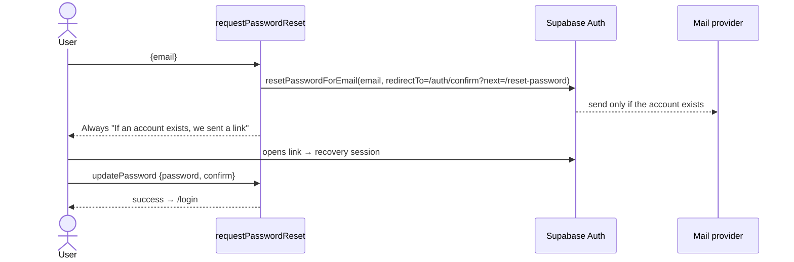
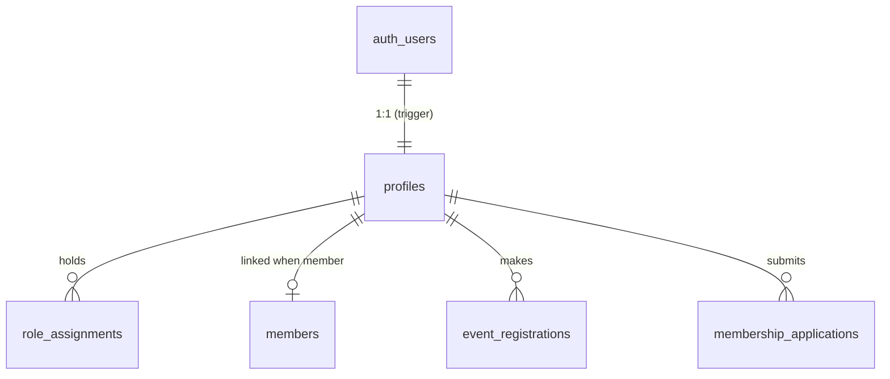

# Module — Authentication & Account

| Field            | Value |
| ---------------- | ----- |
| **Last Updated** | 2026-10-02 |
| **Status**       | Draft |
| **Owner**        | Technology & Development committee |
| **Phase / Sprints** | Phase 2 / Sprint 03 |
| **Code**         | `src/modules/auth/`, `src/modules/account/`, `src/lib/supabase/{server,browser,proxy}.ts`, `proxy.ts` |

## 1. Purpose and scope

This module lets anyone create an **account**, prove they own the e-mail address, sign in securely on the server, recover access, and manage their own account. **An account is not membership** (D-001): joining happens only through [membership intake](../membership/README.md).

| In scope | Out of scope |
| -------- | ------------ |
| Sign-up, confirmation, sign-in, sign-out, reset, change e-mail/password | Membership applications |
| `profiles` row and its sign-up trigger | Roles and permissions (→ [access control](../access-control/README.md)) |
| `/account` area: profile, language, security, my registrations, my membership, my roles | Member directory profile (→ [members](../members/README.md)) |
| Same-site `redirect` handling, session refresh in `proxy.ts` | Social login (not planned) |
| Account deletion request | The privacy policy text (Q-031) |

> **Implementation status (2026-10-02):** Sprint 03 is complete locally — see the [sprint plan](../../99-project-management/sprints/sprint-03-auth-and-profiles/plan.md#implementation-status-updated-at-sprint-end). The problems listed below describe the system *before* that sprint, except where a note says otherwise.

## 2. Current state (CURRENT / PROBLEM)

- Sessions exist only in the browser (`supabase-js` + `AuthContext`). Server Components cannot see the user, and protected content flashes before the redirect.
- Validation is client-only. The password policy (8+ characters, upper, lower, digit, symbol) is checked in the browser alone.
- The `check-email-exists` Edge Function (`verify_jwt=false`) lets anyone **test whether an e-mail is registered**.
- `?redirect=` is honoured without checking the target.
- There is no `profiles` table; the name lives in `user_metadata`.
- [Audit §5](../../01-project/current-system-audit.md#5-authentication).

## 3. Actors and permissions

| Actor | Can | Rule |
| ----- | --- | ---- |
| Visitor | Sign up, sign in, request a reset | public |
| Signed-in user | Read and update own profile (limited columns), change password/e-mail, request deletion, view own registrations/membership/roles | ownership (`id = auth.uid()`) |
| System admin | View any account (read-only) | `users.view` ([administration](../administration/README.md)) |

## 4. Business process — from visitor to signed-in user



## 5. Lifecycle — account



## 6. Key sequences

### 6.1 Sign-in with return path



### 6.2 Password reset (no enumeration)



## 7. Data



| Object | Purpose |
| ------ | ------- |
| `auth.users` | Supabase-managed credentials |
| `profiles` (`id`, `email` mirror, `full_name_ar`, `full_name_en`, `preferred_locale`, `avatar_path`) — deletion requests are recorded in `audit_logs` (`account.deletion_requested`) | App-level identity ([identity entities §1](../../05-database/entities/identity-and-access.md#1-profiles)) |
| `handle_new_user()` trigger | Creates the profile from sign-up metadata |
| `sync_profile_email()` trigger | Mirrors confirmed e-mail changes |

## 8. Business logic and validation

| # | Rule | Enforced in | Source |
| - | ---- | ----------- | ------ |
| AU-1 | Arabic full name, ≥ 3 words, ≤ 100 characters | Zod (client + server) | FR-AUTH-001 |
| AU-2 | Password ≥ 8 with upper, lower, digit, symbol (current rule kept) + Supabase leaked-password check | Zod + Auth settings | FR-AUTH-001 |
| AU-3 | E-mail confirmation required before sign-in | Auth config | FR-AUTH-003 |
| AU-4 | `redirect` accepted only if it starts with `/` and not `//`; it must be a known locale path | `sanitizeRedirect()` | FR-AUTH-004 |
| AU-5 | Sign-up, reset and resend give the same response whether or not the e-mail exists | Server Action | FR-AUTH-005 |
| AU-6 | Protected routes are checked on the server (`requireUser()` in the layout); no client redirect flash | Layout + proxy | FR-AUTH-010 |
| AU-7 | Users update only `full_name_*` and `preferred_locale` on their profile | RLS + column grants | FR-AUTH-008 |
| AU-8 | Rate limits: sign-in 5/min per IP+e-mail, sign-up 3/hour per IP (Supabase Auth limits + server check) | Auth config | NFR-SEC |
| AU-9 | The register page says an account is not membership and links to `/join` | UI copy | FR-AUTH-002, BR-MBR-001 |

## 9. Routes and screens

| Route | Audience | Purpose | Blueprint |
| ----- | -------- | ------- | --------- |
| `/[locale]/register` | Visitor | Create an account | [09-auth-pages](../../10-design-system/PUBLIC-SCREENS/09-auth-pages.md) |
| `/[locale]/login` | Visitor | Sign in (`?redirect=`) | same |
| `/[locale]/forgot-password` | Visitor | Request a reset | same |
| `/[locale]/reset-password` | Recovery session | Set a new password | same |
| `/auth/confirm` | Link target | Verify token hash, then redirect | — |
| `/[locale]/account` (+ `/profile`, `/security`, `/registrations`, `/membership`, `/roles`) | Signed-in | Self-service area | [11-account-area](../../10-design-system/INTERNAL-SCREENS/11-account-area.md) |

## 10. Server operations

| Operation | Input | Authorization | Side effects | Error codes |
| --------- | ----- | ------------- | ------------ | ----------- |
| `signUp` | `fullName, email, password, confirm, locale` | public, rate-limited | `auth.confirm_signup` e-mail | `VALIDATION_FAILED`, `RATE_LIMITED` |
| `signIn` | `email, password, redirect?` | public | session cookie | `INVALID_CREDENTIALS`, `EMAIL_NOT_CONFIRMED`, `RATE_LIMITED` |
| `signOut` | — | session | clear cookie | — |
| `resendConfirmation` | `email` | public | e-mail if unconfirmed | — (always ok) |
| `requestPasswordReset` | `email` | public | `auth.reset_password` | — (always ok) |
| `updatePassword` | `password, confirm` | recovery session or signed-in | — | `WEAK_PASSWORD`, `SAME_PASSWORD` |
| `updateProfile` | `fullNameAr, fullNameEn?, preferredLocale` | own | revalidate header | `VALIDATION_FAILED` |
| `changeEmail` | `newEmail` | own | `auth.email_change` to both addresses | `EMAIL_IN_USE` (shown only to the signed-in user) |
| `requestAccountDeletion` | `confirmText` | own | audit; notify admins | — |

## 11. Notifications

`auth.confirm_signup`, `auth.reset_password`, `auth.email_change` — Supabase Auth templates in `supabase/templates/{ar,en}`, sent through the provider's SMTP ([notifications](../notifications/README.md)).

## 12. Error codes

| Code | Message (ar / en) |
| ---- | ----------------- |
| `INVALID_CREDENTIALS` | البريد أو كلمة المرور غير صحيحة / Incorrect e-mail or password |
| `EMAIL_NOT_CONFIRMED` | يرجى تأكيد بريدك أولًا — [إعادة الإرسال] / Please confirm your e-mail first — [Resend] |
| `WEAK_PASSWORD` | كلمة المرور لا تحقق الشروط / Password does not meet the requirements |
| `RATE_LIMITED` | محاولات كثيرة، حاول بعد قليل / Too many attempts, try again shortly |
| `LINK_EXPIRED` | انتهت صلاحية الرابط / The link has expired |

## 13. Edge cases

1. Signing up with an existing **confirmed** e-mail → the same "check your e-mail" card; Supabase sends nothing new (no enumeration).
2. Signing up with an existing **unconfirmed** e-mail → resends confirmation.
3. `redirect=//evil.example` or `https://…` → ignored; go to the locale home.
4. A user deleted while signed in → the next request fails the session refresh → redirected to login.
5. A signed-in user visits `/login` → redirected to `/account` (or `redirect`).
6. Legacy users without a profile → backfill migration creates profiles from `auth.users` metadata (AUTH-005).
7. The reset link is opened in another browser → it still works (token-hash flow, not PKCE cookie).

## 14. Testing

| Level | Scenarios |
| ----- | --------- |
| Unit | Name/password schemas (Arabic three-part names, edge lengths); `sanitizeRedirect` table of cases |
| pgTAP | `profiles` RLS (own read/update only; no column escalation); sign-up trigger creates the profile; backfill idempotent |
| E2E | J2 sign-up → Mailpit → confirm → return path; J8 reset flow; J9 protected route without session → login (no flash); enumeration test (two e-mails give identical responses) |

## 15. Implementation plan (Sprint 03)

1. Migration `…_profiles.sql` (+ trigger, backfill, RLS, grants).
2. `lib/supabase/server.ts`, `browser.ts`, `proxy.ts` (`@supabase/ssr`); root `proxy.ts` composes locale + session refresh.
3. `modules/auth/{schemas,actions}.ts`; `/auth/confirm/route.ts`.
4. Rewire the existing auth pages to Server Actions **keeping the markup and CSS** (visual check).
5. `/account` area pages; header account menu.
6. Remove `AuthContext` client session logic (keep a thin client hook for UI only); delete `check-email-exists`.

```text
src/modules/auth/      schemas.ts · actions.ts · redirect.ts
src/modules/account/   queries.ts · actions.ts · components/ (ProfileForm, SecurityForm)
```

## 16. Open questions

Q-010 / Q-017 (e-mail provider and sender), Q-031 (deletion and retention).
