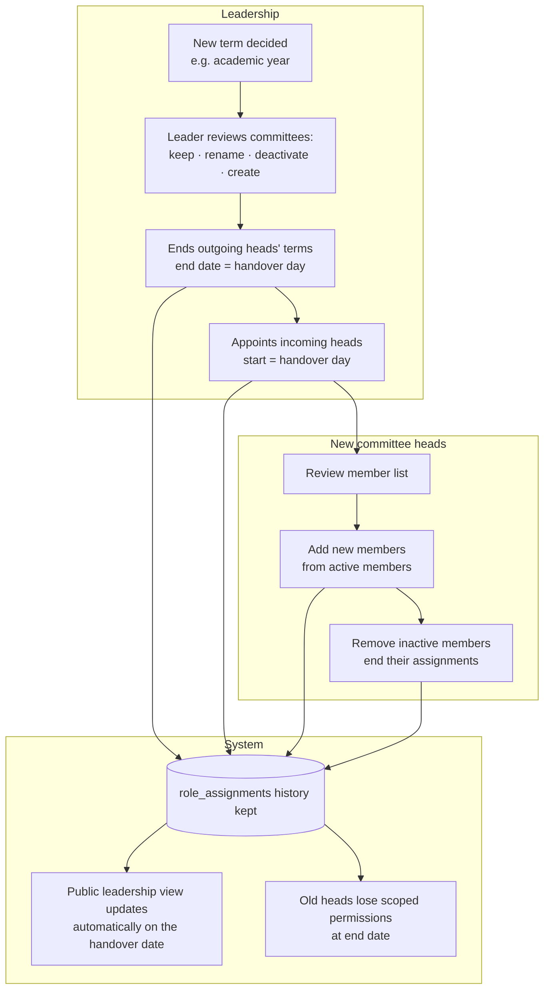
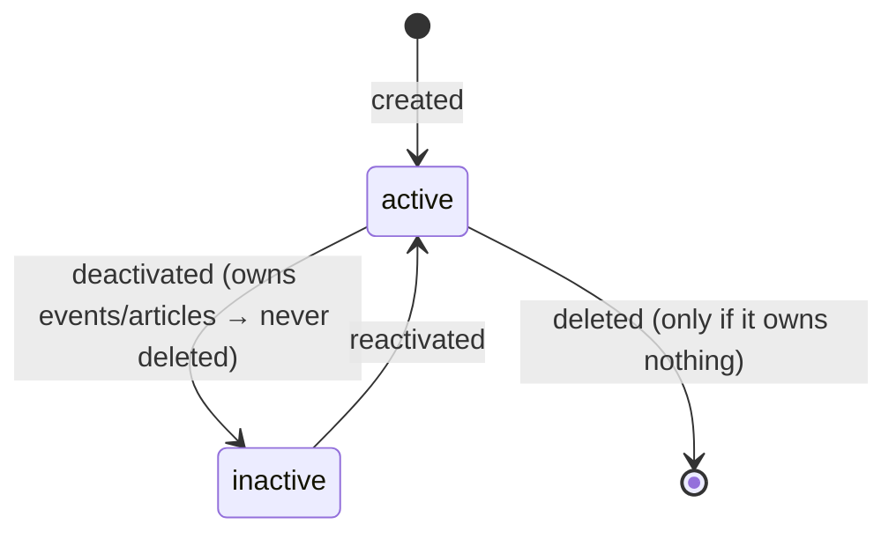
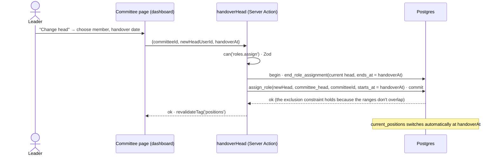
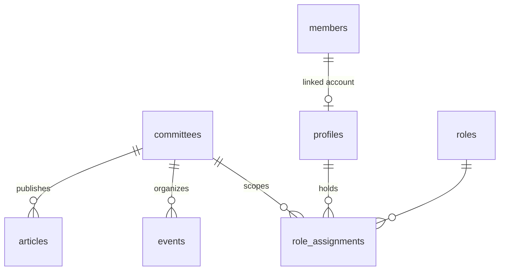

# Module — Committees & Positions

| Field            | Value |
| ---------------- | ----- |
| **Last Updated** | 2026-10-02 |
| **Status**       | Implemented through Sprint 10 (local) |
| **Owner**        | Community leader |
| **Phase / Sprints** | Phase 2 / Sprint 04 (model, leadership view) · Phase 4 / Sprint 10 (management UI, public committee pages) |
| **Code**         | `src/modules/committees/` |

## 1. Purpose and scope

This module represents SDC's **committees** and **who holds which position for which term**. It is the single source for:
- the public leadership display (founders, leader, advisor, committee heads)
- authorization scope (which committee an organizer acts for)
- ownership of events and articles

| In scope | Out of scope |
| -------- | ------------ |
| Committee CRUD (ar/en name, slug, description, order, status) | The role engine (→ [access control](../access-control/README.md)) |
| Committee membership and positions with terms (head, deputy, member) | Member records (→ [members](../members/README.md)) |
| Public leadership view (`current_positions`) and `/committees/[slug]` pages | Committee reports (→ [reports](../reports/README.md)) |
| Term handover (end the current term, appoint the next) | Elections and voting (not planned) |

> **Implementation status (2026-10-03):** Sprint 04 delivered the committees table and seed, `current_positions`, `handover_head()` and the leadership sections on `/members`. Sprint 10 added `save_committee`, `set_committee_status` (deactivation ends the open positions), `delete_committee` (only when it owns nothing), `committee_cards`, the dashboard list and detail screens, and the public `/committees/[slug]` page. The home "community sections" tiles still wait for Q-004.

## 2. Current state (CURRENT / PROBLEM)

- There is no committee entity.
- Leadership (founders, leader, advisor) and committee heads are **hardcoded arrays** in `app/members/page.tsx` with real names. They go stale every term.
- The home page "community sections" (AI, Data Science, Marketing, Podcast & Content, Product, PR) are a static list that may not match the real committees (**Q-004**).
- Committee e-mails are hardcoded (`committeeEmails.ts`) and used as authorization.

## 3. Actors and permissions

| Actor | Can | Key | Scope |
| ----- | --- | --- | ----- |
| Everyone | See active committees, public positions, committee pages | — | — |
| Community leader / system admin | Create, edit, deactivate and reactivate committees; appoint heads and deputies | `committees.manage`, `roles.assign` | global |
| Committee head | Add and remove committee members; propose a deputy | `committee_members.manage` | own committee |
| Committee deputy / member | See their committee's internal page | `events.view_drafts` (scoped) | own committee |
| Founders, advisor | View all committees and position history | `roles.view` | global |

## 4. Business process — term handover



## 5. Lifecycle

### 5.1 Committee



| Transition | Who | Guard | Side effects |
| ---------- | --- | ----- | ------------ |
| create | `committees.manage` | unique slug | audit |
| deactivate | `committees.manage` | — | Its open positions end (confirm dialog lists them); its events stay public with an "inactive committee" label; no new events can be created for it |
| reactivate | `committees.manage` | — | audit |
| delete | `committees.manage` | no events, articles or assignments | audit |

### 5.2 Position (role assignment)

This follows the [access-control lifecycle](../access-control/README.md#5-lifecycle--role-assignment): scheduled → active → ended, derived from dates.

## 6. Key sequences — appoint the next head (handover)



## 7. Data



| Object | Kind | Purpose |
| ------ | ---- | ------- |
| `committees` | table | [organization entities](../../05-database/entities/organization.md) |
| `role_assignments` | table | Positions (shared with access control) |
| `current_positions` | view | Active assignments of **public** roles + display titles + member display names, for `/members` and `/committees/[slug]` |
| `committee_roster(committee_id)` | function | Active members and positions of one committee (scoped read) |
| `handover_head()` | function | End + assign in one transaction |

## 8. Business logic and validation

| # | Rule | Enforced in | Source |
| - | ---- | ----------- | ------ |
| CM-1 | Slug `^[a-z0-9-]+$`, unique, stable (rename keeps the slug) | DB | FR-CMT-001 |
| CM-2 | Committees are deactivated, not deleted, once they own anything | DB function | BR-ORG-005 |
| CM-3 | One active head per committee; one active community leader | Exclusion constraint | BR-ORG-003 |
| CM-4 | Only active members hold committee positions | Trigger | BR-ORG-004 |
| CM-5 | Position history is never deleted; it can be viewed by leadership | No DELETE grant | BR-ORG-001, FR-CMT-005 |
| CM-6 | A head can add and remove **members** only — not deputies or heads | `assign_role()` anti-escalation | BR-ORG-006 |
| CM-7 | Public leadership = active assignments of roles with `is_public_position` | View | FR-PUB-003 |
| CM-8 | New events and articles can be created only for active committees | `transition_event()` / insert check | BR-EVT-001 |

## 9. Routes and screens

| Route | Audience | Purpose | Blueprint |
| ----- | -------- | ------- | --------- |
| `/[locale]/members` (top sections) | Everyone | Founders, leader and advisor, committee leads — from `current_positions` | [PUBLIC 07-members](../../10-design-system/PUBLIC-SCREENS/07-members.md) |
| `/[locale]/committees/[slug]` | Everyone | Committee page: description, leadership, public members, events, threads (Phase 4) | [20-committees-management §public](../../10-design-system/INTERNAL-SCREENS/20-committees-management.md) |
| `/[locale]/dashboard/committees` | Leader, admin | List, create, edit, deactivate | [20-committees-management](../../10-design-system/INTERNAL-SCREENS/20-committees-management.md) |
| `/[locale]/dashboard/committees/[id]` | Leader, head (own) | Roster, positions with terms, handover, add/remove members | same |

## 10. Server operations

| Operation | Input | Authorization | Side effects | Error codes |
| --------- | ----- | ------------- | ------------ | ----------- |
| `createCommittee` / `updateCommittee` | `slug, nameAr, nameEn?, descriptionAr?, descriptionEn?, displayOrder, contactEmail?` | `committees.manage` | audit; revalidate `committees` | `SLUG_TAKEN`, `VALIDATION_FAILED` |
| `deactivateCommittee` / `reactivateCommittee` | `committeeId, reason` | `committees.manage` | ends open positions; audit | `NOT_FOUND` |
| `addCommitteeMember` / `removeCommitteeMember` | `committeeId, userId, startsAt?` / `assignmentId, reason` | `committee_members.manage` (scope) | audit; optional `committee.assigned` | `NOT_ACTIVE_MEMBER`, `ALREADY_IN_COMMITTEE` |
| `handoverHead` | `committeeId, newHeadUserId, handoverAt` | `roles.assign` | audit ×2; revalidate `positions` | `NOT_ACTIVE_MEMBER`, `INVALID_DATE` |

## 11. Notifications

`committee.assigned` (optional) — "You were added to the {committee} committee".

## 12. Error codes

| Code | Message (ar / en) |
| ---- | ----------------- |
| `SLUG_TAKEN` | الرابط المختصر مستخدم / This slug is already used |
| `ALREADY_IN_COMMITTEE` | العضو موجود في اللجنة / Already a member of this committee |
| `COMMITTEE_INACTIVE` | اللجنة غير فعّالة / The committee is inactive |

## 13. Edge cases

1. Appointing a second head while one is active → `HEAD_ALREADY_ACTIVE`; the UI offers **Handover** instead.
2. A head removes themselves → blocked. Only the leader ends a head's term (avoids a headless committee by accident).
3. A committee is deactivated with upcoming published events → confirmation lists them. The events stay published, and the leader decides on each one.
4. A member is in two committees → allowed; heads see only their own committee's roster.
5. The home "community sections" differ from the committees → after Q-004 the tiles read `committees` (A-006).

## 14. Testing

| Level | Scenarios |
| ----- | --------- |
| Unit | Slug generation; handover date validation |
| pgTAP | CM-2…CM-6; the `current_positions` view shows only public, active positions; a head of A cannot add to B; history not deletable |
| E2E | Handover scenario: positions switch on the date; `/members` shows the new head (visual layout unchanged) |

## 15. Implementation plan

- **Sprint 04:**
  1. `committees` migration + seed (Q-004)
  2. `current_positions` view
  3. `/members` leadership sections from the view
  4. head appointment through the roles screen
- **Sprint 10:**
  1. Dashboard committee pages (roster, handover)
  2. Public `/committees/[slug]`
  3. Home tiles from committees

```text
src/modules/committees/
├── queries.ts     listCommittees, getCommittee(slug), getRoster(id), getCurrentPositions()
├── actions.ts     create/update/deactivate/reactivate, add/remove member, handoverHead
├── schemas.ts
└── components/    CommitteeCard, RosterTable, HandoverDialog, LeadershipGrid
```

## 16. Open questions

Q-003, Q-004, Q-014, Q-039.
