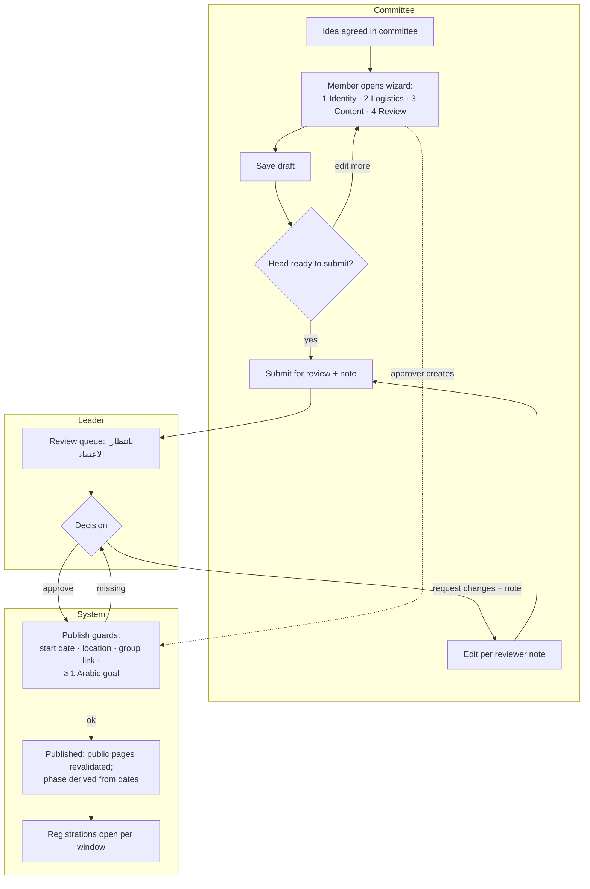
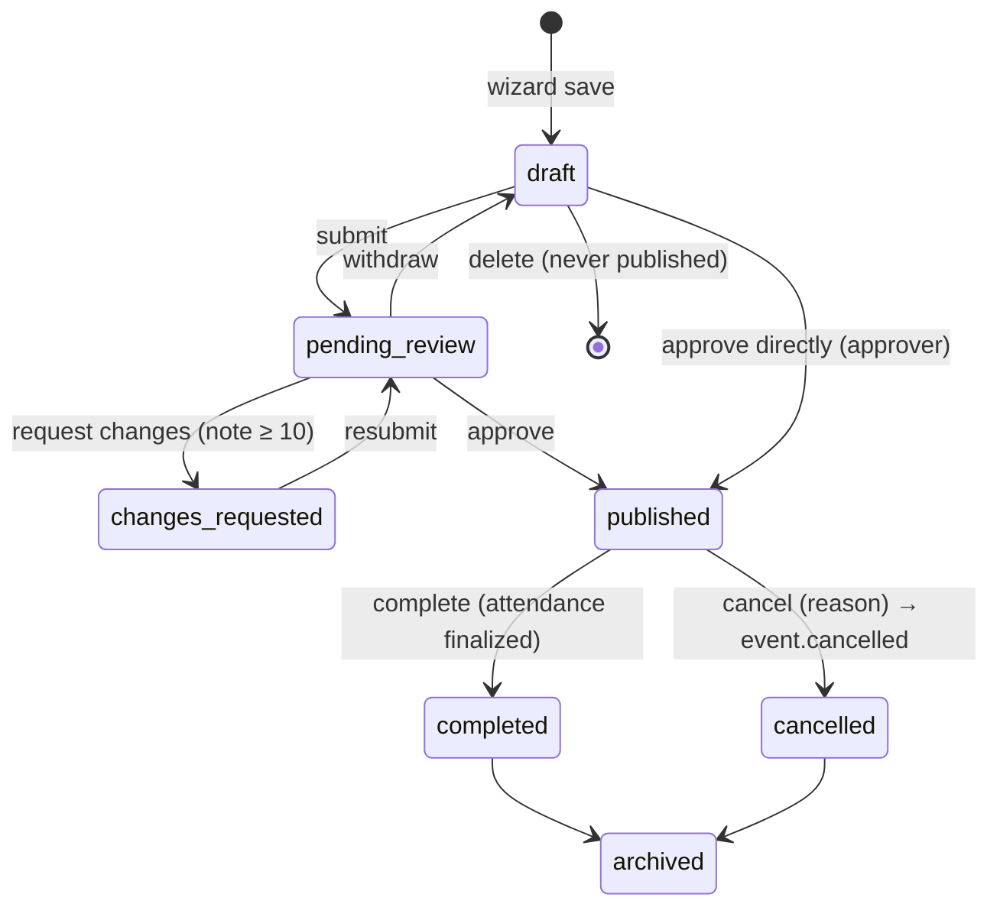
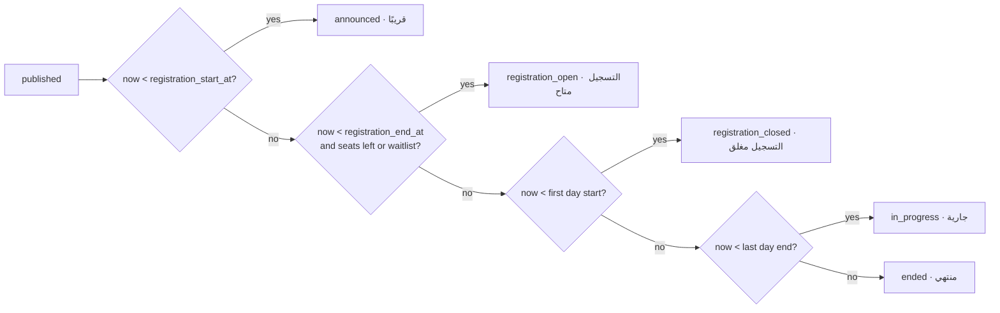
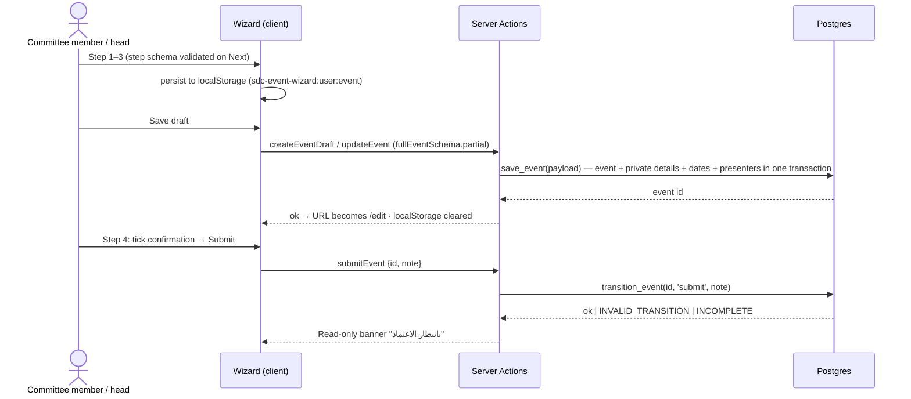
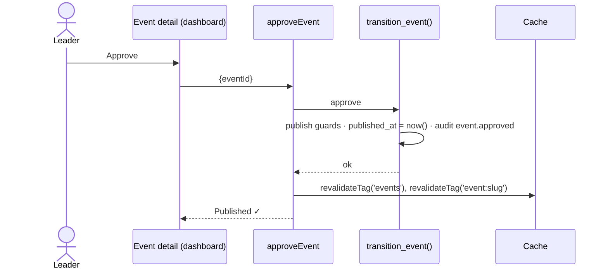
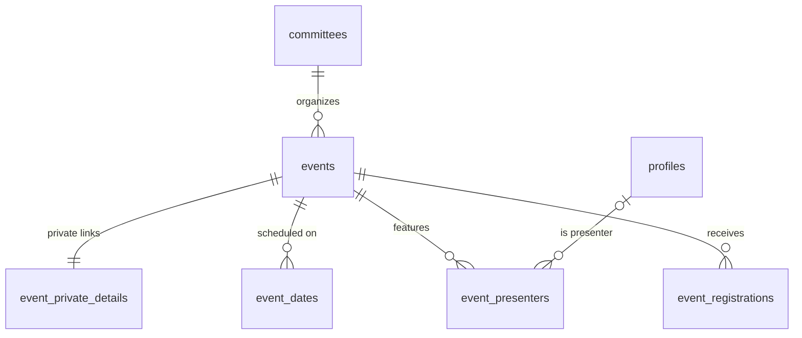

# Module — Events

| Field            | Value |
| ---------------- | ----- |
| **Last Updated** | 2026-10-02 |
| **Status**       | Draft — KFUCS-aligned ([ADR-012](../../90-decisions/ADR-012-event-model-and-wizard-from-kfucs.md)) |
| **Owner**        | Community leader (approvals) · committees (authoring) |
| **Phase / Sprints** | Phase 3A / Sprint 05 (wizard, model, lifecycle) · Sprint 06 (public pages from DB) |
| **Code**         | `src/modules/events/` |

## 1. Purpose and scope

Committees author events in the **KFUCS 4-step wizard**. Events are reviewed and approved, then shown publicly with accurate, derived timing. This replaces three hardcoded copies of the event data.

| In scope | Out of scope |
| -------- | ------------ |
| Event data model (schedule types, dates, location mode, private links, goals, FAQ, presenters, display config, SDC detail lists) | Registrations (→ [registrations](../registrations/README.md)) |
| Creation/edit wizard, review and approval, cancel, complete, archive | Attendance and certificates (→ [attendance](../attendance/README.md)) |
| Public list/detail/home blocks from `public_events` (same look) | E-mail sending mechanics (→ [notifications](../notifications/README.md)) |
| Derived timing phase | Partners / sponsors (Q-021) |
| Migration of the existing events + legacy URL redirects | Paid tickets (never — non-profit) |

## 2. Current state (CURRENT / PROBLEM)

- Event data is hardcoded in three places: `src/data/allEvents.ts`, `app/events/page.tsx` and `app/events/[id]/page.tsx`.
- Dates are free-text strings, and status is a translated label ("قريبًا" / "منتهي"), so status depends on the language.
- Unknown ids fall back to event 2.
- Ended events still offer *تسجيل*.
- There is no authoring, approval or history; changing an event needs a code deploy.

## 3. Actors and permissions

| Actor | Can | Key | Scope |
| ----- | --- | --- | ----- |
| Everyone | See published, cancelled, completed and archived events | — | public view |
| Committee member | Create and edit drafts | `events.create`, `events.edit` (drafts) | own committee |
| Committee deputy / head | Edit, submit, cancel, complete, delete drafts | `events.edit`, `events.submit`, `events.cancel`, `events.complete`, `events.delete` | own committee |
| Community leader | Approve, request changes, fast-track publish; everything above in any committee | `events.approve` + all | global (**Q-005**) |
| Founders | View drafts and pipeline (read-only) | `events.view_drafts` | global (**Q-032**) |

## 4. Business process — from idea to published event



## 5. Lifecycle



**Derived timing phase** (published only, never stored): `announced` → `registration_open` → `registration_closed` → `in_progress` → `ended` ([event lifecycle §4](../../03-business-domain/event-lifecycle.md#4-timing-phase-derived-never-stored)).



## 6. Key sequences

### 6.1 Wizard save and submit



### 6.2 Approve and publish



## 7. Data



| Object | Purpose |
| ------ | ------- |
| `events`, `event_private_details`, `event_dates`, `event_presenters` | [events entities §1–4](../../05-database/entities/events.md) |
| `public_events` (view) | Public columns + `phase`, `last_date`, `accepted_count`, `seats_left` |
| `transition_event(id, action, note)` | The only status writer, with guards |
| `save_event(payload jsonb)` | One-transaction upsert of the event + private details + dates + presenters |
| Storage `public-media/events/<id>/cover.webp` | Cover images |

## 8. Business logic and validation

| # | Rule | Enforced in | Source |
| - | ---- | ----------- | ------ |
| EV-1 | Step schemas: Arabic title 3–200; type in the set; committee where the user can create | Zod + DB | FR-EVT-001 |
| EV-2 | Range: `end_date ≥ start_date`; specific dates ≥ 1 and unique; same day: `end_time > start_time` | Zod `superRefine` + DB CHECK | KFUCS step 2 |
| EV-3 | `registration_end_at` must be after the start of the first day; it **may** be after the event starts (reopen) | Zod + function | KFUCS 2026-09-16 |
| EV-4 | Publish guards: start date, location (in person / hybrid), group link, ≥ 1 Arabic goal | `transition_event()` (not CHECK constraints) | ADR-012 |
| EV-5 | Status changes only through `transition_event()` and the transition table | DB | BR-EVT-002 |
| EV-6 | The phase is derived; never stored | View | BR-EVT-004 |
| EV-7 | Meeting URL, meeting notes and group link are visible only to organizers and accepted registrants | Separate table + RLS | BR-EVT-007 |
| EV-8 | Drafts are visible only to the committee's roles and approvers; unknown or unpublished slug → 404 | RLS + `notFound()` | BR-EVT-008/009 |
| EV-9 | The slug is locked after first publish; changing it before publish is fine | Trigger | FR-EVT-001 |
| EV-10 | Significant change to a published event (dates, location mode, location) → confirm dialog → `event.changed` to accepted registrants | Server Action | notification rules |
| EV-11 | Cover: JPEG/PNG/WebP ≤ 2 MB, converted to WebP 1600×900 | Server Action | FR-EVT-007 |
| EV-12 | Times are stored and shown as Asia/Riyadh; digits follow the locale | Formatter | FR-EVT-009 |

## 9. Routes and screens

| Route | Audience | Purpose | Blueprint |
| ----- | -------- | ------- | --------- |
| `/[locale]/events` | Everyone | Grid of published events, badges by phase (upcoming/past tabs pending sign-off) | [PUBLIC 03](../../10-design-system/PUBLIC-SCREENS/03-events-list.md) |
| `/[locale]/events/[slug]` | Everyone | Detail + registration island; `/events/1…6` → 301 | [PUBLIC 04](../../10-design-system/PUBLIC-SCREENS/04-event-detail.md) |
| `/[locale]` (home block) | Everyone | 3 nearest upcoming events | [PUBLIC 01](../../10-design-system/PUBLIC-SCREENS/01-home.md) |
| `/[locale]/dashboard/events` | Committee roles, leader | Table by status, review queue | [12-events-list](../../10-design-system/INTERNAL-SCREENS/12-events-list.md) |
| `/[locale]/dashboard/events/new`, `/[id]/edit` | Committee roles | 4-step wizard | [13-event-form](../../10-design-system/INTERNAL-SCREENS/13-event-form.md) |
| `/[locale]/dashboard/events/[id]` | Committee roles, leader | Overview, transitions, history, tabs | [14-event-detail-review](../../10-design-system/INTERNAL-SCREENS/14-event-detail-review.md) |

## 10. Server operations

| Operation | Input | Authorization | Side effects | Error codes |
| --------- | ----- | ------------- | ------------ | ----------- |
| `createEventDraft` / `updateEvent` | `fullEventSchema` (partial for drafts) | `events.create` / `events.edit` (scope) | audit; revalidate if published | `VALIDATION_FAILED`, `SLUG_TAKEN`, `NOT_EDITABLE`, `COMMITTEE_INACTIVE`, `STALE_DATA` |
| `uploadEventCover` | file | `events.edit` | Storage write | `FILE_TOO_LARGE`, `FILE_TYPE` |
| `submitEvent` / `withdrawEvent` | `id, note?` | `events.submit` | audit | `INVALID_TRANSITION`, `INCOMPLETE` |
| `approveEvent` / `requestEventChanges` | `id, note` | `events.approve` | revalidate public pages; audit | `INVALID_TRANSITION`, `PUBLISH_GUARD:<field>`, `NOTE_TOO_SHORT` |
| `cancelEvent` | `id, reason` | `events.cancel` | `event.cancelled` to registrants; revalidate | `REASON_REQUIRED` |
| `completeEvent` | `id` | `events.complete` | audit | `ATTENDANCE_NOT_FINALIZED` |
| `archiveEvent` | `id` | `events.complete` | revalidate | `INVALID_TRANSITION` |
| `deleteEventDraft` | `id` | `events.delete` | storage cleanup | `NOT_DELETABLE` |

## 11. Notifications

`event.cancelled` (all active registrants), `event.changed` (accepted registrants), `event.reminder` (optional, 24 h before), `review.pending` (optional digest to approvers).

## 12. Error codes

| Code | Message (ar / en) |
| ---- | ----------------- |
| `INCOMPLETE` | أكمل الحقول المطلوبة قبل الإرسال / Complete the required fields before submitting |
| `PUBLISH_GUARD:group_link` | رابط المجموعة مطلوب للنشر / A group link is required to publish |
| `NOT_EDITABLE` | لا يمكن تعديل الفعالية في حالتها الحالية / This event can't be edited in its current state |
| `ATTENDANCE_NOT_FINALIZED` | اعتمد الحضور قبل إكمال الفعالية / Finalize attendance before completing the event |
| `STALE_DATA` | عدّل شخص آخر هذه الفعالية — أعد التحميل / Someone else changed this event — reload |
| `INVALID_TRANSITION` | الإجراء غير متاح لهذه الحالة / This action isn't available in this state |

## 13. Edge cases

1. The approver fast-tracks their own committee's event → allowed (audited); the history shows "approved directly".
2. Dates move after registrations exist → a confirm dialog lists the accepted count and sends `event.changed`.
3. A "specific dates" event has a date removed that already has a finalized session → blocked (see [attendance](../attendance/README.md)).
4. The committee is deactivated → existing events keep their committee label "(inactive)"; there are no new drafts.
5. An event at 00:30 Riyadh time shows the correct local date in both locales.
6. Two editors save the same draft → an `updated_at` check: the second gets `STALE_DATA` and reloads.
7. A wizard draft in `localStorage` for a deleted event → discarded on load with an info toast.

## 14. Testing

| Level | Scenarios |
| ----- | --------- |
| Unit | Step schemas (ported KFUCS cases + Arabic-first); phase derivation truth table across boundaries; date formatter |
| pgTAP | Transition table (every from/to/role); publish guards; draft visibility by scope; private-details RLS; slug lock |
| E2E | Wizard create → refresh on step 3 → resume → submit → approve → public page shows it; cancel → registrants e-mailed (Mailpit) |
| Visual | `/events` and an event page match the baseline after the switch to the DB |

## 15. Implementation plan

- **Sprint 05:**
  1. Migration `…_events.sql`
  2. `save_event`, `transition_event`
  3. The wizard (KFUCS reference, SDC primitives)
  4. Dashboard list and detail
  5. Approval flow
- **Sprint 06:**
  1. Public pages from `public_events` (keep markup and CSS)
  2. Legacy migration of the six events + 301s
  3. Cancel/changed e-mails

```text
src/modules/events/
├── queries.ts     listPublicEvents, getPublicEvent(slug), listDashboardEvents, getEventForEdit
├── actions.ts     createEventDraft, updateEvent, submit/withdraw/approve/requestChanges/cancel/complete/archive/delete
├── schemas.ts     step1Schema…step4Schema, fullEventSchema
├── phase.ts       derivePhase() (mirrors the SQL view, unit-tested)
└── components/    wizard/ (EventWizard, Step1…Step4, WizardProgress, EventPreviewCard), EventCard, PhaseBadge, StatusBadge
```

## 16. Open questions

Q-005 (approver), Q-009 (members-only), Q-020 (certificates), Q-021 (partners), Q-040 (types).
