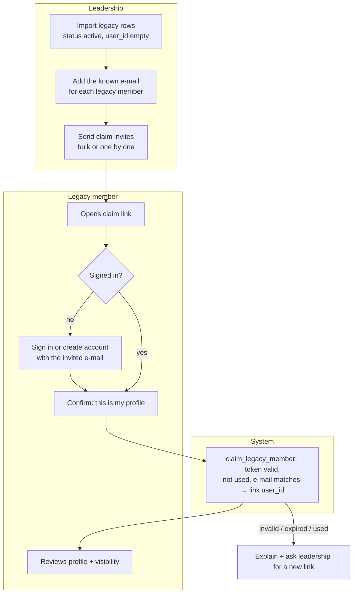
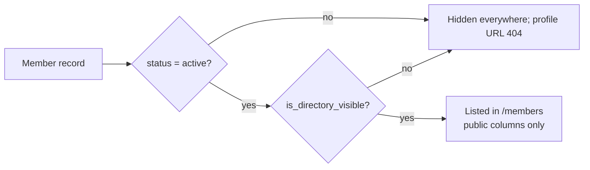
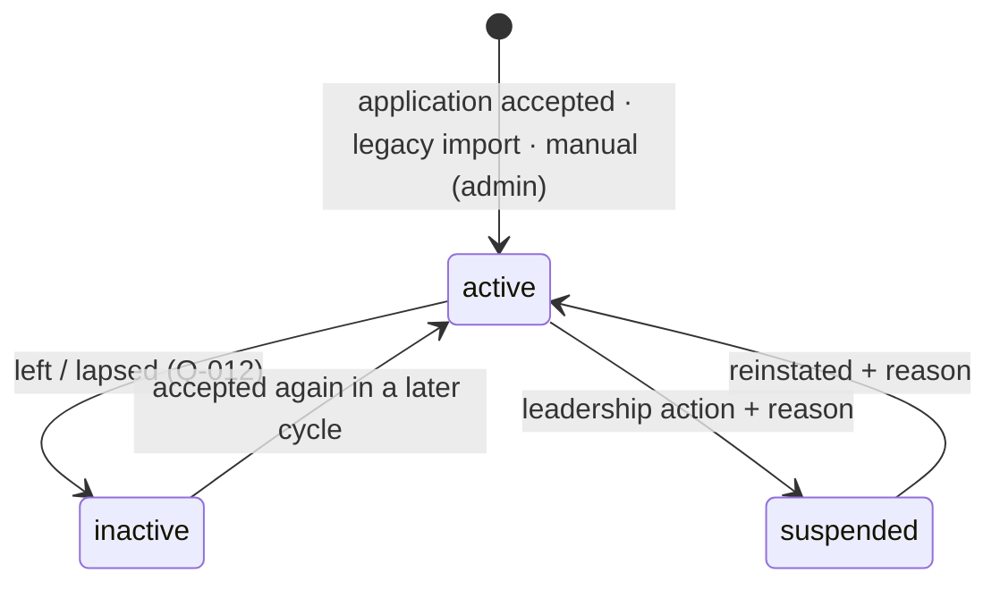
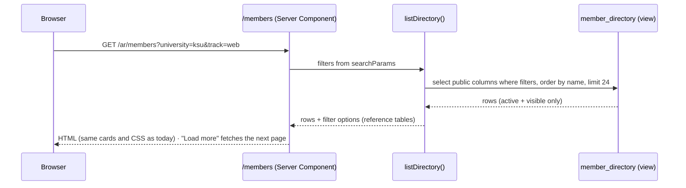
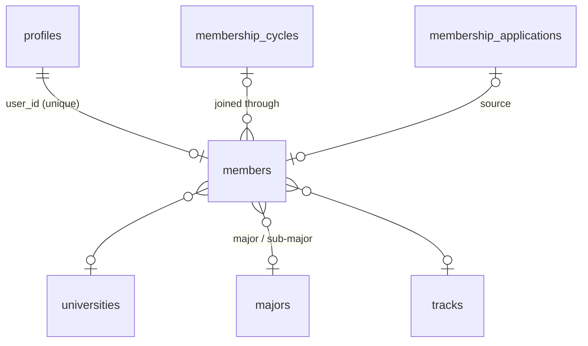

# Module — Members & Directory

| Field            | Value |
| ---------------- | ----- |
| **Last Updated** | 2026-10-02 |
| **Status**       | Draft |
| **Owner**        | Community leader |
| **Phase / Sprints** | Phase 3B / Sprint 08 |
| **Code**         | `src/modules/members/` |

## 1. Purpose and scope

This module keeps member records accurate and linked to accounts. It shows a **privacy-respecting** public directory and member profiles (same look as today), lets members manage their own profile and visibility, and brings legacy members into the new model through a **claim** flow.

| In scope | Out of scope |
| -------- | ------------ |
| `members` records, statuses (active / inactive / suspended) | Becoming a member (→ [membership](../membership/README.md)) |
| Public directory + profile pages (`member_directory` view) | Positions and committees (→ [committees](../committees/README.md)) |
| Self-service profile + directory opt-in | Contacting members (Q-022, not planned) |
| Leadership member management (view all, suspend, reinstate, deactivate) | Bulk messaging |
| Legacy import + claim | — |

## 2. Current state (CURRENT / PROBLEM)

- **Critical:** `members` is readable **and writable** by anyone with the anon key. `/members` reads `select('*')` from the browser, including fields that should be private.
- Records are not linked to accounts. University, major, track and status are bilingual free text.
- Filter options are computed from the loaded rows.
- Profiles use enumerable numeric ids. Social icons always render, falling back to `#`.

## 3. Actors and permissions

| Actor | Can | Key | Scope |
| ----- | --- | --- | ----- |
| Everyone | Directory and visible profiles | — | public view |
| Member | Edit own profile fields and visibility | ownership (`user_id = auth.uid()`) | own |
| Legacy member | Claim their record through an e-mailed link | token | own |
| Founders | View all members including private fields (**Q-007**) | `members.view` | global |
| Leader / admin | View all; suspend, reinstate, deactivate (with reason); send claim invites; edit legacy records | `members.view`, `members.manage` | global |

## 4. Business process

### 4.1 Legacy claim



### 4.2 Directory visibility



## 5. Lifecycle — member



| Transition | Who | Guard | Side effects |
| ---------- | --- | ----- | ------------ |
| suspend | `members.manage` | reason required | committee roles end (BR-MBR-011); hidden from the directory; audit |
| reinstate | `members.manage` | reason | audit (roles are **not** restored automatically) |
| deactivate | `members.manage` or the member ("leave the community") | — | roles end; hidden; audit |
| reactivate | system (membership acceptance) | — | `joined_cycle_id` updated |

## 6. Key sequences — load the public directory



## 7. Data



| Object | Purpose |
| ------ | ------- |
| `members` | [membership entities §3](../../05-database/entities/membership.md#3-members) |
| `member_directory` (view) | Active and visible members; public columns + reference labels |
| `member_claim_tokens` (table) | Hashed one-time tokens: `member_id`, `email`, `expires_at`, `used_at` |
| `claim_legacy_member(token)` | Links `user_id` after checks |
| `set_member_status(id, status, reason)` | Leadership transitions |

## 8. Business logic and validation

| # | Rule | Enforced in | Source |
| - | ---- | ----------- | ------ |
| ME-1 | Directory = active + opted-in, public columns only; anon has **no** access to `members` | View + RLS | BR-MBR-009 |
| ME-2 | Members edit only profile fields; not status, dates, `joined_*` or placement | Column grants + RLS | BR-MBR-010 |
| ME-3 | Social links are `https://` only, ≤ 500 characters; the icon renders only when a link exists | Zod + CHECK + UI | FR-MEM-006 |
| ME-4 | University, major, track and academic status come from reference tables | FK | FR-MEM-007 |
| ME-5 | Suspension requires a reason and ends committee roles | Trigger | BR-MBR-011 |
| ME-6 | Claim tokens: 7-day expiry, single use, stored hashed; the account e-mail must match the invited e-mail (case-insensitive) | DB function | FR-MEM-005 |
| ME-7 | The profile URL uses `members.id` (uuid); old numeric ids redirect only while the member is visible | Route + `legacy_id` | — |
| ME-8 | Hidden or non-existent profiles return the same 404 (no existence leak) | Route | BR-EVT-009 analogue |

## 9. Routes and screens

| Route | Audience | Purpose | Blueprint |
| ----- | -------- | ------- | --------- |
| `/[locale]/members` | Everyone | Leadership (from committees) + directory with filters in the URL | [PUBLIC 07-members](../../10-design-system/PUBLIC-SCREENS/07-members.md) |
| `/[locale]/members/[id]` | Everyone | Public profile | [PUBLIC 08-member-profile](../../10-design-system/PUBLIC-SCREENS/08-member-profile.md) |
| `/[locale]/account/member-profile` | Member | Edit profile and visibility | [11-account-area](../../10-design-system/INTERNAL-SCREENS/11-account-area.md) |
| `/[locale]/claim/[token]` | Legacy member | Claim flow | (auth-card pattern) |
| `/[locale]/dashboard/members` (+ `/[id]`) | Founders (read), leader, admin | Search, view all, status changes, claim invites | [19-members-management](../../10-design-system/INTERNAL-SCREENS/19-members-management.md) |

## 10. Server operations

| Operation | Input | Authorization | Side effects | Error codes |
| --------- | ----- | ------------- | ------------ | ----------- |
| `listDirectory` (query) | filters, cursor | public | — | — |
| `updateMyMemberProfile` | names, academic fields, bio, links, `isDirectoryVisible` | owner | revalidate `/members` | `VALIDATION_FAILED`, `NOT_A_MEMBER` |
| `setMemberStatus` | `memberId, status, reason` | `members.manage` | roles end; audit | `REASON_REQUIRED`, `INVALID_TRANSITION` |
| `sendClaimInvites` | `memberIds[]` (with e-mails) | `members.manage` | e-mail `member.claim_invite`; audit | `NO_EMAIL` |
| `claimLegacyMember` | `token` | signed-in | link account; audit | `TOKEN_INVALID`, `TOKEN_EXPIRED`, `EMAIL_MISMATCH`, `ALREADY_LINKED` |
| `importLegacyMembers` (script) | CSV/SQL from the remote table | admin, run once | dry-run report | — |

## 11. Notifications

`member.claim_invite` (new; added to the [notification catalogue](../../03-business-domain/notification-rules.md)) — "Claim your SDC member profile" with a 7-day link.

## 12. Error codes

| Code | Message (ar / en) |
| ---- | ----------------- |
| `NOT_A_MEMBER` | هذه الصفحة للأعضاء فقط / This page is for members only |
| `TOKEN_EXPIRED` | انتهت صلاحية رابط المطالبة — اطلب رابطًا جديدًا / This claim link expired — ask for a new one |
| `EMAIL_MISMATCH` | سجّل الدخول بالبريد الذي وصلته الدعوة / Sign in with the e-mail that received the invite |
| `ALREADY_LINKED` | هذا الملف مرتبط بحساب بالفعل / This profile is already linked to an account |
| `REASON_REQUIRED` | يرجى كتابة السبب / Please provide a reason |

## 13. Edge cases

1. A member hides their profile → it disappears from the directory, and the profile URL returns 404 (cached pages revalidated by tag).
2. A suspended member signs in → `/account/member-profile` shows a neutral "membership suspended — contact leadership" panel.
3. Two legacy records belong to the same person → admin merges them before sending invites (the import report flags duplicate names).
4. A legacy member never claims → visible per Q-026 until the cut-off, then hidden.
5. A filter combination with zero results → empty state + reset filters (same card grid area).
6. Very long Arabic names or bios → cards clamp to 2 lines, as today.

## 14. Testing

| Level | Scenarios |
| ----- | --------- |
| Unit | Profile schema (https links, lengths); filter-param parser |
| pgTAP | anon `select * from members` denied; the view exposes public columns only; owner update limited to the allowed columns; claim token single-use and expiry; suspension ends roles |
| E2E | Directory filters through the URL; member hides profile → 404; claim flow end-to-end with Mailpit |
| Visual | `/members` and a profile match the baseline (Sprint 01 visual check) |

## 15. Implementation plan (Sprint 08, after membership)

1. Migration `…_members_v2.sql`: expand-contract from the legacy `members` (new FK columns, backfill from free text via a mapping table, view, RLS lockdown).
2. Legacy import script with dry-run report (Q-026) + claim tokens.
3. `/members` and `/members/[id]` from the view (keep the CSS); filters in the URL; load more.
4. Account member-profile page; dashboard members screens.

```text
src/modules/members/
├── queries.ts     listDirectory, getPublicProfile, getMyMemberProfile, adminListMembers
├── actions.ts     updateMyMemberProfile, setMemberStatus, sendClaimInvites, claimLegacyMember
├── schemas.ts
└── components/    MemberCard (existing markup), FilterPanel, ProfileForm, StatusDialog
```

## 16. Open questions

Q-007 (public fields, opt-in), Q-012 (expiry), Q-022 (contact), Q-026 (legacy data, cut-off), Q-030 (moderated edits), Q-038 (claim method).
