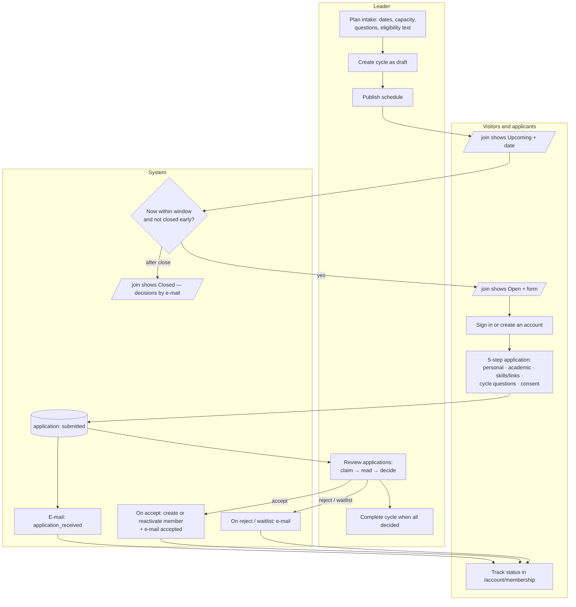
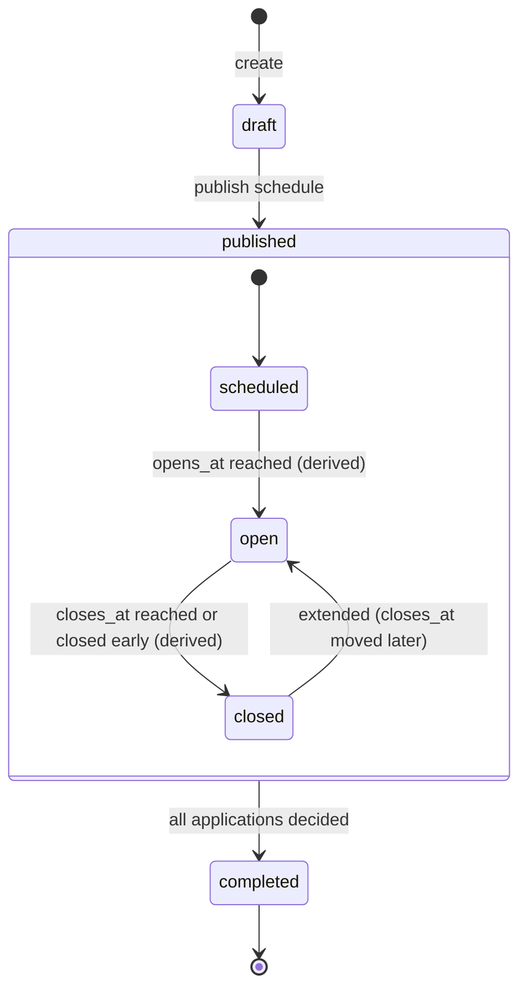
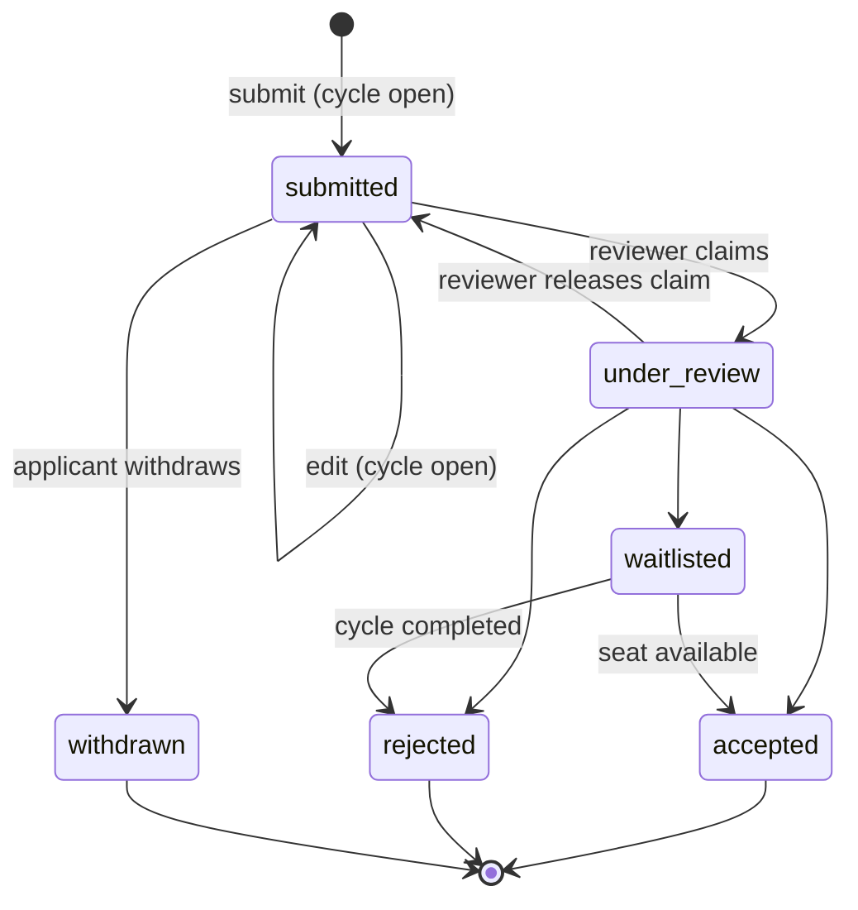
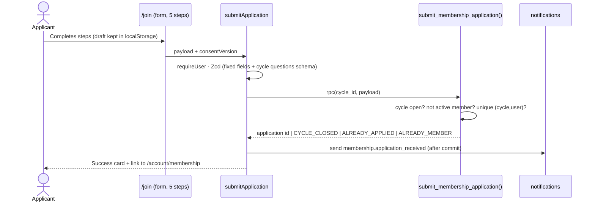
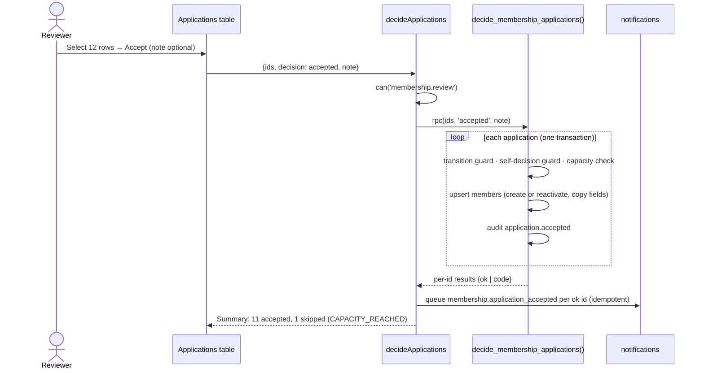
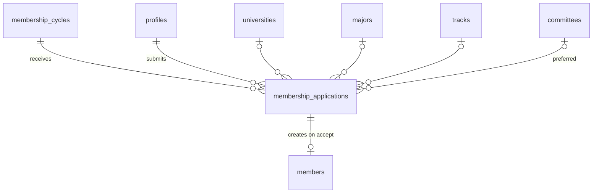

# Module — Membership Intake

| Field            | Value |
| ---------------- | ----- |
| **Last Updated** | 2026-10-02 |
| **Status**       | Draft |
| **Owner**        | Community leader |
| **Phase / Sprints** | Phase 3B / Sprint 07 (cycles, `/join`, apply) · Sprint 08 (review, decisions) |
| **Code**         | `src/modules/membership/` |

## 1. Purpose and scope

This module runs SDC's **periodic membership intake**, about once a year (D-001):
- announce and open a cycle
- accept applications **only** through `/join` while the cycle is open
- review them fairly
- turn accepted applicants into members linked to their accounts

| In scope | Out of scope |
| -------- | ------------ |
| Intake cycles (schedule, extend, close early, complete) | Account creation (→ [authentication](../authentication/README.md)) |
| `/join` page states and the 5-step application form | Member profile editing after acceptance (→ [members](../members/README.md)) |
| Application review: claim, decide, bulk decisions, export | Committee placement (→ [committees](../committees/README.md)) |
| Creating or reactivating the member record on acceptance | Membership fees (none; non-profit, D-007) |

## 2. Current state (CURRENT / PROBLEM)

**Nothing exists.** `/register` creates accounts only. Members are inserted manually into an open table, not linked to accounts. There is no record of who applied, when, or why someone became a member.

## 3. Actors and permissions

| Actor | Can | Key | Scope |
| ----- | --- | --- | ----- |
| Visitor | See the `/join` state | — | — |
| Signed-in user (not an active member) | Apply while open; view, edit and withdraw own application while `submitted` and open | ownership | own |
| Membership reviewer (community leader by default) | Claim, review, decide, bulk-decide | `membership.review` | global (**Q-013**: committee heads may recommend) |
| Leader / admin | Create and manage cycles; export applications | `membership.manage_cycles`, `membership.export` | global |

## 4. Business process — the annual intake



## 5. Lifecycle

### 5.1 Cycle — stored status + derived phase



Stored `status`: `draft`, `published`, `completed`. The **phase** (`scheduled` / `open` / `closed`) is computed from `opens_at`, `closes_at` and `closed_early_at` in the view `membership_cycle_phase`. There is no cron.

| Transition | Who | Guard | Side effects |
| ---------- | --- | ----- | ------------ |
| publish | `membership.manage_cycles` | dates valid; no other published cycle overlapping (MC-1) | audit; `/join` revalidated |
| extend | same | phase `open` or `closed`, not completed | audit `cycle.extended` |
| close early | same | phase `open` | `closed_early_at = now()`; audit |
| complete | same | no application in `submitted`, `under_review` or `waitlisted` (waitlisted → auto-rejected with confirmation) | audit |

### 5.2 Application



## 6. Key sequences

### 6.1 Submit an application



### 6.2 Bulk decision



## 7. Data



| Object | Purpose |
| ------ | ------- |
| `membership_cycles` | Windows, capacity, questions JSON ([membership entities §1](../../05-database/entities/membership.md#1-membership_cycles)) |
| `membership_applications` | One per user per cycle, with snapshot fields and answers |
| `members` | Created or reactivated on acceptance |
| `membership_cycle_phase` (view) | Derived phase; the single source for `/join` |
| `submit_membership_application()`, `update_membership_application()`, `withdraw_membership_application()` | Applicant write path |
| `claim_application()`, `decide_membership_applications()` | Reviewer write path |

## 8. Business logic and validation

| # | Rule | Enforced in | Source |
| - | ---- | ----------- | ------ |
| MB-1 | Applications only while the phase is `open` (checked inside the insert function, using the DB clock) | DB | BR-MBR-002 |
| MB-2 | At most one published cycle with an overlapping window | Exclusion constraint | BR-MBR-003 |
| MB-3 | One application per account per cycle | UNIQUE | BR-MBR-004 |
| MB-4 | Active members cannot apply | DB function | BR-MBR-005 |
| MB-5 | The applicant can edit or withdraw only while `submitted` and open | DB function | BR-MBR-006 |
| MB-6 | A reviewer cannot decide their own application | DB function | Proposed |
| MB-7 | Accepted count ≤ `capacity` (if set); overflow → `CAPACITY_REACHED`, reviewer may waitlist | DB lock | Q-011 |
| MB-8 | Acceptance creates or reactivates exactly one member (`joined_via='application'`, `joined_cycle_id`) | DB function | BR-MBR-008 |
| MB-9 | Answers are validated against the cycle's `questions` schema (type, required, max length) | Zod built from the JSON | FR-MBR-004 |
| MB-10 | Consent version is stored with the timestamp; the application cannot be submitted without it | Zod + NOT NULL | NFR-PRIV |
| MB-11 | `decision_note` is internal; never in e-mails or applicant views | Column grants + view | MA-5 |

## 9. Routes and screens

| Route | Audience | Purpose | Blueprint |
| ----- | -------- | ------- | --------- |
| `/[locale]/join` | Everyone | Phase states + 5-step form | [25-join-page](../../10-design-system/INTERNAL-SCREENS/25-join-page.md) |
| `/[locale]/account/membership` | Applicant / member | Application timeline, edit/withdraw, member status | [11-account-area](../../10-design-system/INTERNAL-SCREENS/11-account-area.md) |
| `/[locale]/dashboard/membership/cycles` | Leader | List, create, schedule, extend, close early, complete | [17-membership-cycles](../../10-design-system/INTERNAL-SCREENS/17-membership-cycles.md) |
| `/[locale]/dashboard/membership/applications?cycle=` | Reviewers | Table + filters + drawer + bulk decisions + export | [18-membership-applications](../../10-design-system/INTERNAL-SCREENS/18-membership-applications.md) |

## 10. Server operations

| Operation | Input | Authorization | Side effects | Error codes |
| --------- | ----- | ------------- | ------------ | ----------- |
| `createCycle`, `updateCycle` | names, descriptions, `opensAt`, `closesAt`, `reviewEndsAt?`, `capacity?`, `questions[]` | `membership.manage_cycles` | audit | `INVALID_DATES`, `CYCLE_OVERLAP` |
| `publishCycle`, `extendCycle`, `closeCycleEarly`, `completeCycle` | `cycleId` (+ `closesAt`) | same | audit; revalidate `/join` | `INVALID_TRANSITION`, `PENDING_APPLICATIONS` |
| `submitApplication` | profile fields, answers, `wantsDirectoryListing`, `consentVersion` | signed-in | e-mail `application_received` | `CYCLE_CLOSED`, `ALREADY_APPLIED`, `ALREADY_MEMBER` |
| `updateApplication`, `withdrawApplication` | `applicationId`, fields | owner | audit | `NOT_EDITABLE`, `CYCLE_CLOSED` |
| `claimApplication`, `releaseApplication` | `applicationId` | `membership.review` | sets `reviewer_id` | `ALREADY_CLAIMED` |
| `decideApplications` | `ids[], decision, note?` | `membership.review` | member upsert; decision e-mails; audit | `INVALID_TRANSITION`, `SELF_DECISION`, `CAPACITY_REACHED` |
| `exportApplications` | `cycleId, filters` | `membership.export` | CSV; audit `export.applications` | — |

## 11. Notifications

| Template | Trigger | Recipient |
| -------- | ------- | --------- |
| `membership.application_received` | Submitted | Applicant |
| `membership.application_accepted` | Accepted | Applicant (welcome, next steps: profile, directory opt-in) |
| `membership.application_rejected` | Rejected | Applicant (neutral; may apply in a future cycle — Q-012) |
| `membership.application_waitlisted` | Waitlisted | Applicant |

## 12. Error codes

| Code | Message (ar / en) |
| ---- | ----------------- |
| `CYCLE_CLOSED` | باب التقديم مغلق حاليًا / Applications are closed |
| `ALREADY_APPLIED` | لديك طلب في هذه الدورة / You already applied in this cycle |
| `ALREADY_MEMBER` | أنت عضو بالفعل / You are already a member |
| `NOT_EDITABLE` | لا يمكن تعديل الطلب الآن / This application can't be changed now |
| `SELF_DECISION` | لا يمكنك البت في طلبك / You can't decide your own application |
| `CAPACITY_REACHED` | اكتمل العدد المحدد للقبول / The acceptance limit is reached |
| `CYCLE_OVERLAP` | يوجد دورة أخرى في نفس الفترة / Another cycle overlaps these dates |

## 13. Edge cases

1. Submitting at 23:59:59 while the cycle closes → the DB clock decides; the UI shows `CYCLE_CLOSED` and keeps the local draft.
2. The leader extends the window after it closed → `/join` reopens immediately (derived phase).
3. An accepted applicant already has an **inactive** member record → reactivated with the new cycle id; no duplicate.
4. An applicant deletes their account before a decision → the application is anonymized and excluded from the queue.
5. Two reviewers open the same application → the second sees "claimed by …" and can view read-only.
6. Cycle questions change after applications exist → editing questions is blocked once the first application arrives (versioned questions are out of scope).
7. Completing a cycle with waitlisted applicants → the confirmation dialog: "N waitlisted will be rejected and e-mailed".

## 14. Testing

| Level | Scenarios |
| ----- | --------- |
| Unit | Dynamic question schema builder; `/join` phase → UI state mapping |
| pgTAP | MB-1…MB-8, MB-11; phase view at boundary instants; overlap constraint; atomic member creation (failure rolls back the decision) |
| E2E | J5: schedule a cycle opening in one minute → `/join` updates → apply → bulk accept → member appears in `/account/membership` and (after opt-in) in the directory |

## 15. Implementation plan

**Sprint 07:**
1. Migration `…_membership.sql`
2. Reference-data dependencies
3. Cycles screens
4. `/join` states
5. Apply form
6. `/account/membership`

**Sprint 08:**
1. Claim and decide (single and bulk)
2. Member upsert
3. Decision e-mails
4. Export

> **Order swap rule:** if Q-011 says the next intake opens before January 2027, Sprints 07–08 move before 05–06.

```text
src/modules/membership/
├── queries.ts     getCurrentCycle(), getMyApplication(), listApplications(filters)
├── actions.ts     cycle actions, submit/update/withdraw, claim/decide, export
├── schemas.ts     CycleInput, ApplicationInput (+ buildQuestionsSchema)
└── components/    JoinState, ApplicationStepper, ApplicationsTable, DecisionDialog
```

## 16. Open questions

Q-002 (account required), Q-011 (next intake, capacity, questions), Q-012 (expiry and renewal, re-application), Q-013 (who reviews), Q-031 (consent text).

## Revision — apply without an account (2026-10-03)

Q-002 is answered: applications need no account ([ADR-013](../../90-decisions/ADR-013-accounts-for-members-only.md)). `/join` shows the form to everyone while a cycle is open; `apply_for_membership` stores the application with its e-mail and language (no `user_id`) behind the same anti-spam layers as guest registration (minimum fill time 5 s, 3 per e-mail per 3 min, 6 per address per 10 min). Accepting creates the account (confirmed, no password), links it, creates the member and e-mails a one-time link to `/reset-password?welcome=1` to choose a password. A failure creating the account leaves that application undecided. Self sign-up is disabled; `/register` redirects to `/join`.
