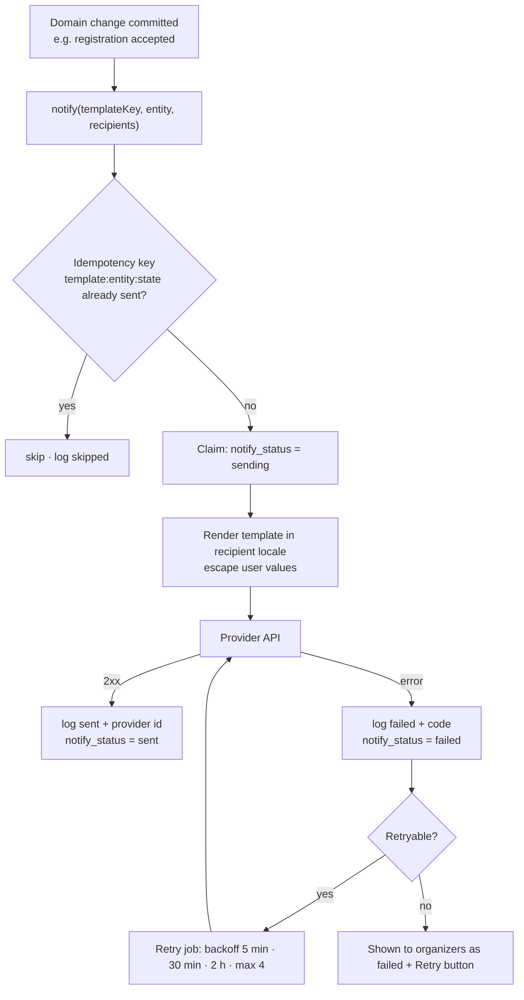
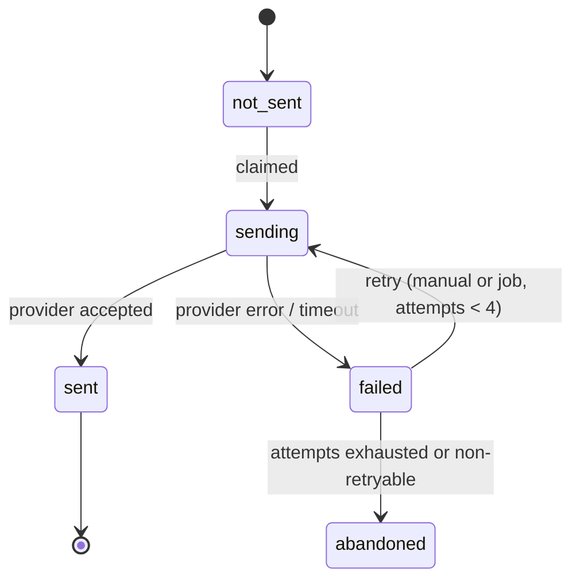
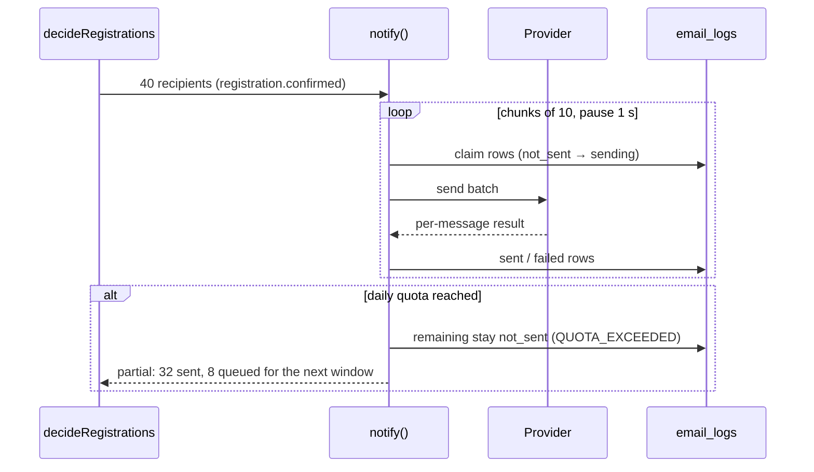
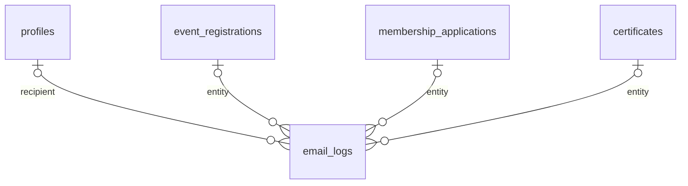

# Module — Notifications (Transactional E-mail)

| Field            | Value |
| ---------------- | ----- |
| **Last Updated** | 2026-10-02 |
| **Status**       | Draft |
| **Owner**        | Technology & Development committee |
| **Phase / Sprints** | Sprint 03 (auth e-mails) · Sprint 06 (module + registration templates) · Sprint 09 (remaining templates, retry job) · Sprint 10 (certificates) |
| **Code**         | `src/lib/email/` (transport, templates), `src/modules/notifications/` (send, log, retry, UI) |

## 1. Purpose and scope

This module sends **correct, safe, logged, bilingual** transactional e-mails as consequences of state changes. A failed e-mail never undoes a decision and can always be retried. It follows the KFUCS outbox lessons: claim-before-send, one log row per attempt, idempotency.

| In scope | Out of scope |
| -------- | ------------ |
| Template catalogue (ar/en), rendering, transport via the provider (ADR-006) | Marketing or newsletter e-mails |
| `email_logs` per recipient and attempt; retry (manual + scheduled) | Push / SMS / WhatsApp notifications |
| Supabase Auth e-mails through the provider's SMTP | In-app notification centre (not planned) |
| Quota-aware batching for bulk decisions | — |

## 2. Current state (CURRENT / PROBLEM)

- Edge Functions `send-registration-email` and `send-status-email` run with `verify_jwt=false`: an **open relay** that sends Gmail SMTP mail to any address with any content.
- They are called from the browser, the e-mails are Arabic-only, nothing is logged, and there is no retry.
- [Audit §7](../../01-project/current-system-audit.md#7-edge-functions-and-email).

## 3. Actors and permissions

| Actor | Can | Key |
| ----- | --- | --- |
| System (Server Actions, jobs) | Send | server-only provider key |
| Organizers | See e-mail status per registration/application in scope; retry | `registrations.review` / `membership.review` (scope) |
| System admin | Global log, filters, retry | `email_logs.view` |

## 4. Business process — every e-mail

## 5. Lifecycle — one notification (per recipient)

## 6. Key sequence — bulk decisions (quota-aware)

## 7. Data

| Object | Purpose |
| ------ | ------- |
| `email_logs` | One row per attempt ([platform entities §2](../../05-database/entities/platform.md#2-email_logs)) |
| `notify_status` on `event_registrations` (and equivalent on applications, certificates) | Claim-before-send state |
| `lib/email/provider.ts` | Transport adapter (provider chosen in ADR-006 / Q-010); Mailpit SMTP locally |
| `lib/email/templates.ts` | Plain-HTML templates (no React Email dependency), ar + en, one shared layout in the SDC e-mail green; values are escaped (Sprint 06) |
| `/api/cron/email-retry` | Protected route (Vercel Cron, secret header) running the retry job |

## 8. Business logic and validation

| # | Rule | Enforced in | Source |
| - | ---- | ----------- | ------ |
| NO-1 | Send only after the DB transaction commits; addresses are resolved on the server | `notify()` | BR-NOT-001 |
| NO-2 | Every attempt writes exactly one log row; a failure never rolls back the decision | `notify()` | BR-NOT-002 |
| NO-3 | Idempotency key `template:entity:state` — a repeated decision doesn't send twice | Unique index on `(idempotency_key, attempt)` + check | BR-NOT-003 |
| NO-4 | All user values are HTML-escaped; links come from server config only | Templates | BR-NOT-004 |
| NO-5 | The recipient's `preferred_locale` picks the template language; otherwise Arabic | `notify()` | FR-NOT-001 |
| NO-6 | Private links (meeting, group) appear only in `registration.confirmed` | Template data builder | BR-EVT-007 |
| NO-7 | No secrets or full bodies in logs; e-mail addresses are visible only to authorized viewers | RLS on `email_logs` | NFR-PRIV |
| NO-8 | Retry: at most 4 attempts with backoff; non-retryable codes (`INVALID_RECIPIENT`, `NO_RECIPIENT`) are not retried | Job | FR-NOT-003 |

## 9. Template catalogue

| Key | Module | Recipient | Since |
| --- | ------ | --------- | ----- |
| `auth.confirm_signup`, `auth.reset_password`, `auth.email_change` | authentication | user | S03 |
| `registration.received`, `registration.confirmed`, `registration.rejected`, `registration.waitlisted`, `registration.cancelled_by_organizer` | registrations | participant | S06 |
| `event.cancelled`, `event.changed` | events | registrants | S06 |
| `membership.application_received`, `…_accepted`, `…_rejected`, `…_waitlisted` | membership | applicant | S07–S08 |
| `member.claim_invite` | members | legacy member | S08 |
| `certificate.issued` | attendance | participant | S10 |
| `event.reminder`, `review.pending`, `committee.assigned` | events / access | — | optional, Phase 4 |

The full trigger table is in [notification rules](../../03-business-domain/notification-rules.md).

## 10. Routes, screens and operations

| Surface | Audience | Purpose | Blueprint |
| ------- | -------- | ------- | --------- |
| E-mail status column + retry in registrations/applications tables | Organizers in scope | Per-recipient status | [15](../../10-design-system/INTERNAL-SCREENS/15-event-registrations.md), [18](../../10-design-system/INTERNAL-SCREENS/18-membership-applications.md) |
| `/[locale]/dashboard/admin/emails` | System admin | Global log, filters, retry | [24-admin](../../10-design-system/INTERNAL-SCREENS/24-admin-audit-emails-settings.md) |

| Operation | Authorization | Error codes |
| --------- | ------------- | ----------- |
| `notify(templateKey, entityRef, recipients, data)` (server-only) | internal | `QUOTA_EXCEEDED`, `PROVIDER_ERROR`, `INVALID_RECIPIENT`, `NO_RECIPIENT` |
| `retryEmail(logId \| entityRef)` | scoped review permission / `email_logs.view` | `NOTHING_TO_RETRY` |
| `GET /api/cron/email-retry` | `CRON_SECRET` header | 401 otherwise |

## 11. Edge cases

1. The provider quota is exhausted mid-batch → the rest stay `not_sent`; the UI shows "will continue after {time}"; the job resumes.
2. A legacy recipient has no e-mail → `failed` with `NO_RECIPIENT`; never retried automatically.
3. The same decision is saved twice → the second send is `skipped` (idempotency).
4. A user changes their language after registering → later e-mails use the new `preferred_locale`.
5. A decision is reversed (accepted → rejected) → a different state, so a new idempotency key; the rejected e-mail is sent.

## 12. Testing

| Level | Scenarios |
| ----- | --------- |
| Unit | Each template renders in ar/en with escaped values (snapshot); locale selection; backoff schedule |
| Integration | send → log row; provider error → log + no rollback; idempotency; quota partial batch (fake provider) |
| E2E | Mailpit receives the expected subject and language for J2, J3, J5 |

## 13. Implementation plan

1. **S03:** provider SMTP for Supabase Auth; templates in `supabase/templates/`.
2. **S06:** `lib/email` (provider adapter, layout, first templates), `notify()`, `email_logs` RLS, status column + retry; delete the two Edge Functions.
3. **S09:** remaining templates, retry cron, admin e-mail log.
4. **S10:** `certificate.issued` with the PDF link.

## 14. Open questions

Q-010 (provider), Q-017 (sender domain and DNS), Q-028 (rejection wording).
