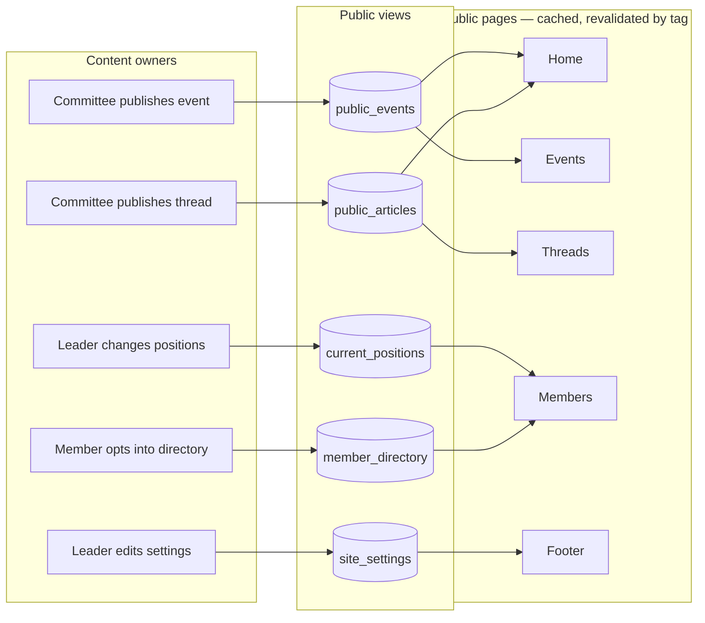
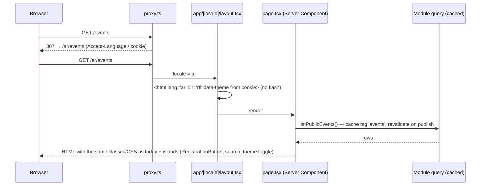

# Module — Public Site

| Field            | Value |
| ---------------- | ----- |
| **Last Updated** | 2026-10-02 |
| **Status**       | Draft |
| **Owner**        | Design & Identity committee (content and look) · Technology & Development (build) |
| **Phase / Sprints** | Phase 1 (locale routing, visual baseline — S01–S02) · 3A–3C (data from DB — S06, S08, S09) · 4 (committee pages, settings — S10–S11) |
| **Code**         | `app/[locale]/(public)/**`, `src/components/layout/{Header,Footer}`, existing page CSS |

## 1. Purpose and scope

The public site is SDC's face: identity, vision, leadership, committees, events, threads, the members directory and the join page. It is server-rendered, bilingual and discoverable. **Its look is frozen** (D-009): the rebuild changes data sources, states, accessibility and performance, never the visual identity.

| In scope | Out of scope |
| -------- | ------------ |
| Home, about, events, threads, members, auth pages, 404, `/join`, check-in, certificate verification, privacy, search | Dashboard (→ [access control](../access-control/README.md) shell) |
| Header (nav, theme, language, account menu, search) and footer | Content authoring (owning modules) |
| SEO: metadata, Open Graph, sitemap, robots, canonical + `hreflang` | Blog comments, newsletter |
| Locale routing `/ar` and `/en` with server `lang`/`dir` | A visual redesign (needs explicit approval) |
| Visual-regression protection | — |

## 2. Current state (CURRENT / PROBLEM)

- Every page is a client component with hardcoded data.
- Direction and language are switched on the client, so the page flashes LTR → RTL.
- The header search goes to a missing `/search`. The partners section shows placeholders.
- The `` tags have no size hints (24 lint warnings). There is no metadata per page.
- Captured blueprints of every page: [PUBLIC-SCREENS](../../10-design-system/PUBLIC-SCREENS/README.md).

## 3. Actors and permissions

Everyone reads. Content comes from other modules' public views. Site settings need `settings.manage` ([administration](../administration/README.md)).

## 4. Business process — keeping the public site current without developers

## 5. Page rendering model

## 6. Data

| Source | Pages |
| ------ | ----- |
| `public_events` | Home (3 upcoming), `/events`, `/events/[slug]` |
| `public_articles` | Home (6 latest), `/articles`, `/articles/[slug]` |
| `current_positions`, `committees` | `/members` leadership, home community tiles, `/committees/[slug]` |
| `member_directory` | `/members`, `/members/[id]`, home avatar strip |
| `membership_cycle_phase` | `/join`, header *انضم إلينا* link |
| `site_settings` | Footer social links, contact e-mail, about text (optional) |

## 7. Business logic and validation

| # | Rule | Enforced in | Source |
| - | ---- | ----------- | ------ |
| PS-1 | Only public views are queried from public pages (never base tables) | Lint rule + review | BR-EVT-008, BR-ART-001, BR-MBR-009 |
| PS-2 | Unknown slug/id → `notFound()` (no fallback to another item) | Route | BR-EVT-009, FR-PUB-005 |
| PS-3 | Locale-prefixed URLs; old URLs 301 to the new ones (`/events/2` → `/ar/events/<slug>`) | `proxy.ts` + redirects map | ADR-010 |
| PS-4 | `lang`/`dir`/theme are set on the server from the URL and cookie | Layout | FR-PUB-006 |
| PS-5 | Each page has a title, description, OG image and `hreflang` alternates | `generateMetadata` | FR-PUB-004 |
| PS-6 | **No visual change**: every public route is covered by the screenshot baseline (ar/en × dark/light × 1440/375) | CI | D-009 |
| PS-7 | Missing English content → Arabic fallback with `lang="ar" dir="rtl"` on that block | Component | NFR-I18N |
| PS-8 | Placeholders (partners) never ship to production | Feature flag in settings | Q-021 |

## 8. Routes and screens

| Route | Blueprint | Phase |
| ----- | --------- | ----- |
| Header, footer, search overlay | [PUBLIC 00](../../10-design-system/PUBLIC-SCREENS/00-public-chrome.md) | 1–2 |
| `/[locale]` | [PUBLIC 01](../../10-design-system/PUBLIC-SCREENS/01-home.md) | 3A/3C |
| `/[locale]/about` | [PUBLIC 02](../../10-design-system/PUBLIC-SCREENS/02-about.md) | 1 |
| `/[locale]/events`, `/[slug]` | [PUBLIC 03](../../10-design-system/PUBLIC-SCREENS/03-events-list.md), [04](../../10-design-system/PUBLIC-SCREENS/04-event-detail.md) | 3A |
| `/[locale]/articles`, `/[slug]` | [PUBLIC 05](../../10-design-system/PUBLIC-SCREENS/05-articles-list.md), [06](../../10-design-system/PUBLIC-SCREENS/06-article-detail.md) | 3C |
| `/[locale]/members`, `/[id]` | [PUBLIC 07](../../10-design-system/PUBLIC-SCREENS/07-members.md), [08](../../10-design-system/PUBLIC-SCREENS/08-member-profile.md) | 2/3B |
| Auth pages | [PUBLIC 09](../../10-design-system/PUBLIC-SCREENS/09-auth-pages.md) | 2 |
| 404 / error | [PUBLIC 10](../../10-design-system/PUBLIC-SCREENS/10-not-found.md) | 1 |
| `/committee` → 301 | [PUBLIC 11](../../10-design-system/PUBLIC-SCREENS/11-committee-legacy.md) | 3A |
| `/join`, check-in, certificates, privacy, search | [PUBLIC 12](../../10-design-system/PUBLIC-SCREENS/12-new-public-pages.md) | 3A–5 |
| `/[locale]/committees/[slug]` | [committees](../committees/README.md) | 4 |
| `sitemap.xml`, `robots.txt` | — | 3C |

## 9. Edge cases

1. A visitor opens `/` with an English browser → `/en`; their language choice is stored in a cookie and wins next time.
2. Cached home after an event is published → revalidated by tag immediately.
3. A leader's term ends → they disappear from leadership automatically at `ends_at` (view by time; page revalidated hourly + on change).
4. No upcoming events → the home shows the latest ended ones with *منتهي* (current behaviour kept).
5. JavaScript disabled → every page still renders its content (islands degrade to links).

## 10. Testing

| Level | Scenarios |
| ----- | --------- |
| Visual | Screenshot baseline for every route and variant (required CI check) |
| E2E | J1 browse home → event → login → register for the event; J10 language/theme persistence without flash |
| Accessibility | axe on every public route in both locales and themes (Phase 5 blocking) |
| SEO | Metadata snapshot per route; `hreflang` pairs valid; sitemap lists published content only |

## 11. Implementation plan

1. **S01:** visual baseline. **S02:** tokens + `[locale]` routing (no visual change).
2. **S03–S04:** auth pages on Server Actions; header account menu; leadership from the DB.
3. **S06:** events pages + home events block. **S08:** members. **S09:** threads + home threads + sitemap.
4. **S10–S11:** committee pages, settings-driven footer, (optional) public stats. **S12:** accessibility and performance pass.

## 12. Open questions

Q-004 (sections vs committees), Q-008 (public stats), Q-015 (vision text), Q-021 (partners), Q-023 (global search), Q-044 (follow the OS theme).
