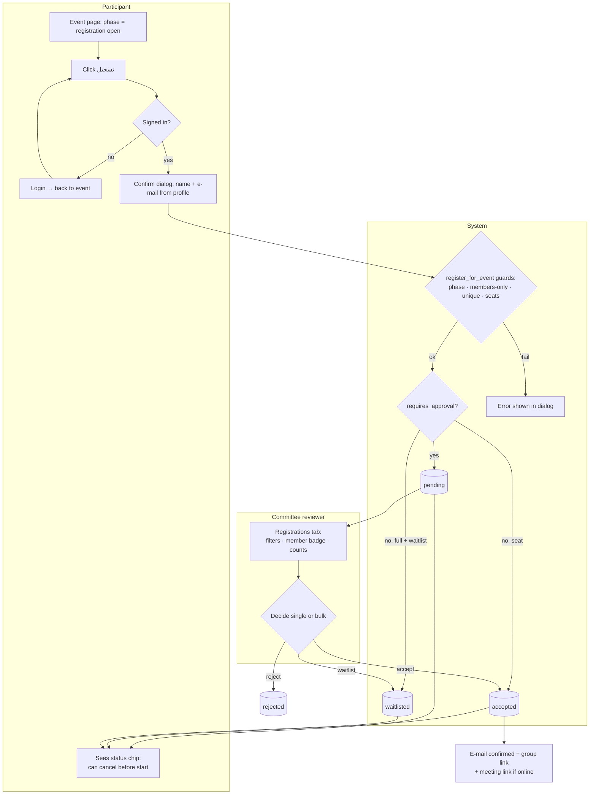
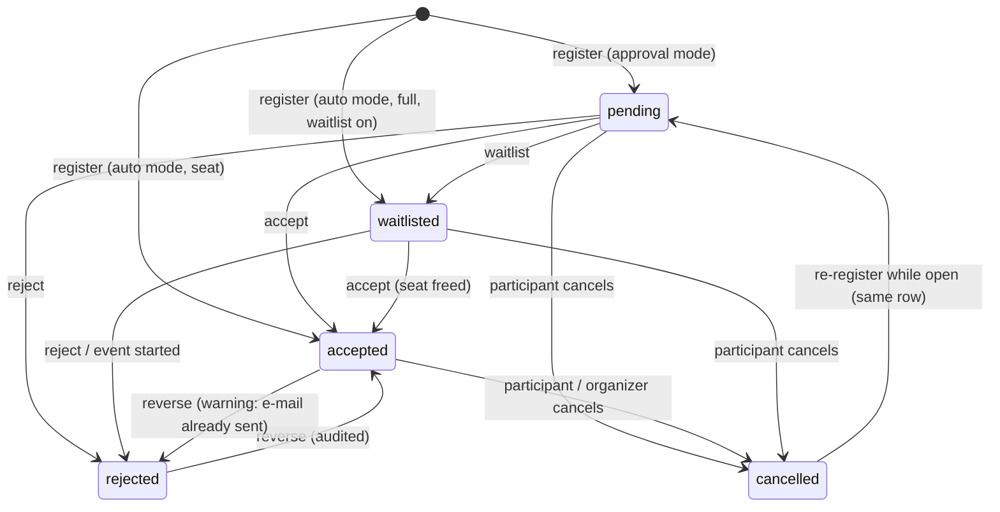
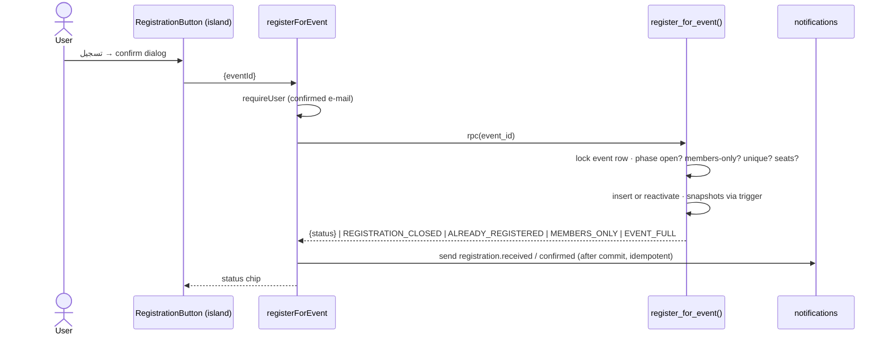
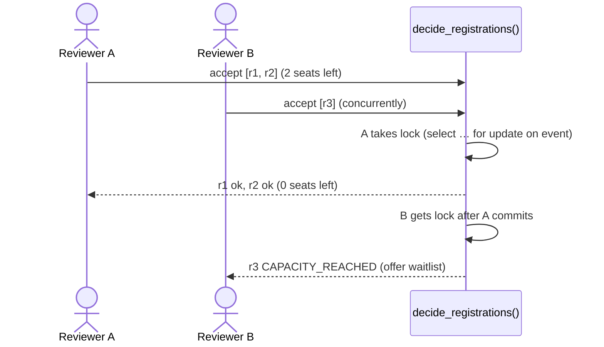
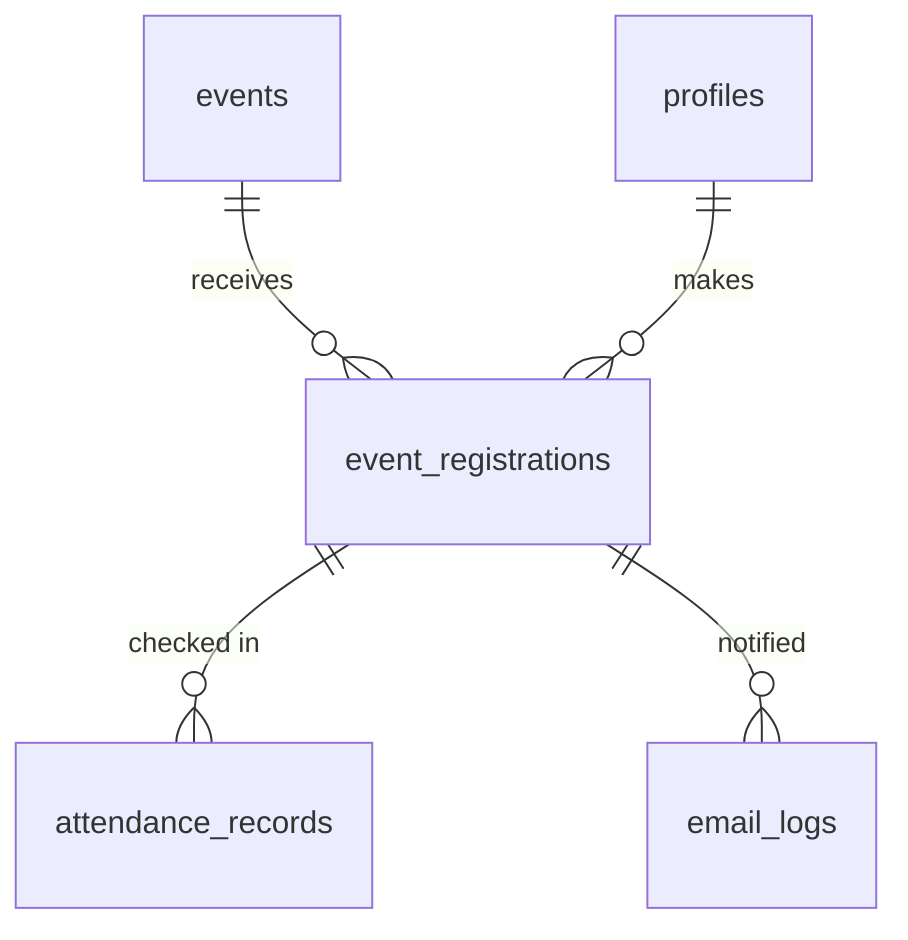

# Module — Event Registrations

| Field            | Value |
| ---------------- | ----- |
| **Last Updated** | 2026-10-02 |
| **Status**       | Draft |
| **Owner**        | Committee heads (review) |
| **Phase / Sprints** | Phase 3A / Sprint 06 |
| **Code**         | `src/modules/registrations/` |

## 1. Purpose and scope

This module lets signed-in users register for an event **once**, lets reviewers scoped to the organizing committee decide registrations, and keeps participants informed. It replaces the single global `/committee` page and the browser-side inserts and e-mails.

| In scope | Out of scope |
| -------- | ------------ |
| Register, cancel, re-register | Attendance and check-in (→ [attendance](../attendance/README.md)) |
| Decision workflow (accept / reject / waitlist; bulk) | Event authoring (→ [events](../events/README.md)) |
| Capacity, waitlist and members-only guards | Paid tickets (never) |
| "My registrations" | E-mail transport (→ [notifications](../notifications/README.md)) |
| Registrant export (audited); legacy registrations migration | Custom registration forms (the `answers` column is reserved for later) |

## 2. Current state (CURRENT / PROBLEM)

- **Critical:** the browser inserts into `event_registrations` with open RLS. Anyone can read every registrant's name and e-mail and change any status through the API.
- Duplicates are possible. There is no registration window, capacity or cancellation.
- The member/visitor badge is decided by matching e-mails against `members` in the browser.
- E-mails are fired from the browser to an open Edge Function relay.
- [Registration lifecycle §1](../../03-business-domain/registration-lifecycle.md#1-registration-today-current).

## 3. Actors and permissions

| Actor | Can | Key | Scope |
| ----- | --- | --- | ----- |
| Signed-in user (confirmed e-mail) | Register, see own status, cancel before start | ownership | own |
| Committee head / deputy | Review and decide; see the e-mail status; retry e-mails | `registrations.review` | event's committee |
| Committee head | Export registrants | `registrations.export` | event's committee |
| Community leader / admin | All of the above, in every committee | same | global |

## 4. Business process



## 5. Lifecycle



| Transition | Who | Guard | Side effects |
| ---------- | --- | ----- | ------------ |
| register | participant | RG-1…RG-4, RG-6 | snapshot name, e-mail, `was_member`; `registration.received` or `registration.confirmed` |
| accept | reviewer in scope | seats (lock) | `registration.confirmed` (+ private links); audit |
| reject / waitlist | reviewer in scope | — | `registration.rejected` / `registration.waitlisted`; audit |
| cancel (self) | participant | before the first day starts | seat freed; audit |
| cancel (organizer) | reviewer | reason | `registration.cancelled_by_organizer` |

## 6. Key sequences

### 6.1 Register



### 6.2 Bulk accept with a capacity race



## 7. Data



| Object | Purpose |
| ------ | ------- |
| `event_registrations` | [events entities §5](../../05-database/entities/events.md#5-event_registrations) |
| `event_registration_counts` (view) | Counts per event and status (capacity, dashboards) |
| `my_registrations` (view) | Own registrations joined with public event fields + private links if accepted |
| `register_for_event()`, `cancel_registration()`, `decide_registrations()` | The only write paths (no direct INSERT/UPDATE grants) |

## 8. Business logic and validation

| # | Rule | Enforced in | Source |
| - | ---- | ----------- | ------ |
| RE-1 | Confirmed e-mail required | Server Action + function | BR-REG-001 |
| RE-2 | One registration per account per event; re-register reactivates the same row | UNIQUE + function | BR-REG-002 |
| RE-3 | Only in the `registration_open` phase of a published event | Function (DB clock) | BR-REG-003 |
| RE-4 | Members-only → active member required | Function | BR-REG-004, Q-009 |
| RE-5 | Name and e-mail are snapshotted by a trigger; client values are ignored | Trigger | BR-REG-005 |
| RE-6 | Accepted count ≤ seats, with a row lock on the event | Function | BR-REG-007 |
| RE-7 | Decisions only by reviewers in the event's committee scope | RLS + function | BR-REG-006 |
| RE-8 | Participants read only their own rows | RLS | BR-REG-008 |
| RE-9 | Self-cancel until the start of the first day | Function | BR-REG-009 |
| RE-10 | The member badge comes from `was_member` (snapshot) or the current `is_active_member`, never name matching | View | RG-11 |
| RE-11 | Auto-close: when `display_config.auto_close_registration` is on and seats are full → phase `registration_closed` | View | KFUCS |
| RE-12 | E-mails are sent after commit; failures never roll back (claim-before-send via `notify_status`) | Server Action | RG-15 |

## 9. Routes and screens

| Route | Audience | Purpose | Blueprint |
| ----- | -------- | ------- | --------- |
| `/[locale]/events/[slug]` (island) | Signed-in user | Register / status chip / cancel | [PUBLIC 04 §3](../../10-design-system/PUBLIC-SCREENS/04-event-detail.md#3-states) |
| `/[locale]/account/registrations` | Signed-in user | Upcoming and past registrations, links, cancel | [11-account-area](../../10-design-system/INTERNAL-SCREENS/11-account-area.md) |
| `/[locale]/dashboard/events/[id]/registrations` | Reviewers in scope | Counts, filters, member badge, bulk decide, e-mail status, export | [15-event-registrations](../../10-design-system/INTERNAL-SCREENS/15-event-registrations.md) |
| `/[locale]/dashboard/registrations` | Reviewers | Cross-event pending queue | same |
| `/committee` (legacy) | — | 301 → `/dashboard/registrations` | [PUBLIC 11](../../10-design-system/PUBLIC-SCREENS/11-committee-legacy.md) |

## 10. Server operations

| Operation | Input | Authorization | Side effects | Error codes |
| --------- | ----- | ------------- | ------------ | ----------- |
| `registerForEvent` | `eventId` | signed-in, confirmed | e-mail; revalidate the event's counts | `REGISTRATION_CLOSED`, `ALREADY_REGISTERED`, `MEMBERS_ONLY`, `EVENT_FULL`, `EMAIL_NOT_CONFIRMED` |
| `cancelMyRegistration` | `registrationId` | owner | audit | `TOO_LATE_TO_CANCEL` |
| `decideRegistrations` | `ids[], decision, note?` | `registrations.review` (scope) | e-mails; audit | `INVALID_TRANSITION`, `CAPACITY_REACHED` (per id) |
| `cancelRegistrationByOrganizer` | `id, reason` | `registrations.review` | e-mail; audit | `REASON_REQUIRED` |
| `retryRegistrationEmail` | `registrationId` | `registrations.review` | resend; log | `NOTHING_TO_RETRY` |
| `exportRegistrants` | `eventId, statuses[]` | `registrations.export` | CSV (UTF-8 BOM for Excel Arabic); audit | — |

## 11. Notifications

`registration.received`, `registration.confirmed` (+ group link, meeting link and notes for online), `registration.rejected` (Q-028 wording), `registration.waitlisted`, `registration.cancelled_by_organizer`.

## 12. Error codes

| Code | Message (ar / en) |
| ---- | ----------------- |
| `REGISTRATION_CLOSED` | التسجيل مغلق لهذه الفعالية / Registration is closed for this event |
| `ALREADY_REGISTERED` | أنت مسجّل مسبقًا / You're already registered |
| `MEMBERS_ONLY` | هذه الفعالية للأعضاء فقط / This event is for members only |
| `EVENT_FULL` | اكتمل العدد / The event is full |
| `CAPACITY_REACHED` | لا توجد مقاعد متبقية — يمكن الإضافة لقائمة الانتظار / No seats left — you can waitlist instead |
| `TOO_LATE_TO_CANCEL` | لا يمكن الإلغاء بعد بدء الفعالية / You can't cancel after the event starts |

## 13. Edge cases

1. A double click on *تسجيل* → one row; the second call returns `ALREADY_REGISTERED` and the UI shows the existing status.
2. Accepting after an acceptance e-mail was sent, then rejecting → allowed with a warning; `registration.rejected` is sent.
3. The user cancels, then registers again while open → the same row returns to `pending` or `accepted`.
4. The event is cancelled → registrations stay for history; participants get `event.cancelled` (from events).
5. Legacy registrations whose user no longer exists → migrated with snapshots only, `user_id = null`.
6. Registration deadline extended while in progress → registration reopens (KFUCS rule).
7. The participant's profile name changes later → the registration keeps its snapshot; the reviewer table shows the snapshot.

## 14. Testing

| Level | Scenarios |
| ----- | --------- |
| Unit | Status chip mapping; CSV export (Arabic, BOM) |
| pgTAP | RE-2…RE-9; concurrency test (two sessions racing for the last seat); scope isolation; no direct INSERT/UPDATE grants; snapshot trigger |
| E2E | J3 register → pending → accept → e-mail with group link; J4 reviewer of committee A can't see committee B; cancel and re-register |

## 15. Implementation plan (Sprint 06)

1. Migration `…_registrations_v2.sql`: expand the legacy table (new columns, unique constraint after de-duplicating, functions, RLS lockdown). Legacy rows are mapped to the new event ids through `legacy_id`.
2. `RegistrationButton` island on the public event page (existing styles).
3. Dashboard registrations tab + global queue; export.
4. Delete `send-registration-email` and `send-status-email`; `/committee` → 301.

```text
src/modules/registrations/
├── queries.ts     getMyRegistration(eventId), listMyRegistrations, listForEvent(eventId, filters), pendingQueue
├── actions.ts     registerForEvent, cancelMyRegistration, decideRegistrations, cancelByOrganizer, retryEmail, export
├── schemas.ts
└── components/    RegistrationButton, StatusChip, RegistrantsTable, DecisionDialog, EmailStatusCell
```

## 16. Open questions

Q-009 (members-only), Q-018 (approval default), Q-028 (rejection wording), Q-029 (capacity and waitlist).

## Revision — guests (2026-10-03)

Registration needs no account ([ADR-013](../../90-decisions/ADR-013-accounts-for-members-only.md)). A visitor registers from a modal on the event page through `register_guest` (name, e-mail, phone, optional university): same seat rules as `register_for_event`, plus honeypot, minimum fill time (1.5 s), per-e-mail (3 per 3 min) and per-address (8 per 10 min, hashed) throttles, and one active registration per e-mail and event. The row has no `user_id`, keeps the phone and university in `answers`, and e-mails use the language the person used. Organizers see a *Guest* badge, the phone and the university in the registrant dialog. Guests cannot cancel by themselves; the organizer can.
