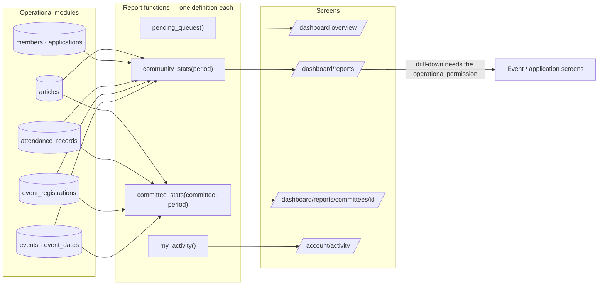
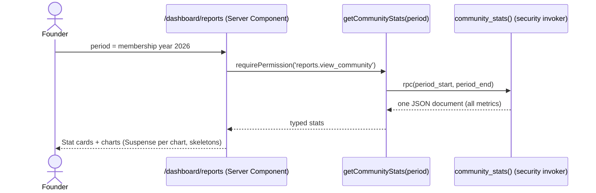

# Module — Reports & Dashboards

| Field            | Value |
| ---------------- | ----- |
| **Last Updated** | 2026-10-02 |
| **Status**       | Draft — metric set pending **Q-008** |
| **Owner**        | Founders / community leader |
| **Phase / Sprints** | Phase 2 (overview page skeleton, S04) · Phase 4 (metrics, S11) |
| **Code**         | `src/modules/reports/` |

## 1. Purpose and scope

This module gives founders, leadership and committee heads a reliable view of community health, **derived from operational data** with one definition per metric. It also gives every user a view of their own activity.

| In scope | Out of scope |
| -------- | ------------ |
| `/dashboard` overview (role-aware cards and queues) | BI tools, data warehouse |
| Community and committee dashboards with a period selector | Real-time analytics or web traffic (Q-037) |
| "My activity" | Predictions |
| Public aggregate stats (if Q-008 says yes, min group size 5) | Exports of raw personal data (those live in the owning modules, audited) |

## 2. Current state (CURRENT / PROBLEM)

None. The only "report" is the per-event registration count on the legacy `/committee` page.

## 3. Actors and permissions

| Actor | Sees | Key | Scope |
| ----- | ---- | --- | ----- |
| Founders, leader, advisor, admin | Community dashboard | `reports.view_community` | global |
| Committee head / deputy | Committee dashboard | `reports.view_committee` | own committee |
| Any signed-in user | My activity | ownership | own |
| Everyone | Public aggregates (optional) | — | public |

## 4. Business process — using the dashboards



## 5. Metric definitions (single source)

| Metric | Function field | Definition |
| ------ | -------------- | ---------- |
| Active members | `active_members` | `members.status = 'active'` at the period end |
| New members | `new_members` | Acceptances in the period, by cycle |
| Application funnel | `applications_by_status` | Per cycle: submitted, accepted, rejected, waitlisted, withdrawn |
| Events held | `events_held` | Published/completed events whose last date is in the period |
| Registrations | `registrations` | Created in the period, by status |
| Acceptance rate | `acceptance_rate` | accepted ÷ (accepted + rejected) |
| Attendance rate | `attendance_rate` | Mean `attendance_percent` over accepted registrations of finalized events |
| Member participation | `member_share` | Share of registrations with `was_member = true` |
| Content output | `articles_published` | Articles with `published_at` in the period |
| Committee size | `committee_size` | Active committee-member assignments |
| Pending work | `pending_queues` | Events `pending_review`, articles `in_review`, applications `submitted`/`under_review`, registrations `pending` — in the viewer's scope |

The full catalogue is in the [reporting model](../../03-business-domain/reporting-model.md). The period defaults to the current membership year (RP-4).

## 6. Key sequence — load the community dashboard



## 7. Data

| Object | Kind | Notes |
| ------ | ---- | ----- |
| `community_stats(from, to)` | SQL function returning jsonb | Checks `reports.view_community` inside |
| `committee_stats(committee_id, from, to)` | SQL function | Checks `reports.view_committee` for that committee |
| `pending_queues()` | SQL function | Counts limited by the caller's permissions |
| `my_activity()` | SQL function | Own registrations, attendance %, certificates, application status |
| `public_stats` | Materialized view refreshed daily (only if Q-008 says yes) | Suppresses groups < 5 |

## 8. Business logic and validation

| # | Rule | Enforced in | Source |
| - | ---- | ----------- | ------ |
| RP-1 | Dashboards show aggregates; drilling into people needs the operational permission | Functions + links | reporting model |
| RP-2 | Public numbers never show groups smaller than 5 | View | reporting model |
| RP-3 | One SQL definition per metric; the UI never recomputes metrics | Code review | KFUCS F-19 lesson |
| RP-4 | The attendance rate excludes events without finalized attendance (labelled "not recorded") | Function | ADR-012 |
| RP-5 | Charts follow the [dataviz](../../10-design-system/patterns.md) rules and the frozen palette (accent = the SDC green) | UI | D-009 |

## 9. Routes and screens

| Route | Audience | Purpose | Blueprint |
| ----- | -------- | ------- | --------- |
| `/[locale]/dashboard` | Any dashboard user | Role-aware overview: queues + key numbers in scope | [10-dashboard-overview](../../10-design-system/INTERNAL-SCREENS/10-dashboard-overview.md) |
| `/[locale]/dashboard/reports` | Community viewers | Community dashboard | [22-reports](../../10-design-system/INTERNAL-SCREENS/22-reports.md) |
| `/[locale]/dashboard/reports/committees/[id]` | Committee viewers | Committee dashboard | same |
| `/[locale]/account/activity` | Signed-in | My activity | [11-account-area](../../10-design-system/INTERNAL-SCREENS/11-account-area.md) |

## 10. Server operations

These are read-only queries: `getOverview()`, `getCommunityStats(period)`, `getCommitteeStats(id, period)`, `getMyActivity()`. Errors: `FORBIDDEN`, `INVALID_PERIOD`.

## 11. Edge cases

1. A committee head of two committees → a committee picker on the reports page; the overview sums both.
2. The period contains no events → cards show "—" with an empty-state hint, not 0 %.
3. An event's attendance is finalized late → the metrics update on the next load (no caching beyond 5 minutes).
4. The membership year is undefined (no cycle yet) → the default period is the last 12 months.

## 12. Testing

| Level | Scenarios |
| ----- | --------- |
| Unit | Period parsing; card formatting (Arabic digits per locale) |
| pgTAP | Every metric against a fixture dataset with known answers; scope (a head of A can't query B); small-group suppression |
| E2E | Leader vs head dashboards for the same period show the expected numbers |

## 13. Implementation plan

1. **S04:** `/dashboard` overview with `pending_queues()` only (it gives the shell a useful landing page).
2. **S11:** stats functions with fixtures, community and committee dashboards, my activity, optional public stats.

```text
src/modules/reports/
├── queries.ts     getOverview, getCommunityStats, getCommitteeStats, getMyActivity
├── period.ts
└── components/    StatCard, TrendChart, FunnelChart, QueueList, PeriodPicker
```

## 14. Open questions

Q-008 (KPIs, public stats), Q-032 (founders' access to drafts and audit), Q-037 (web analytics).
