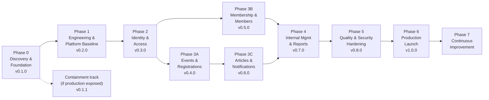

# Transformation Roadmap

| Field            | Value      |
| ---------------- | ---------- |
| **Last Updated** | 2026-10-02 |
| **Status**       | Draft — durations indicative (volunteer capacity) |

## Overview



Ordering rationale: data and authorization foundations before features (every module depends on them); events first among domain modules because they are the community's main activity and carry the critical security exposure — **unless the next membership intake opens soon**, in which case Phase 3B moves before 3A (**OPEN Q-011**: when is the next cycle?).

---

## Phase 0 — Discovery & Foundation

| Item | Detail |
| ---- | ------ |
| Goal | Understand the current system, document the target, and establish control of the project |
| Scope | This `docs/` set; inspection of the remote Supabase project (Q-025); Git repository + GitHub organization + branch protection (Q-024); access inventory (R-013); answers to P1 open questions |
| Exit criteria | Docs reviewed and marked In Review/Approved by the product owner; all **P1** questions answered; repository established with `main`/`develop` protected; remote schema dump recorded in [current schema](../05-database/current-schema.md); containment applied if needed |
| Version | `v0.1.0` (docs + repository baseline; no behaviour change) |
| Duration | 1–2 weeks |

### Phase 0 containment track

Only if Q-025 confirms production is exposed. Minimal, approved changes ([security model §16](../06-security/security-model.md#16-containment-of-current-critical-findings)): lock down `members` writes and `event_registrations` reads/updates; require JWT on email functions or disable them; disable `check-email-exists`; rotate the Gmail app password if abused. Shipped as `v0.1.1` with a release record. This is the only application change allowed before Phase 1.

## Phase 1 — Engineering & Platform Baseline

| Item | Detail |
| ---- | ------ |
| Goal | A safe place to build: tooling, CI, environments, migrations, and the architectural skeleton |
| Scope | Upgrade Next.js/React to latest stable (ADR-001); TypeScript (ADR-008); ESLint/Prettier/Husky; `.nvmrc`; Vitest, Testing Library, Playwright, pgTAP; GitHub Actions CI (ADR-007); complete `supabase/config.toml`; migration baseline + history repair (ADR-003); staging Supabase project + Vercel environments (ADR-005); `lib/env.ts`, `.env.example`; Supabase SSR clients + middleware/proxy skeleton; module folder structure; design tokens + Tailwind configured (ADR-009); `[locale]` routing skeleton with next-intl (ADR-010); remove dead code; regression pgTAP tests for the Critical findings |
| Exit criteria | CI required checks green on `develop`; `supabase db reset` reproduces schema; staging deploys from `develop`; existing pages still render (visual parity) in both locales via URL |
| Version | `v0.2.0` |
| Duration | 2 sprints |

## Phase 2 — Identity & Access

| Item | Detail |
| ---- | ------ |
| Goal | Server-side authentication and the database-backed authorization model |
| Scope | Cookie-based SSR auth flows (sign-up/in/out, callback, reset, account page); `profiles` + trigger; roles/permissions/role_permissions/role_assignments + helpers + RLS (ADR-004); committees table + seed (Q-004); dashboard shell with permission-filtered navigation; admin UI for users and role assignments; migrate `COMMITTEE_EMAILS` reviewer and hardcoded leadership into assignments (Q-039); public leadership view from `current_positions`; Auth custom SMTP via provider (ADR-006); remove `check-email-exists` |
| Exit criteria | No hardcoded authorization remains; pgTAP covers access tables and anti-escalation; E2E J2, J8, J9 pass |
| Blocking questions | Q-003, Q-004, Q-010, Q-014, Q-017, Q-039 |
| Version | `v0.3.0` |
| Duration | 2 sprints |

## Phase 3 — Core Domain Modules

### Phase 3A — Events & Registrations (`v0.4.0`, 2 sprints)

Events entity in the KFUCS shape + **4-step creation wizard** + lifecycle + dashboard (create/submit/approve/cancel) ([ADR-012](../90-decisions/ADR-012-event-model-and-wizard-from-kfucs.md)); public event pages from DB with derived phases; registration functions and RLS; review dashboard per committee; notifications module + email log (first templates); data migration of the six events and legacy registrations; legacy URL redirects; retire `send-*-email` functions and `/committee`. **Blocking:** Q-005, Q-009, Q-018, Q-028, Q-029, Q-040.

### Phase 3B — Membership & Members (`v0.5.0`, 2 sprints)

Reference data tables; intake cycles + `/join` + applications + review + decisions; members linked to accounts; directory/profile from views; self-service profile; legacy member import + claim flow. **Blocking:** Q-002, Q-007, Q-011, Q-012, Q-013, Q-026, Q-030, Q-038.

### Phase 3C — Articles & Notifications completion (`v0.6.0`, 1–2 sprints)

Articles entity + lifecycle + Markdown editor + public pages; migration of the six articles; remaining notification templates; email retry job. **Blocking:** Q-006, Q-033, Q-035.

## Phase 4 — Internal Management & Reporting

| Item | Detail |
| ---- | ------ |
| Goal | Leadership and committees can run and observe the community without developers |
| Scope | Committee management UI and pages; **attendance sessions per day with QR/online/manual check-in and finalization (KFUCS)**; certificates behind a setting (Q-020); exports; community and committee dashboards; audit log UI; reference data and site settings UIs; partners (if Q-021); optional reminders |
| Blocking questions | Q-008, Q-020 (certificates only), Q-021, Q-032 |
| Version | `v0.7.0` |
| Duration | 2 sprints |

## Phase 5 — Quality & Security Hardening

| Item | Detail |
| ---- | ------ |
| Goal | Production-grade quality |
| Scope | Accessibility audit and fixes (axe blocking); CSP from report-only to enforced; performance (Core Web Vitals); privacy notice, consent text, data-subject flows (Q-031); restore drill; coverage thresholds blocking; remaining legacy CSS migrated; security review of RLS and server actions |
| Version | `v0.8.0` |
| Duration | 1–2 sprints |

## Phase 6 — Production Readiness & Launch

| Item | Detail |
| ---- | ------ |
| Goal | The transformed platform is the production system |
| Scope | Final data migration rehearsal on staging copy (synthetic) and production run; contract migrations (drop legacy tables); production env vars, domain, email domain verification; monitoring/keep-alive; runbooks; handover; launch announcement (ar/en) |
| Exit criteria | All **Must** requirements done; release checklist complete; two system admins; backups verified |
| Version | `v1.0.0` |
| Duration | 1 sprint |

## Phase 7 — Continuous Improvement

Post-launch backlog: certificates (Q-020), event-scoped grants, partners management, analytics (Q-037), member contact (Q-022), projects showcase. Planned per release with the same process.

## Next stage after the foundation

Once Phase 0 exits, the work proceeds as:

```text
Foundation → Detailed system analysis (per module, at sprint planning) → Internal design (module docs) →
Database design (migrations) → RBAC implementation → Member management → Committee management →
Event management → Articles → Reports & statistics → Notifications → Testing & security → Production readiness
```

Sprint plans for the whole roadmap (Sprint 00 → 13, v1.0.0 ≈ 2027-04-10) are in [sprints](./sprints/README.md#2-sprint-roadmap). Implementation sprints start only after Phase 0 exit criteria are met; the current priorities are on the [action board](./action-board.md).
